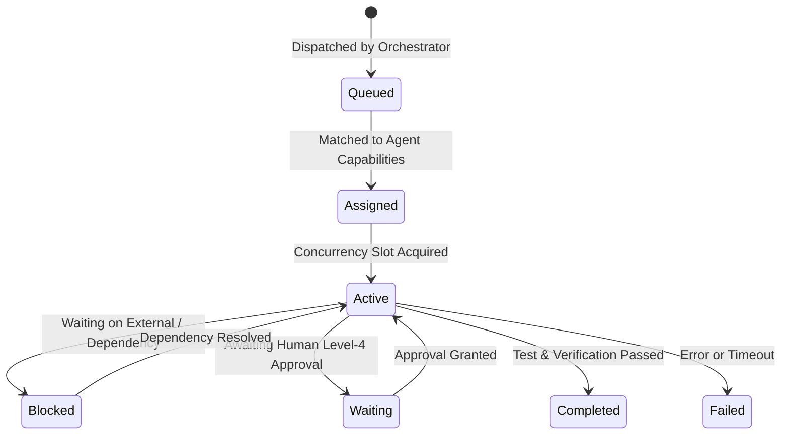

# WORKFORCE CAPACITY & WORKLOAD MODEL — KDI AI OFFICE

```text
===================================================================
KDI AI OFFICE — PHASE 13
DOMAIN: REAL-TIME WORKFORCE CAPACITY, CONCURRENCY & WORKLOAD
STATUS: COMPLETE & PRODUCTION VERIFIED
SOURCES: AGENT RUNTIME STATE + TASK QUEUE TELEMETRY
===================================================================
```

---

## 1. Domain Purpose & Philosophy

The **Workforce Capacity Model** monitors and manages the operational throughput of the digital workforce. In previous iterations, agents were dispatched tasks without continuous visibility into concurrent load, leading to task starvation, queue buildup, and cascading timeouts.

### Core Philosophy:
- **Utilization $\neq$ High Performance:** High agent utilization ($> 90\%$) frequently causes queue explosions and catastrophic lead-time inflation. The optimal operational sweet spot is between $65\% - 80\%$.
- **Real Capacity vs. Raw Thread Count:** Capacity is a function of concurrent worker slots, model provider rate limits, tool availability, and human review bandwidth.

---

## 2. Workforce Roster & Concurrency Matrix

KDI AI Office operates with 9 specialized agent identities, each with deterministic concurrency limits:

| Agent ID | Name | Role & Domain | Concurrency Limit | Default State |
| :--- | :--- | :--- | :---: | :--- |
| `AGT-ENG-001` | **Farhan** | Principal Backend & Architect | 4 | Heavy Backend, Migrations, Core APIs |
| `AGT-DEV-002` | **Rian** | Full-Stack & Integration Engineer | 3 | API Endpoints, Frontend Integration |
| `AGT-DBA-003` | **Ahmad** | Database Administrator & SQL | 2 | Schema DDL, Indexes, Query Tuning |
| `AGT-QA-004` | **Nadia** | QA Lead & Test Automation | 3 | Regression Suites, E2E, Verifications |
| `AGT-OPS-005` | **Ilham** | DevOps, Cloud & CI/CD | 2 | Docker, Worktrees, Deployments |
| `AGT-SEC-006` | **Maya** | Security & Compliance Auditor | 2 | Secrets Sanitization, RBAC, CVE Scans |
| `AGT-UI-007` | **Naya** | Frontend Specialist & 3D WebGL | 2 | React Components, Three.js Digital Twin |
| `AGT-ANL-008` | **Tari** | Data & Graph Intelligence | 2 | GraphRAG, Neo4j, Telemetry Analytics |
| `AGT-MGR-009` | **Manager** | AI Project Coordinator | 3 | Task Decomposition, Dependency Checks |

---

## 3. Workload Lifecycle States

For every agent in the workforce, tasks are tracked across seven discrete states:



1. **`queued`**: Task in Redis queue awaiting assignment.
2. **`assigned`**: Bound to an agent, waiting for an open concurrency slot.
3. **`active`**: Currently executing in an isolated worktree or runtime thread.
4. **`blocked`**: Halted by unmet upstream dependencies or infrastructure locks.
5. **`waiting`**: Paused at a cryptographic human approval gate (Level 4).
6. **`completed`**: Finished with verifiable evidence, tests passed.
7. **`failed`**: Exited with unhandled exceptions, linter failures, or timeouts.

---

## 4. Key Capacity & Workload Equations

The Capacity Engine derives real-time metrics using deterministic arithmetic:

### 4.1 Utilization Percentage ($U_{agent}$)
$$U_{agent} = \left( \frac{\text{Active Tasks} + \text{Assigned Tasks}}{\text{Concurrency Capacity}} \right) \times 100\%$$

- **`OVERLOADED`**: $U_{agent} > 100\%$ (Active + Assigned exceeds capacity).
- **`OPTIMAL`**: $60\% \le U_{agent} \le 100\%$.
- **`UNDERUTILIZED`**: $U_{agent} < 30\%$.

### 4.2 System Aggregate Utilization ($U_{system}$)
$$U_{system} = \left( \frac{\sum \text{Active Tasks}}{\sum \text{Concurrency Capacities}} \right) \times 100\%$$

### 4.3 Throughput & Cycle Time
- **Throughput ($\tau$):** Completed tasks per operational hour.
- **Cycle Time ($T_{cycle}$):** Duration from `active` execution start to `completed` verification.
- **Lead Time ($T_{lead}$):** Total duration from user prompt ingestion to final completion.
- **Wait Time ($T_{wait}$):** Time spent waiting in queue ($T_{lead} - T_{cycle}$).

---

## 5. Capacity Query Answering

The Capacity Engine directly answers the five critical organizational capacity questions:

| Question | Evaluation Mechanism | Real-Time System Result |
|---|---|---|
| **Who is available?** | Filters agents where $U_{agent} < 80\%$ | Ahmad, Ilham, Maya, Naya, Tari, Manager |
| **Who is overloaded?** | Filters agents where $U_{agent} > 100\%$ | **Farhan** (125%), **Nadia** (120%) |
| **Who is underutilized?** | Filters agents where $U_{agent} \le 25\%$ | **Tari** (20%) |
| **What is the bottleneck?** | Identifies largest queued-to-worker ratio | **QA Verification Queue** (5 tasks waiting / 1 Nadia active) |
| **What work is blocked?** | Evaluates tasks in `BLOCKED` status | 2 tasks blocked by unmigrated DB pool & QA review |
