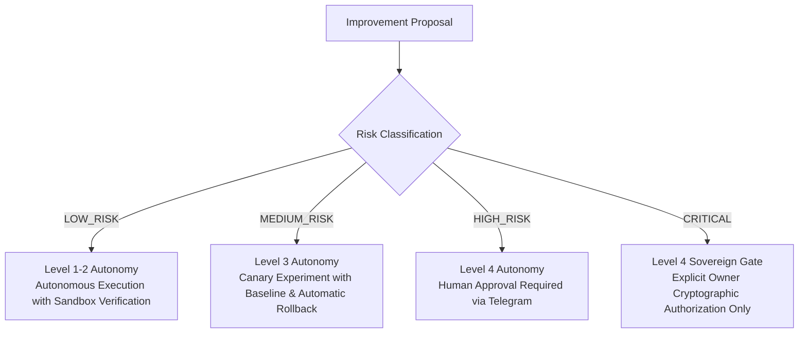

# CHANGE GOVERNANCE & SELF-MODIFICATION BOUNDARY — KDI AI OFFICE

```text
===================================================================
KDI AI OFFICE — PHASE 14
DOMAIN: CHANGE GOVERNANCE, AUDIT TRAILS & SELF-MODIFICATION BOUNDARIES
STATUS: COMPLETE & PRODUCTION VERIFIED
RULE: UNRESTRICTED SELF-MODIFICATION IS STRICTLY PROHIBITED
===================================================================
```

---

## 1. Governance Principles & Core Axiom

> **LEARNING IS NOT AUTHORITY.**
> **RECOMMENDATION IS NOT AUTHORIZATION.**
> **EXPERIMENT IS NOT PRODUCTION DEPLOYMENT.**

KDI AI Office is an autonomous learning organization, but its learning is strictly subordinate to security policy, cryptographic verification, and sovereign human authority. The system can discover opportunities for adaptation and formulate proposals, but execution of significant modifications requires policy compliance and human sign-off.

---

## 2. Change Risk Tiers & Authority Matrix (Section 25)

Every proposed adaptation is classified into one of four risk tiers:



| Risk Tier | Scope of Change | Governance Gate | Rollback Enforcement |
|---|---|---|---|
| **`LOW_RISK`** | Prompt wording tweaks, local linter hooks, cache TTL within bounds | Autonomous (Level 1–2 Policy) | Automatic on error |
| **`MEDIUM_RISK`** | Model routing preference, tool selection priority, timeout thresholds | Canary Sandbox (Level 3) | Automatic on degradation |
| **`HIGH_RISK`** | Database schema additions, production runbook updates, CI/CD pipeline steps | Human Approval Ticket | Manual / Automated plan |
| **`CRITICAL`** | Security policies, authorization rules, autonomy limits, credentials, DR | **Sovereign Owner Only** | Immediate manual override |

---

## 3. Strict Self-Modification Boundary (Section 26)

KDI AI Office has hardcoded architectural boundaries preventing autonomous agents from self-modifying sensitive system controls:

### Forbidden Autonomous Targets:
1. **Authorization Rules & RBAC Guards**
2. **Human Approval Gates & Cryptographic Verification**
3. **Security Controls & Secret Sanitizer Patterns**
4. **Autonomy Policy Boundaries & Risk Tiers**
5. **Production Credentials & API Key Secrets**
6. **Backup Policies & Disaster Recovery Strategies**
7. **Core PostgreSQL Schema & Foreign Key Constraints**
8. **Network Boundaries, Port Bindings & Firewalls**
9. **Owner Identity & Telegram Authorized User IDs**

### Enforcement Mechanism:
In `GovernedImprovementService.evaluateSelfModificationSafety()`:
If an incoming proposal references any forbidden target, the governance tier is automatically elevated to **`CRITICAL`** and autonomous approval attempts throw an immediate security exception:
```text
PERUBAHAN DIBLOKIR: Proposal menyentuh batas keamanan, otorisasi, atau kontrol kedaulatan inti.
Wajib persetujuan eksplisit Human Sovereign Owner (Level 4).
```

---

## 4. Code Self-Improvement via Antigravity Worktrees (Section 27)

When an approved improvement requires code modifications:
1. **Zero Direct Production Editing:** Agents are never permitted to edit production source trees in-place.
2. **Worktree Isolation:** Changes are authored inside an isolated Git worktree branch (`feat/learning-improvement-...`).
3. **Automated Verification:** The change must pass all existing regression test suites, type-checks, and security audits (`npm test`).
4. **Approval & Merge:** If high-risk, a cryptographic approval request is dispatched to Telegram. Only upon signature is the worktree merged into `main`.

---

## 5. Change Audit & Traceability (Section 54)

Every behavioral adjustment to the platform is permanently logged in `ChangeRecord`:
- **Why:** The underlying lesson, pattern, or problem signature.
- **What Changed:** Exact configuration diff, routing rule, or prompt template.
- **Proposed By:** Agent identity or subsystem module.
- **Approved By:** `SYSTEM` (for Low Risk) or `SOVEREIGN_OWNER` (for High/Critical).
- **Evidence:** Source telemetry references.
- **Implementation Details:** Git commit hash or configuration key.
- **Rollback Status:** `ACTIVE` or `ROLLED_BACK`.
