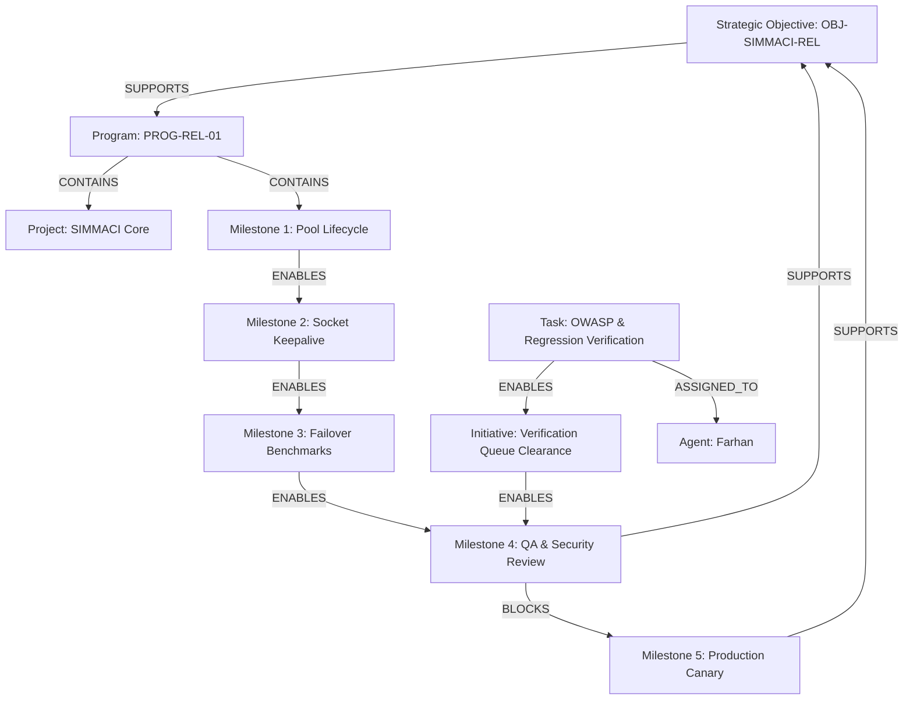

# DEPENDENCY IMPACT & CASCADE ANALYSIS MODEL

## 1. Multi-Tier Graph Representation

KDI represents strategic dependencies as a directed acyclic graph (DAG) in Neo4j, mirrored in PostgreSQL. The topology spans 6 distinct hierarchical tiers:



---

## 2. Cascade Impact Analysis Algorithm

When a node (task, milestone, or provider) experiences failure or slippage, KDI computes downstream blast radius **from actual graph relationships**, rather than naively assuming all downstream nodes fail.

### Traversal Logic:
1. Traverse outbound edges with relationship `BLOCKS`. Directly blocked nodes are marked for immediate execution pause.
2. Traverse `ENABLES` edges to calculate downstream milestone target date slippage.
3. Traverse `SUPPORTS` edges to evaluate impact on parent strategic objectives.
4. Traverse `ASSIGNED_TO` edges to identify which agents will experience queue saturation or idle starvation.

---

## 3. Concrete Cascade Analysis Case Study: MS-SIM-04 Delay

When milestone `MS-SIM-04` falls 4 days behind baseline:

```json
{
  "failedDependencyId": "MS-SIM-04",
  "failedDependencyType": "MILESTONE",
  "directBlockedNodes": ["MS-SIM-05"],
  "affectedMilestoneIds": ["MS-SIM-04", "MS-SIM-05"],
  "affectedObjectiveIds": ["OBJ-SIMMACI-REL"],
  "affectedProjectIds": ["SIMMACI"],
  "affectedAgentRoles": ["Farhan", "Rian"],
  "estimatedDeadlineDelayDays": 4,
  "invalidatedDownstreamWork": ["MS-SIM-05"],
  "impactSeverity": "HIGH",
  "graphTraversalDepth": 2
}
```

### Insights Delivered to Owner:
- **Direct Blocker:** MS-SIM-05 cannot begin until MS-SIM-04 security verification completes.
- **Scope of Impact:** Exactly 2 milestones and 1 strategic objective affected; other projects (e.g. Gowa Waha migration) remain 100% unaffected.
- **Resource Bottleneck:** QA queue is saturated; Farhan is overloaded at 94% utilization while engineering is comfortable at 72%.
