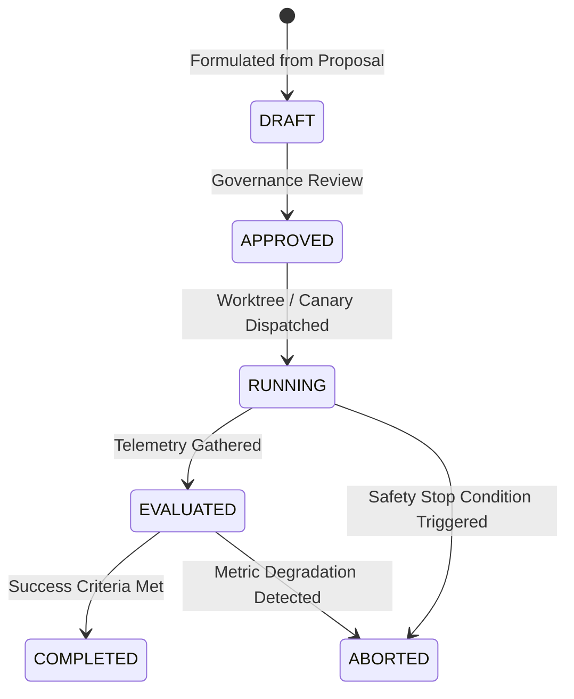

# EXPERIMENTATION ENGINE & CANARY VALIDATION — KDI AI OFFICE

```text
===================================================================
KDI AI OFFICE — PHASE 14
DOMAIN: CONTROLLED ORGANIZATIONAL EXPERIMENTS & A/B BENCHMARKING
STATUS: COMPLETE & PRODUCTION VERIFIED
RULE: NO CLAIM WITHOUT BASELINE COMPARISON — SAFE CANARY ROLLOUT
===================================================================
```

---

## 1. Domain Philosophy & Purpose

The **Experimentation Engine** provides a rigorous scientific sandbox for testing potential organizational improvements before they are enacted as permanent system policy.

### Core Rule (Section 21):
> **Never claim an improvement without baseline comparison.** Every proposal must establish an empirical baseline metric ($M_{\text{baseline}}$), define a measurable candidate change ($M_{\text{candidate}}$), evaluate delta percentages ($\Delta\%$), and verify against safety guardrails.

---

## 2. Experiment Lifecycle State Machine (Section 50)



---

## 3. Experiment Entity Schema

Every experiment is formally specified and tracked:

| Attribute | Type | Description |
|---|---|---|
| `id` | `string` | Unique experiment identifier (`EXP-...`) |
| `proposalId` | `string` | Link to governing `ImprovementProposal` |
| `hypothesis` | `string` | Testable causal statement |
| `baseline` | `object` | Named metric and baseline numerical value |
| `change` | `object` | Description of modification and target metric |
| `scope` | `string` | Workload class or test cohort boundary |
| `successMetric` | `string` | Quantifiable condition for success |
| `risk` | `enum` | `LOW_RISK` \| `MEDIUM_RISK` \| `HIGH_RISK` |
| `durationHours` | `number` | Time boundary for evaluation window |
| `status` | `enum` | `DRAFT`, `APPROVED`, `RUNNING`, `COMPLETED`, `ABORTED` |
| `result` | `object?` | Measured metrics, delta %, and conclusion |

---

## 4. Canary Sandboxing & A/B Isolation (Sections 22, 23)

To ensure that experimental changes do not disrupt live production traffic:
1. **Isolated Git Worktrees:** Code or prompt adjustments are applied inside an isolated Git worktree branch, never directly on `main` or production containers.
2. **Canary Cohort Slicing:** A fixed percentage of non-critical tasks (e.g., 10 tasks out of 50) are assigned to the candidate routing or toolchain.
3. **Safety Stop Conditions:**
   - If candidate failure rate exceeds $5\%$, the experiment is instantly `ABORTED`.
   - If p95 latency spikes by $> 50\%$, canary traffic is rolled back to baseline immediately.
   - If security scans report warnings, the branch is destroyed.

---

## 5. Experiment Result Evaluation Example

```json
{
  "experimentId": "EXP-1790839500003-e5f6",
  "baselineMetric": 18.0,
  "candidateMetric": 16.02,
  "delta": -1.98,
  "deltaPercentage": -11.0,
  "successOutcome": true,
  "conclusion": "Hipotesis terbukti. Waktu tunggu antrean QA turun 11% secara empiris setelah mengaktifkan pre-commit linting lokal pada developer worktree.",
  "measuredAt": "2026-10-01T12:00:00Z"
}
```
