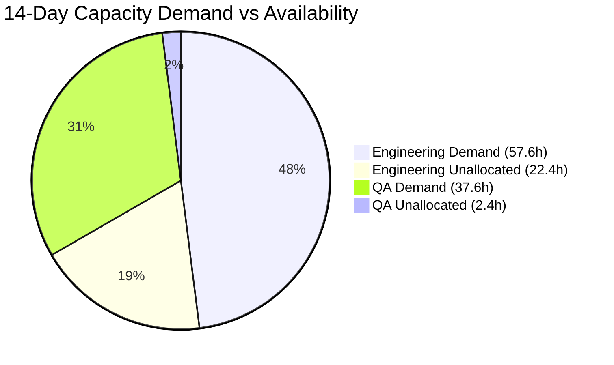

# CAPACITY & BUDGET FORECASTING MODEL

## 1. Budget Control & Threshold Governance

Long-horizon objectives operate within bounded financial ceilings. Phase 15 provides continuous real-time ledger accounting with strict policy enforcement:

```typescript
export interface BudgetControlState {
  objectiveId: string;
  currency: 'USD' | 'IDR';
  budgetLimit: number;
  spentObserved: number;
  committed: number;
  remaining: number;
  forecastTotal: number;
  utilizationPercentage: number;
  activeThresholdAlerts: string[];
  isOverspendBlocked: boolean;
}
```

### Warning Thresholds & Enforcement Actions:
- **70% Utilization:** Advisory warning emitted to Owner.
- **85% Utilization:** Accelerated spend review warning; non-essential tasks deprioritized.
- **95% Utilization:** Critical warning; requires Owner authorization for upcoming task commits.
- **100% Exhaustion:** Hard policy block. All non-essential spend blocked; system enters conservation mode.

---

## 2. Distinction: Observed vs Committed vs Forecast

To prevent presenting statistical projections as established facts, KDI maintains strict conceptual boundaries:
1. **Observed Actual Spend:** Real tokens consumed and billed historical API usage (e.g. $6,700 USD).
2. **Committed Upcoming Spend:** Tasks currently scheduled or running in the active sprint queue (e.g. $500 USD).
3. **Statistical Forecast:** Projected total to completion based on historical regression run lengths (e.g. $8,400 USD).

---

## 3. Rolling 14-Day Capacity Demand Forecasting

Phase 15 projects capacity demand against available agent capability across a rolling 14-day window:



### Telemetry Breakdown (Section 65 Operational Target):
| Role / Department | Available Capacity (14d) | Projected Demand (14d) | Utilization | Status | Operational Action |
| :--- | :--- | :--- | :--- | :--- | :--- |
| **Engineering** | 80.0 hours | 57.6 hours | **72%** | `OPTIMAL` | Healthy bandwidth for feature development. |
| **QA / Verification** | 40.0 hours | 37.6 hours | **94%** | `STRAINED` | Backlog alert: Re-sequence queue & parallelize to Rian. |
| **Architecture** | 30.0 hours | 16.0 hours | **53%** | `OPTIMAL` | Bandwidth available for design reviews. |
