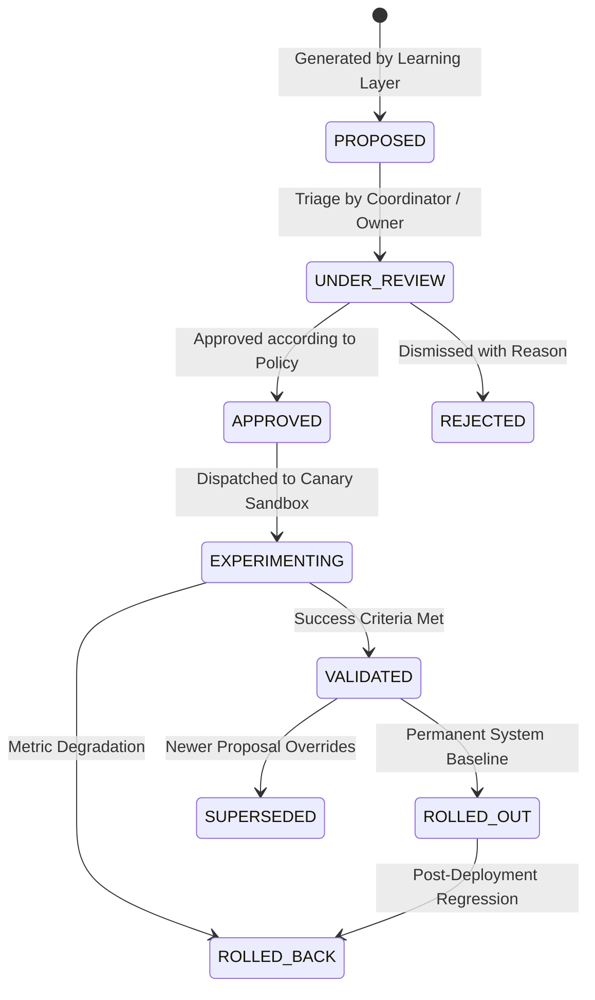

# IMPROVEMENT PROPOSAL & ROI MODEL — KDI AI OFFICE

```text
===================================================================
KDI AI OFFICE — PHASE 14
DOMAIN: IMPROVEMENT PROPOSALS, LIFECYCLE GOVERNANCE & ROI ESTIMATION
STATUS: COMPLETE & PRODUCTION VERIFIED
RULE: EVERY PROPOSAL REQUIRES EXPLICIT EVIDENCE & A ROLLBACK PLAN
===================================================================
```

---

## 1. Domain Overview

The **Improvement Proposal Model** serves as the formal vehicle for continuous organizational adaptation. In naive AI systems, self-modification occurs unchecked in invisible loops. In KDI AI Office, any proposed adjustment to code, workflows, runbooks, routing preferences, or prompts must be drafted as an explicit, auditable `ImprovementProposal`.

---

## 2. Improvement Proposal Entity Schema (Section 24)

Every proposal contains the following mandatory fields:

```json
{
  "id": "PROP-2026-10-001",
  "title": "Pre-Commit Automated Linting on Worktree Dispatch",
  "description": "Menjalankan linter lokal di Git worktree sebelum dispatch ke proses review/test QA.",
  "problem": "Rework rate sebesar 12% disebabkan oleh formatting error sepele yang membuang waktu QA.",
  "evidence": [
    "pg://tasks?status=REWORK&count=8",
    "pg://qa_reviews?defect=linting"
  ],
  "hypothesis": "Pre-commit linter menurunkan rework rate sebesar 8% dan menghemat token evaluasi.",
  "expectedBenefit": "Pengurangan rework sebesar 8% dan waktu tunggu QA turun 11%.",
  "risk": "LOW_RISK",
  "affectedSystems": [
    "Git Worktree",
    "Antigravity Runtime",
    "QA Pipeline"
  ],
  "proposedChange": "Tambahkan hook npm run lint --fix pada worktree initialization pipeline.",
  "validationPlan": "Jalankan 10 tugas engineering dan ukur first-pass verification rate.",
  "rollbackPlan": "Hapus flag pre-commit linter dari config runtime.",
  "confidence": 0.96,
  "status": "VALIDATED",
  "governanceTier": "LOW_RISK",
  "approvedBy": "SYSTEM",
  "createdAt": "2026-10-01T08:00:00Z",
  "updatedAt": "2026-10-01T12:00:00Z"
}
```

---

## 3. Proposal Lifecycle State Machine (Section 50)



---

## 4. Proposal Prioritization Matrix (Section 33)

Proposals are prioritized using the Phase 13 Multi-Dimensional Priority Engine, balancing cumulative operational friction against implementation complexity:

$$\text{Proposal Score} = (0.25 \times \text{Impact}) + (0.20 \times \text{Frequency}) + (0.15 \times \text{Strategic Alignment}) + (0.15 \times \text{Reversibility}) - (0.15 \times \text{Risk}) - (0.10 \times \text{Effort})$$

A minor recurring bug (e.g., weekly manual backup audits) may score high priority because its cumulative yearly friction is high ($42\text{ hours/year}$) while implementation effort and risk are low.

---

## 5. Improvement ROI Calculation (Section 34)

Before an experiment is approved, the system estimates Return on Investment (ROI):

| Metric | Estimation Formula | Proposal PROP-001 Value |
|---|---|:---:|
| **Time Saved** | $T_{\text{wait\_delta}} \times N_{\text{weekly\_tasks}}$ | $\approx 4.5\text{ hours / week}$ |
| **Token Cost Saved** | $N_{\text{avoided\_retries}} \times \text{Cost}_{\text{review}}$ | $\approx \$12.40\text{ / month}$ |
| **Rework Reduction** | $\Delta_{\text{rework}}\%$ | $-8.0\%$ |
| **Implementation Effort**| Worktree hook addition | $0.5\text{ hours}$ |
| **Risk / Maintenance** | Low risk, fully reversible | Minimal |
| **ROI Verdict** | **Net Positive** | **HIGH PRIORITY** |

> *Note:* All projections are explicitly labeled as **`ESTIMATE`** until experimentally validated and measured by the Continuous Improvement Engine.
