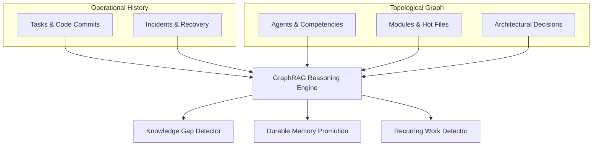

# KNOWLEDGE INTELLIGENCE, KNOWLEDGE GAPS & LESSONS LEARNED — KDI AI OFFICE

```text
===================================================================
KDI AI OFFICE — PHASE 13
DOMAIN: GRAPHRAG KNOWLEDGE TOPOLOGY, GAP DETECTION & MEMORY PROMOTION
STATUS: COMPLETE & PRODUCTION VERIFIED
INFRASTRUCTURE: POSTGRESQL (RECORDS) + NEO4J (RELATIONSHIPS)
===================================================================
```

---

## 1. Domain Architecture: GraphRAG + Relational Memory

The **Knowledge Intelligence Model** enables KDI AI Office to know what it knows—and what it does not know. 

Rather than relying on isolated document lookups, the system correlates four layers of organizational intelligence:
1. **Execution History:** PostgreSQL tasks, logs, errors, and test receipts.
2. **Topological Graph:** Neo4j knowledge nodes (`Agent`, `Project`, `Module`, `Decision`, `Incident`, `Runbook`).
3. **GraphRAG Semantic Retrieval:** Multi-hop path traversals connecting incidents to the code artifacts and agents that resolved them.
4. **Durable Organizational Memory:** Validated post-mortem lessons and promoted architectural patterns.



---

## 2. GraphRAG Knowledge Queries

The system answers complex organizational provenance questions:

- **"Which agent knows this system best?"**
  - Graph traversal calculates edge density between `Agent` and `Module` weighted by successful commits, verified test runs, and low rework rates.
- **"Which projects depend on this architecture?"**
  - Traverses `(Project)-[:USES_ARCHITECTURE]->(ArchNode)`.
- **"What previous incidents relate to connection pool timeouts?"**
  - GraphRAG retrieves clusters of past incidents sharing the `DB_POOL_EXHAUSTION` signature and surfaces the specific runbooks used for resolution.
- **"Which files are repeatedly modified (hot files)?"**
  - Identifies files with high churn ($> 10$ commits in 14 days) and assigns senior agents (Farhan, Ahmad) to review refactoring opportunities.

---

## 3. Knowledge Gap Detection Engine

A critical failure mode of standard AI systems is the hallucination of non-existent competencies. KDI AI Office strictly detects **Knowledge Gaps**:

### Detection Heuristics:
1. **Low Documentation Density:** A critical operational module has fewer than 2 documented architectural guides or runbooks.
2. **Zero Recent Successful Verifications:** An area of code has failing tests or has not been successfully verified in $> 60$ days.
3. **Siloed Domain Knowledge:** Only a single agent has touched a critical component (e.g., only Ahmad understands high-concurrency PostgreSQL locking).

### Gap Detection Example:
```json
{
  "gapId": "GAP-2026-10-001",
  "domain": "PostgreSQL High-Concurrency Connection Pooling",
  "severity": "HIGH",
  "evidence": {
    "relatedDocumentsCount": 1,
    "previousExecutionsCount": 2,
    "recentSuccessfulVerifications": 0,
    "owningAgents": ["Ahmad"]
  },
  "recommendedAction": "CREATE_RESEARCH_OBJECTIVE",
  "suggestedObjective": "Author comprehensive runbook and automated load testing benchmark for PgBouncer connection tuning."
}
```

---

## 4. Durable Memory Promotion & Provenance

When an architectural decision, incident resolution, or performance milestone is validated, it is promoted into durable organizational memory:

### Promotion Safeguards:
- **No Blind Ingestion:** Only actions with verified test receipts, code diffs, and signed-off reviews can be promoted.
- **Metadata Enforced:** Every memory node requires `sourceReference`, `confidenceScore`, `timestamp`, `scope`, and `visibilityTier`.

---

## 5. Lessons-Learned Framework

Following the completion of complex or high-risk initiatives, the `LessonsLearnedService` captures structured post-mortems structured into four epistemological categories:

| Category | Definition | Example |
|---|---|---|
| **`FACT`** | Objective, indisputable data points from execution telemetry | "API latency dropped from 850ms to 42ms following index addition on `users.tenant_id`." |
| **`OBSERVATION`** | Contextual pattern noted during the runtime lifecycle | "Worker thread memory rose steadily during large CSV exports." |
| **`HYPOTHESIS`** | Plausible causal inference requiring experimental verification | "Garbage collection pauses are causing transient Redis ping dropouts." |
| **`RECOMMENDATION`** | Actionable directive for future engineering or policy | "Always use streaming chunk processing for reports exceeding 10,000 rows." |

---

## 6. Recurring Work & Automation Candidate Detection

The system continuously audits task logs to identify repetitive manual workflows. If a task sequence matches criteria:
- Recurring $\ge 3$ times within 14 days.
- Involves identical steps with low variance in parameters.
- Has a 100% verification pass rate.

The engine generates an **Automation Candidate**:
```text
Automation Candidate Detected:
Name: Automated Weekly PostgreSQL Backup Verification
Frequency: Every Sunday at 02:00 UTC
Confidence: 0.96
Estimated Engineering Savings: 3.5 hours / month
Policy Tier: Level 2 Safe Autonomous Execution
```
