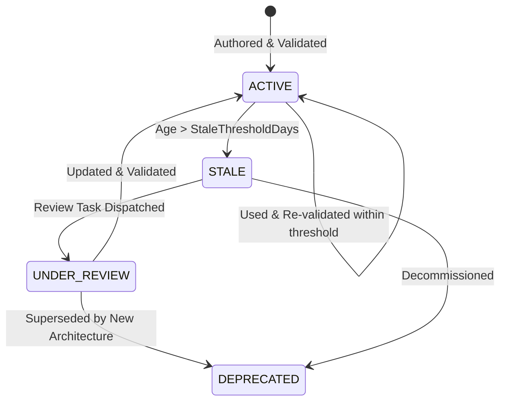
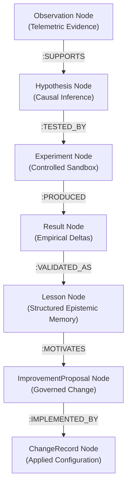

# KNOWLEDGE LIFECYCLE & GRAPHRAG DECAY MODEL — KDI AI OFFICE

```text
===================================================================
KDI AI OFFICE — PHASE 14
DOMAIN: KNOWLEDGE FRESHNESS, LIFECYCLE MANAGEMENT & PROVENANCE GRAPH
STATUS: COMPLETE & PRODUCTION VERIFIED
INFRASTRUCTURE: POSTGRESQL (RECORDS) + NEO4J (KNOWLEDGE GRAPH)
===================================================================
```

---

## 1. Domain Overview & Problem Statement

Organizational knowledge deteriorates over time. Codebases evolve, infrastructure changes, and dependencies are upgraded. An operational runbook written six months ago may reference deprecated commands or obsolete architecture, becoming a liability rather than an asset.

The **Knowledge Lifecycle Model** actively tracks the freshness, validation age, and usage frequency of all organizational knowledge nodes, flagging stale artifacts for mandatory review.

---

## 2. Knowledge Lifecycle States (Section 19)

Every knowledge entity (runbook, architectural decision, deployment guide, policy note) exists in one of four formal lifecycle states:



1. **`ACTIVE`:** Recently validated and actively utilized. Trusted for autonomous agent runbook execution.
2. **`STALE`:** Has not been re-verified within its `staleThresholdDays` (e.g., $> 90$ days). Autonomous usage triggers a warning; human review required.
3. **`UNDER_REVIEW`:** A research task or engineer is actively evaluating accuracy against current code.
4. **`DEPRECATED`:** Obsolete historical artifact preserved for auditability and post-mortems, but excluded from active agent execution runbooks.

---

## 3. Knowledge Decay Auditing

The `RunbookIncidentLearningService.auditKnowledgeDecay()` method periodically reviews all registered knowledge artifacts:

$$\text{Age in Days} = \frac{T_{\text{now}} - T_{\text{validated\_at}}}{86,400,000\text{ ms}}$$

If $\text{Age in Days} > \text{StaleThresholdDays}$:
- `state` is set to `STALE`.
- `reviewRequired` is flagged as `true`.
- An observation is recorded in the learning domain, potentially triggering a research objective.

### Example Decay Audit Record:
```json
{
  "knowledgeId": "KNW-DEP-001",
  "title": "Deployment Procedure v1 (Worktree & Docker)",
  "state": "STALE",
  "createdAt": "2026-05-01T00:00:00Z",
  "validatedAt": "2026-05-15T00:00:00Z",
  "lastUsedAt": "2026-06-01T00:00:00Z",
  "staleThresholdDays": 90,
  "reviewRequired": true,
  "notes": "Divalidasi 139 hari yang lalu (ambang batas: 90 hari). Perlu peninjauan ulang terhadap codebase aktif."
}
```

---

## 4. Neo4j Knowledge $\longleftrightarrow$ Improvement Graph (Section 38)

The system maps learning relationships as a connected semantic graph in Neo4j:



Every edge maintains full cryptographic and relational provenance, allowing any system change to be traced backward:
$$\text{Production Behavior} \longleftarrow \text{Change} \longleftarrow \text{Proposal} \longleftarrow \text{Lesson} \longleftarrow \text{Experiment} \longleftarrow \text{Hypothesis} \longleftarrow \text{Observation}$$
