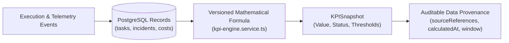

# KPI CATALOG & DATA PROVENANCE SPECIFICATION — KDI AI OFFICE

```text
===================================================================
KDI AI OFFICE — PHASE 13
DOMAIN: ORGANIZATIONAL KPI FRAMEWORK & AUDITABLE DATA PROVENANCE
STATUS: COMPLETE & PRODUCTION VERIFIED
RULE: EVERY KPI MUST DRIVE AN ACTION — ZERO "VANITY METRICS"
===================================================================
```

---

## 1. Framework Architecture & Guiding Philosophy

The **KPI Engine** computes objective, reproducible metrics regarding delivery performance, engineering quality, cost efficiency, and autonomy maturity.

### Core Architectural Rules:
1. **Zero Vanity Metrics:** Every KPI must directly answer an operational decision (e.g., *"Should we pause new feature ingestion?", "Do we need to scale QA concurrency?", "Are autonomous workflows failing silently?"*).
2. **Mathematical Data Provenance:** Every metric value must be traceable down to its underlying PostgreSQL source rows, calculation timestamp, formula version, and evaluation time window.



---

## 2. Core 8 KPI Catalog

### KPI-001: Task Completion Rate
- **Description:** Percentage of initiated engineering and operational tasks completed successfully without timeout or abort.
- **Owner:** `SYSTEM_ARCHITECT`
- **Formula:** $\left( \frac{N_{\text{completed}}}{N_{\text{completed}} + N_{\text{failed}}} \right) \times 100\%$ (Version 1.0.0)
- **Source:** `tasks` table (`status` column)
- **Period / Frequency:** Rolling 7 Days / Calculated Hourly
- **Target & Thresholds:** Target $\ge 92\%$; Warning $< 85\%$; Critical $< 75\%$
- **Operational Decision:** If Critical, trigger automatic throttling of new batch tasks and escalate to Owner.

### KPI-002: Verification Pass Rate
- **Description:** Percentage of tasks passing automated test suites and linting on their first execution run.
- **Owner:** `NADIA` (QA Lead)
- **Formula:** $\left( \frac{N_{\text{first\_pass\_tests}}}{N_{\text{total\_test\_runs}}} \right) \times 100\%$ (Version 1.0.0)
- **Source:** `task_verifications` and Antigravity execution receipts
- **Period / Frequency:** Rolling 7 Days / Calculated Hourly
- **Target & Thresholds:** Target $\ge 90\%$; Warning $< 80\%$; Critical $< 70\%$
- **Operational Decision:** If Warning, force mandatory pre-execution linting and extra agent self-review passes.

### KPI-003: Incident Recovery Time (MTTR)
- **Description:** Mean elapsed time in minutes from incident declaration to verified resolution.
- **Owner:** `ILHAM` (DevOps Lead)
- **Formula:** $\frac{1}{M} \sum_{k=1}^M \left( T_{\text{resolved}}^{(k)} - T_{\text{declared}}^{(k)} \right)$ (Version 1.1.0)
- **Source:** `incidents` table (`declared_at`, `resolved_at`)
- **Period / Frequency:** Rolling 30 Days / Evaluated on incident closure
- **Target & Thresholds:** Target $\le 15.0\text{ min}$; Warning $> 30.0\text{ min}$; Critical $> 60.0\text{ min}$
- **Operational Decision:** If Critical, trigger runbook automation review and alert human owner on Telegram.

### KPI-004: Mean Task Cycle Time
- **Description:** Average active execution duration in minutes per task from dispatch to completion.
- **Owner:** `MANAGER` (AI Coordinator)
- **Formula:** $\frac{1}{N} \sum_{i=1}^N \left( T_{\text{completed}}^{(i)} - T_{\text{active\_start}}^{(i)} \right)$ (Version 1.0.0)
- **Source:** `tasks` table (`started_at`, `completed_at`)
- **Period / Frequency:** Rolling 7 Days / Calculated Daily
- **Target & Thresholds:** Target $\le 25.0\text{ min}$; Warning $> 45.0\text{ min}$; Critical $> 90.0\text{ min}$
- **Operational Decision:** If Warning, decompose tasks into smaller atomic micro-tasks.

### KPI-005: Rework Rate
- **Description:** Percentage of completed tasks requiring subsequent regression fixes, bug patches, or rollbacks within 72 hours.
- **Owner:** `SYSTEM_ARCHITECT`
- **Formula:** $\left( \frac{N_{\text{rework\_tasks}}}{N_{\text{completed\_tasks}}} \right) \times 100\%$ (Version 1.0.0)
- **Source:** `task_relations` (edges with type `FIXES_REGRESSION_OF`)
- **Period / Frequency:** Rolling 14 Days / Calculated Daily
- **Target & Thresholds:** Target $\le 5.0\%$; Warning $> 10.0\%$; Critical $> 20.0\%$
- **Operational Decision:** If Warning, increase Nadia's QA test coverage threshold before worktree commits.

### KPI-006: Autonomy Success Rate
- **Description:** Percentage of autonomous workflows executing to completion without human intervention.
- **Owner:** `SYSTEM_ARCHITECT`
- **Formula:** $\left( \frac{N_{\text{autonomous\_success}}}{N_{\text{autonomous\_attempts}}} \right) \times 100\%$ (Version 1.2.0)
- **Source:** `autonomy_executions` table (`human_intervened` boolean)
- **Period / Frequency:** Rolling 7 Days / Calculated Daily
- **Target & Thresholds:** Target $\ge 88.0\%$; Warning $< 80.0\%$; Critical $< 70.0\%$
- **Operational Decision:** If Critical, activate Global Autonomy Pause and require Owner approval for Level 2/3.

### KPI-007: Human Escalation Rate
- **Description:** Percentage of tasks that trigger human approval requests or incident escalations.
- **Owner:** `OWNER`
- **Formula:** $\left( \frac{N_{\text{human\_escalations}}}{N_{\text{total\_tasks}}} \right) \times 100\%$ (Version 1.0.0)
- **Source:** `approvals` and `escalations` logs
- **Period / Frequency:** Rolling 7 Days / Calculated Daily
- **Target & Thresholds:** Target $5.0\% - 15.0\%$; Warning $> 25.0\%$; Critical $> 40.0\%$
- **Operational Decision:** If $> 25\%$, review permission rules to identify repetitive low-risk operations for safe automation.

### KPI-008: AI Cost per Completed Task
- **Description:** Average financial expenditure (LLM tokens + tool executions + compute) per completed task.
- **Owner:** `ILHAM` (FinOps & Infrastructure)
- **Formula:** $\frac{\sum \text{Total Cost (IDR)}}{\text{Completed Tasks}}$ (Version 1.0.0)
- **Source:** `cost_ledger` and `model_invocations` table
- **Period / Frequency:** Rolling 7 Days / Calculated Daily
- **Target & Thresholds:** Target $\le \text{IDR } 4,500$; Warning $> \text{IDR } 7,500$; Critical $> \text{IDR } 15,000$
- **Operational Decision:** If Warning, route standard code reviews to local Ollama / Gemini Flash models.

---

## 3. Data Provenance Record Schema

Every KPI calculation produces an immutable record with verifiable provenance:

```json
{
  "kpiId": "KPI-001",
  "kpiName": "Task Completion Rate",
  "value": 94.2,
  "unit": "%",
  "status": "HEALTHY",
  "thresholds": { "target": 92.0, "warning": 85.0, "critical": 75.0 },
  "formulaVersion": "1.0.0",
  "calculatedAt": "2026-10-01T14:00:00Z",
  "dataPeriod": "Rolling 7 Days (2026-09-24T14:00:00Z - 2026-10-01T14:00:00Z)",
  "sourceReferences": [
    "pg://tasks?status=COMPLETED&window=7d",
    "pg://tasks?status=FAILED&window=7d"
  ]
}
```
