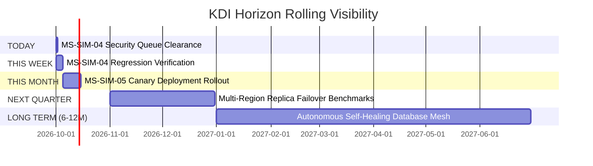

# LONG-HORIZON PLAN MODEL & HORIZON MONITOR

## 1. Durable Plan Representation

A **Long-Horizon Plan** is a durable, structured representation of how a Strategic Objective will be achieved over time. Unlike fragile in-memory task lists, plans persist across days and system reboots.

```typescript
export interface LongHorizonPlan {
  id: string;                      // e.g. "OBJ-SIMMACI-REL-PLAN-V3"
  objectiveId: string;             // References StrategicObjective
  programId: string;               // References StrategicProgram
  version: number;                 // Plan revision integer (1, 2, 3...)
  title: string;                   // Plan name
  milestones: StrategicMilestone[];// Ordered milestones
  status: 'ACTIVE' | 'SUPERSEDED' | 'ARCHIVED';
  createdAt: string;               // ISO timestamp
  approvedBy: string;              // "Owner / Chief Architect"
  changeReason?: string;           // Rationale for revision
}
```

---

## 2. Dynamic Plan Generation

Plans are not static waterfall documents. As milestones execute, the plan dynamically generates:
- Specific implementation initiatives
- Engineering tasks assigned to specialized agents (Farhan, Rian, Ahmad)
- Automated verification pipelines
- Checkpoint reviews

---

## 3. Horizon Monitor

The Horizon Monitor provides rolling operational visibility across 5 continuous time slices, answering the question:
> **"Apa yang sedang dilakukan KDI sekarang untuk mencapai tujuan tiga bulan ke depan?"**



| Horizon | Primary Focus | Current Deliverable |
| :--- | :--- | :--- |
| **TODAY** | Active Execution | OWASP static analysis remediation report & pool test runner |
| **THIS WEEK** | Near-term Sprint | QA verification queue clearance & auto-recovery validation |
| **THIS MONTH** | Month Checkpoint | Zero-outage production canary deployment sign-off |
| **NEXT QUARTER** | Medium-term Expansion | Multi-region replica failover sync (RTO $< 10$s) |
| **LONG-TERM** | 6–12+ Months | Autonomous AI-driven self-healing database mesh |
