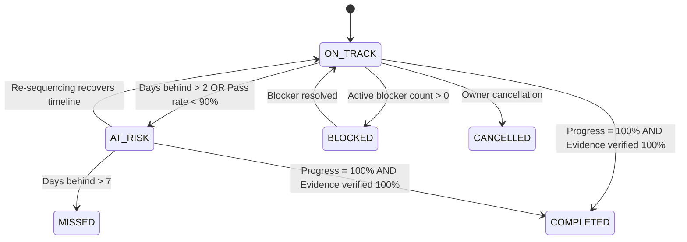

# STRATEGIC MILESTONE MODEL & EVIDENCE DERIVATION

## 1. Domain Specification

A **Strategic Milestone** is a measurable, time-bounded condition representing significant progress toward completing a Program. Vague goals like *"Make system better"* are strictly prohibited.

```typescript
export interface StrategicMilestone {
  id: string;                      // e.g. "MS-SIM-04"
  programId: string;               // References StrategicProgram
  projectId?: string;              // Optional specific project binding
  name: string;                    // "QA Verification & Automated Security Review"
  description: string;             // Concrete milestone scope
  targetDate: string;              // ISO date
  actualCompletionDate?: string;   // Set only upon verified completion
  successCriteria: string[];       // Measurable criteria
  dependencies: string[];          // Prior milestone IDs (e.g. ["MS-SIM-03"])
  status: MilestoneStatus;         // ON_TRACK | AT_RISK | BLOCKED | MISSED | COMPLETED | CANCELLED
  risk: RiskLevel;                 // LOW | MEDIUM | HIGH | CRITICAL
  evidenceRequirements: string[];  // e.g. ["Test report artifact", "Security audit scan"]
  progressPercent: number;         // 0 to 100
}
```

---

## 2. Milestone State Machine & Deterministic Health Derivation

Milestone health is **never** determined by subjective LLM narrative. It is computed deterministically from operational telemetry and verified evidence thresholds:



### Quantitative Health Evaluation Matrix:

| Condition / Signal | Resulting Status | Required System Action |
| :--- | :--- | :--- |
| `actualProgressPercent == 100` && `testPassRatePercent == 100` | `COMPLETED` | Log completion date & verify cryptographic evidence |
| `blockerCount > 0` | `BLOCKED` | Emit High-Severity Early Warning & analyze cascade |
| `daysBehindBaseline > 7` | `MISSED` | Trigger Strategic Replanning Engine |
| `daysBehindBaseline > 2` \|\| `testPassRate < 90%` | `AT_RISK` | Emit Warning Alert (e.g. MS-SIM-04 delayed 4 days) |
| Otherwise | `ON_TRACK` | Continue standard execution |

---

## 3. Evidence Requirements

Every milestone completion requires cryptographic artifacts stored in PostgreSQL:
1. **Automated Test Report:** E2E, integration, or fuzz test JSON execution logs.
2. **Security Static Scan:** SAST / OWASP zero critical vulnerability sign-off.
3. **Telemetry Assertion:** Benchmark metrics (e.g., connection pool latency $< 100$ms, zero drops).
4. **Peer Sign-off:** Verification signature by designated agent (e.g. Farhan, Chief AI Architect).
