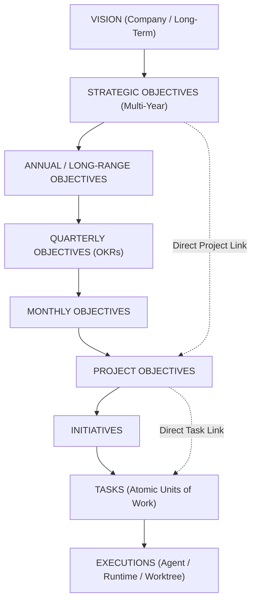
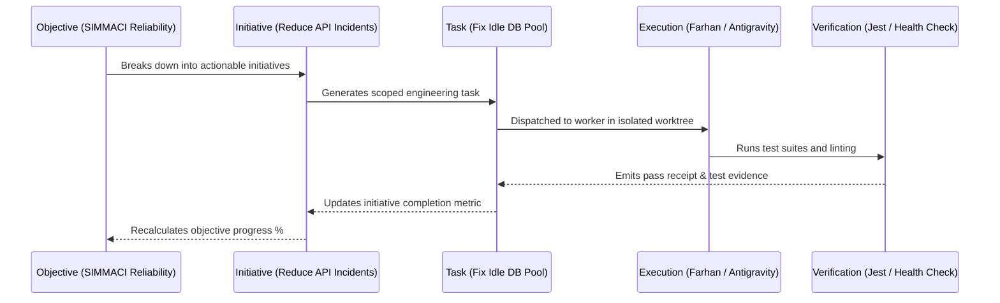

# OBJECTIVE DOMAIN MODEL & TASK TRACEABILITY — KDI AI OFFICE

```text
===================================================================
KDI AI OFFICE — PHASE 13
DOMAIN: OBJECTIVES, INITIATIVES, AND TASK TRACEABILITY
STATUS: COMPLETE & PRODUCTION VERIFIED
STORAGE: POSTGRESQL (AUTHORITATIVE) + NEO4J (TRACEABILITY GRAPH)
===================================================================
```

---

## 1. Domain Overview

The **Objective Model** establishes a structured, hierarchical purpose framework across all projects within KDI AI Office. In earlier phases, tasks were executed based solely on incoming prompts or triggers without structural awareness of broader organizational goals. Phase 13 introduces first-class **Objectives** and **Initiatives**, allowing every engineering, security, and operational action to be mapped directly to an explicit business or technical goal.

---

## 2. Flexible Organizational Hierarchy

The system supports a multi-tier hierarchy with flexible depth. Not all tiers are required for every initiative, but all work connects upwards toward strategic vision:



---

## 3. Objective Entity Schema

The `OrgObjective` entity contains the following attributes, stored authoritatively in PostgreSQL:

| Attribute | Type | Description | Example |
| :--- | :--- | :--- | :--- |
| `id` | `string` | Unique objective identifier | `OBJ-STRAT-001` |
| `name` | `string` | Human-readable title | `SIMMACI Core Reliability & Zero Outage` |
| `description` | `string` | Detailed mission and operational rationale | `Eliminate idle connection timeout errors and ensure 99.9% uptime` |
| `owner` | `string` | Responsible role or persona | `SYSTEM_ARCHITECT` / `FARHAN` |
| `parentObjectiveId`| `string?` | Optional parent objective for nesting | `OBJ-VISION-001` |
| `hierarchyLevel` | `enum` | Level in organizational hierarchy | `PROJECT` / `STRATEGIC` |
| `type` | `enum` | Category of objective | `ENGINEERING`, `SECURITY`, `PRODUCT`, `RESEARCH` |
| `priority` | `enum` | Importance tier | `CRITICAL`, `HIGH`, `MEDIUM`, `LOW` |
| `status` | `enum` | Real-time lifecycle state | `PLANNED`, `IN_PROGRESS`, `AT_RISK`, `COMPLETED` |
| `startDate` | `string` | ISO 8601 start timestamp | `2026-09-01T00:00:00Z` |
| `targetDate` | `string` | Target completion timestamp | `2026-10-31T23:59:59Z` |
| `successCriteria` | `string[]`| Quantifiable verification milestones | `["API latency < 100ms", "Zero DB pool exhaustions"]` |
| `measurementMethod`| `string` | Specific measurement tool / mechanism | `Prometheus MTTR & Automated Load Testing` |
| `riskLevel` | `enum` | Risk exposure | `LOW`, `MEDIUM`, `HIGH`, `CRITICAL` |
| `progressPercentage`| `number` | Calculated progress (0 - 100) | `85` |
| `createdAt` | `string` | Creation timestamp | `2026-09-01T08:00:00Z` |
| `updatedAt` | `string` | Last modification timestamp | `2026-10-01T12:00:00Z` |

---

## 4. Objective Types Catalog

1. **`STRATEGIC`**: Organization-wide multi-project objectives governed by the human owner.
2. **`PRODUCT`**: Feature delivery, user experience enhancements, and public portfolio initiatives.
3. **`ENGINEERING`**: Core platform architecture, database tuning, refactoring, and CI/CD pipelines.
4. **`OPERATIONAL`**: Runbook automation, backup verification, and telemetry maintenance.
5. **`SECURITY`**: Vulnerability remediation, zero-leakage enforcement, and cryptographic validation.
6. **`RESEARCH`**: Technology evaluation, GraphRAG experiments, and model benchmarking.
7. **`BUSINESS`**: Client deliverables, SLA tracking, and partner integrations.
8. **`PERSONAL_OWNER`**: Private directives, owner priority tasks, and executive workflows.

---

## 5. Bidirectional Objective $\longleftrightarrow$ Task Traceability

Every task processed by KDI AI Office maintains a cryptographic and relational link to its governing initiative and objective.



### Traceability Inspection Example
When the Orchestrator or Owner queries:
> *"What objective does task `tsk_simmaci_fix_001` contribute to?"*

The system returns:
```json
{
  "taskId": "tsk_simmaci_fix_001",
  "taskTitle": "Fix idle DB connection pool timeout handling",
  "taskStatus": "COMPLETED",
  "initiative": {
    "id": "INIT-SIM-001",
    "name": "SIMMACI Connection Resiliency"
  },
  "objective": {
    "id": "OBJ-STRAT-001",
    "name": "SIMMACI Core Reliability & Zero Outage",
    "type": "ENGINEERING",
    "status": "IN_PROGRESS",
    "progressPercentage": 85
  },
  "traceChain": [
    "Task: Fix idle DB connection pool timeout handling",
    "Initiative: SIMMACI Connection Resiliency",
    "Objective: SIMMACI Core Reliability & Zero Outage",
    "Vision: High-Reliability AI Office & Digital Twin"
  ]
}
```

---

## 6. At-Risk Objective Detection

The `ObjectiveService` periodically audits target completion dates against real-time progress percentages and blocked task counts:
- An objective is flagged as **`AT_RISK`** if:
  1. Remaining calendar duration is $< 25\%$ while progress is $< 60\%$.
  2. One or more critical path tasks are `BLOCKED` by external or dependency constraints.
  3. The objective has a critical risk level and unresolved incident associations.
- At-risk objectives are elevated into the executive daily briefing and Telegram `/briefing` summaries.
