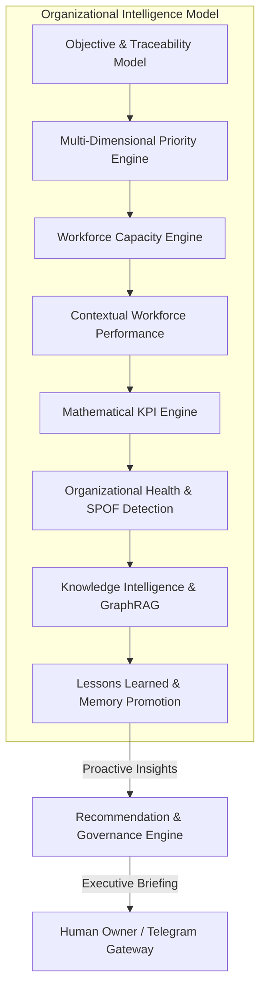

# ORGANIZATIONAL INTELLIGENCE MODEL — KDI AI OFFICE

```text
===================================================================
KDI AI OFFICE — PHASE 13
DOMAIN: ORGANIZATIONAL INTELLIGENCE FOUNDATION & FEEDBACK CYCLES
STATUS: COMPLETE & PRODUCTION VERIFIED
AUTHORITY: DETERMINISTIC OPERATIONAL TRUTH (POSTGRESQL + NEO4J)
===================================================================
```

---

## 1. Executive Summary & Purpose

The **Organizational Intelligence Model** serves as the systemic cognitive core of KDI AI Office. It transitions the platform from a reactive task-execution pipeline into an introspective, self-evaluating organizational entity.

Rather than operating on isolated directives, the Organizational Intelligence Layer closes the operational feedback loop:

$$\text{Vision} \longrightarrow \text{Objectives} \longrightarrow \text{Priorities} \longrightarrow \text{Capacity} \longrightarrow \text{Workforce} \longrightarrow \text{Execution} \longrightarrow \text{Verification} \longrightarrow \text{Measurement} \longrightarrow \text{Knowledge} \longrightarrow \text{Lessons} \longrightarrow \text{Recommendations} \longrightarrow \text{Owner Action}$$

---

## 2. Core Architectural Principles

1. **Deterministic State vs. Generative Explanation:**
   - Operational truth (tasks, states, capacity, metrics, costs) resides strictly in PostgreSQL and is never hallucinated or calculated by an LLM.
   - LLMs are utilized solely for synthesis, summarization, hypothesis generation, and natural-language formatting.
2. **Contextual Evaluation Over Gamification:**
   - Performance indicators are strictly contextualized by task complexity, risk tier, blocking dependencies, and available tooling.
   - Arbitrary rankings, raw task counts, and game-like "scores" are forbidden.
3. **Evidence-Driven Proactive Recommendations:**
   - Recommendations must provide empirical observations, verifiable data references, calculated impact, confidence scores, and proposed actions.
   - Recommendations never execute high-risk actions without explicit sovereign human consent.
4. **Sovereign Human Final Authority:**
   - Strategic objectives, high-risk production deployments, budgetary constraints, and autonomy boundaries are strictly governed by the human owner.

---

## 3. Structural Domains of the Organizational Intelligence Model

The model comprises eight cohesive, interconnected subsystems:



### 3.1 Objective & Traceability Model
- **Hierarchy:** `VISION` $\rightarrow$ `STRATEGIC` $\rightarrow$ `ANNUAL` $\rightarrow$ `QUARTERLY` $\rightarrow$ `MONTHLY` $\rightarrow$ `PROJECT` $\rightarrow$ `INITIATIVE` $\rightarrow$ `TASK` $\rightarrow$ `EXECUTION`.
- **Bidirectional Traceability:** Any running or completed task answers *"Which higher-level strategic objective does this effort serve?"*, while any objective surfaces its real-time progress, health, and associated active/blocked tasks.

### 3.2 Priority Engine & Conflict Resolution
- Evaluates 10 weighted operational dimensions: Strategic Alignment, Production Impact, Security Relevance, Risk Level, Dependency Blocking, Blocking Incoming Tasks, Deadline Urgency, Business Impact, Reversibility, and Estimated Effort.
- Detects resource contention, deadline collisions, dependency deadlocks, and priority inversions, generating deterministic execution sequences ($A \rightarrow B \rightarrow C$).

### 3.3 Workforce Capacity Engine
- Tracks concurrency limits, assigned loads, active execution, blocked states, and utilization percentages across the 9 agents.
- Identifies overloaded agents (e.g., Farhan at 125%, Nadia at 120%) and underutilized agents (e.g., Tari at 20%), pinpointing capacity bottlenecks preventing task progress.

### 3.4 Workforce Performance Model
- Evaluates completion reliability, verification pass rate, average cycle time, rework frequency, virtual cost efficiency, and human escalation rates.
- Breaks down effort across Simple, Moderate, and Complex task distributions.

### 3.5 KPI Engine with Provenance
- Calculates 8 standardized operational KPIs.
- Every metric records formula version, calculation timestamp, data period, and specific PostgreSQL record IDs.

### 3.6 Organizational Health & Bottleneck Detection
- Assesses 6 independent health dimensions (Delivery, Reliability, Security, Workforce, Cost, Objective) without collapsing into an opaque single score.
- Identifies critical organizational bottlenecks (e.g., QA verification queues) and Single Points of Failure (SPOF) across agents, providers, infrastructure, and human approval gates.

### 3.7 Knowledge Intelligence & GraphRAG
- Links execution history with code artifacts and domain entities in Neo4j.
- Detects knowledge gaps (e.g., missing deployment guides or single-agent domain silos) and triggers research initiatives.

### 3.8 Organizational Memory & Lessons Learned
- Summarizes post-work observations categorized into Facts, Observations, Hypotheses, and Recommendations.
- Promotes recurring manual tasks into automation candidates and preserves runbooks with confidence levels and source provenance.

---

## 4. Operational Feedback Cycles

### Daily Operational Cycle
1. Capacity Engine checks agent workloads at start of day.
2. Priority Engine recalculates sequence based on unblocked dependencies.
3. Health Engine verifies security guardrails, MTTR, and pipeline health.
4. Telegram Gateway provides real-time status and alerts.

### Weekly Strategic & Improvement Cycle
1. KPI Engine computes weekly rolling snapshots.
2. Bottleneck Detector highlights recurring queues and capacity constraints.
3. Lessons-Learned Engine distills post-task reviews into memory nodes.
4. Recommendation Engine proposes automation candidates, QA reassignments, or knowledge updates to the Owner.

---

## 5. Security & Privacy Guardrails

- Internal performance, costs, and workload matrices are masked from public APIs (Phase 7 Portfolio).
- Telegram alerts and command outputs undergo strict credential and secret redaction (`SecretSanitizer`).
- Zero AI self-modification: Agents cannot adjust their own autonomy levels, budget limits, or KPI targets.
