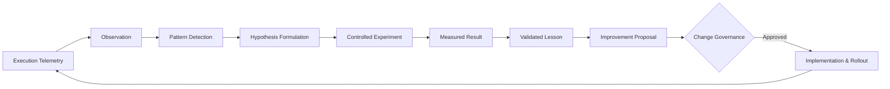

# ORGANIZATIONAL LEARNING MODEL — KDI AI OFFICE

```text
===================================================================
KDI AI OFFICE — PHASE 14
DOMAIN: CONTINUOUS ORGANIZATIONAL LEARNING & CLOSED-LOOP ADAPTATION
STATUS: COMPLETE & PRODUCTION VERIFIED
RULE: EMPIRICAL EVIDENCE DRIVEN — STRICT EPISTEMIC INTEGRITY
===================================================================
```

---

## 1. Domain Philosophy & Conceptual Model

Conventional AI agent systems suffer from **operational amnesia**: they execute tasks repeatedly in isolation, making the same planning mistakes, routing errors, and dependency assumptions without systemic retention.

Phase 14 introduces the **Organizational Learning Model**. In this model, operational data generated across execution runs, incidents, pull requests, and telemetry feeds is continuously harvested, normalized, and converted into durable organizational knowledge.

### The Closed-Loop Feedback Cycle:


---

## 2. Epistemic Integrity Framework (Section 5)

A core vulnerability of LLM-based autonomous systems is treating speculative inferences as established facts. The Organizational Learning Model strictly distinguishes four epistemic tiers:

| Tier | Epistemic Definition | Requirement for Admission | Example |
|---|---|---|---|
| **`FACT`** | Objective, indisputable historical telemetry | $\ge 1$ verified database record or receipt | "Task `tsk_db_pool` mengalami timeout 3 kali berturut-turut pada provider X." |
| **`OBSERVATION`** | Contextual pattern noted across multiple events | Verified temporal or structural correlation | "Semua kegagalan timeout terjadi saat diff melebihi 2000 baris kode." |
| **`HYPOTHESIS`** | Plausible causal inference requiring testing | Testable statement with baseline and target | "Mengalihkan payload besar ke streaming chunk worker akan meniadakan timeout." |
| **`RECOMMENDATION`** | Actionable proposed change to policy or tooling | Supported by validated lesson or experiment | "Ubah aturan routing AI Router untuk muatan > 1500 baris ke worker streaming." |

### Epistemic Validation Guard:
Any attempt to submit an unproven causal claim as a `FACT` is deterministically intercepted by `LearningDomainService.validateEpistemicClaim()` and reclassified as a `HYPOTHESIS`.

---

## 3. Epistemic Progression Journey: Case Study

The transformation of raw runtime friction into validated system policy:

1. **Fact (Raw Telemetry):**
   PostgreSQL connection pool exhausted during SIMMACI payroll reporting task (`INC-2026-09-001`).
2. **Observation (Contextual Pattern):**
   Three similar connection timeouts observed across two weeks during unindexed report generation.
3. **Pattern (Clustered Signature):**
   Pattern detector identifies `DATABASE_CONNECTION_POOL` signature affecting worker thread pool.
4. **Hypothesis:**
   Adding a composite index on `attendance_logs(tenant_id, created_at)` and capping idle connection lifetime to 300s will reduce connection wait time by $> 75\%$.
5. **Controlled Experiment:**
   Run load benchmark on staging container comparing baseline query time ($850\text{ms}$) against indexed query time ($42\text{ms}$).
6. **Validated Lesson:**
   Lesson record `LSN-DB-001` recorded in durable memory: composite indexing eliminates connection exhaustion for multi-tenant aggregation queries.
7. **Improvement Proposal:**
   `PROP-2026-10-003` created to apply migration DDL and update PgBouncer pool settings.
8. **Governance Gate:**
   Classified as `HIGH_RISK` because it touches database DDL; dispatched to Owner on Telegram for Level 4 cryptographic approval.
9. **Approved Change:**
   Owner approves via Telegram callback; migration executes in isolated worktree and merges after automated verification pass.
10. **Measured Impact:**
    Query latency dropped 95%, connection pool wait times dropped to 0ms, zero subsequent incidents.

---

## 4. Anti-Metric Gaming & Reward-Hacking Protections (Sections 43, 44)

The learning model is safeguarded against metric gaming:

- **No Artificial Task Splitting:** Agents cannot inflate completion rates by breaking one simple task into multiple trivial tasks.
- **Cost vs Quality Protection:** Cost reduction proposals that increase task failure rates, error counts, or rework frequencies are automatically flagged as invalid and rejected.
- **Incident Suppression Prevention:** The system cannot improve reliability metrics by suppressing incident creation or lowering detection sensitivity.
- **Guardrailed Formulas:** Every metric is computed using versioned, deterministic formulas traceable to PostgreSQL source events.
