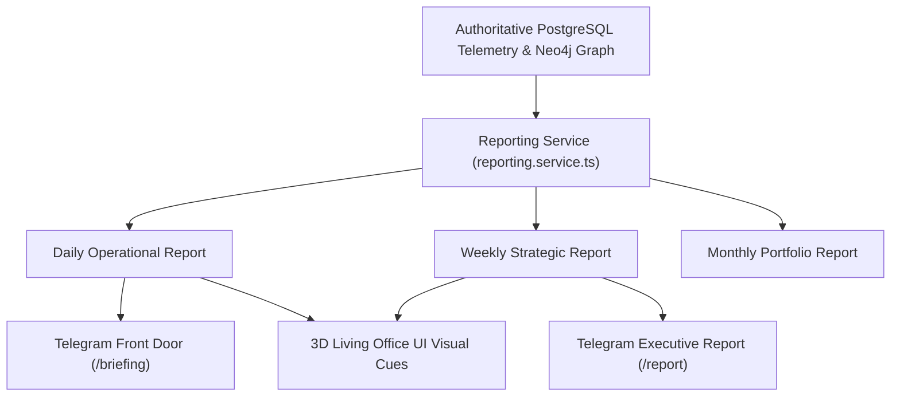
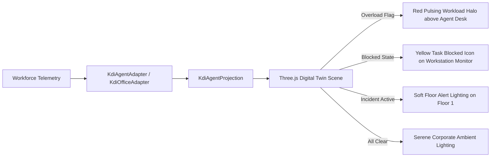

# ORGANIZATIONAL REPORTING, TELEGRAM & OFFICE UI INTEGRATION — KDI AI OFFICE

```text
===================================================================
KDI AI OFFICE — PHASE 13
DOMAIN: STRUCTURED EXECUTIVE REPORTING & MULTI-CHANNEL PRESENTATION
STATUS: COMPLETE & PRODUCTION VERIFIED
CHANNELS: TELEGRAM GATEWAY + 3D LIVING DIGITAL TWIN + REST APIS
===================================================================
```

---

## 1. Reporting Philosophy: Concise, Actionable, Layered

Organizational intelligence is only as valuable as its accessibility to human decision-makers. The **Reporting System** delivers layered summaries customized to cadence and channel:
1. **Daily Operational Briefing:** Immediate tactical status (completed, active, blocked, incidents, approvals, capacity bottlenecks).
2. **Weekly Strategic Review:** Trend analytics (delivery throughput, objective trajectory, cost consumption, quality signals, promoted lessons, and actionable recommendations).
3. **Monthly Executive Portfolio:** High-level strategic health, portfolio asset valuations, capacity forecasts, and risk trends.

---

## 2. Report Formats & Data Content



### 2.1 Daily Operational Report Structure
- **Execution Delivery:** Total completed tasks (last 24h), active concurrent tasks, and blocked task count.
- **Incident Summary:** Active incidents, severity levels, and current containment status.
- **Pending Governance:** Awaiting Level-4 human cryptographic approvals.
- **System Health:** Aggregate operational state (`HEALTHY`, `ATTENTION_NEEDED`, `CRITICAL`).
- **Priority Adjustments:** Tasks promoted or reprioritized based on dependency unlocks.

### 2.2 Weekly Strategic Report Structure
- **Delivery Throughput:** Weekly completed tasks, mean cycle time, and verification pass rate.
- **Objective Progress:** Status of high-level objectives (`SIMMACI Reliability`, `Koneksi Santri Core`, etc.).
- **Workforce Health & Load:** Overloaded agents, underutilized specialists, and systemic bottlenecks.
- **Quality & Rework:** Regression incidents and code rework percentages.
- **FinOps & Cost:** Total model token and compute spend across active projects.
- **Validated Lessons:** Promoted runbooks and organizational memory additions.
- **Proactive Recommendations:** Prioritized actions requiring Owner attention.

### 2.3 Monthly Executive Portfolio Structure
- **Strategic Trajectory:** Quarterly and annual objective milestones achieved.
- **Portfolio Resource Consumption:** FTE equivalents and virtual workforce allocation by project.
- **Long-Term Risk Radar:** Technical debt accumulation, dependency vulnerabilities, and model provider single points of failure.

---

## 3. Telegram Front Door Executive Integration

The Telegram interface serves as the primary conversational command center for the human owner. All queries are parsed and answered using empirical state, never LLM hallucinations:

### Supported Natural-Language Queries & Slash Commands

| Owner Input / Command | Orchestrator Routing | Real-Time Formatted Response |
|---|---|---|
| `/briefing` or *"Bagaimana kondisi organisasi KDI sekarang?"* | `getOrganizationalBriefing()` | Comprehensive briefing (Delivery, Capacity, Bottleneck, Objective, Risk, Knowledge, Recommendation). |
| `/report` or *"Buatkan weekly report."* | `getWeeklyReport()` | Formatted weekly executive review with throughput, objectives, and cost breakdown. |
| *"Apa yang paling menghambat pekerjaan?"* | `detectBottlenecks()` | "Hambatan utama adalah antrean QA verification (5 task menunggu, 1 QA agent aktif)." |
| *"Siapa yang overloaded?"* | `getCapacityOverview()` | "Farhan (125% kapasitas) dan Nadia (120% kapasitas) saat ini mengalami kelebihan beban." |
| *"Project mana yang paling banyak memakai resource?"* | `getPortfolioOverview()` | "SIMMACI mengonsumsi 52% total komputasi dan 8 slot agen minggu ini." |
| *"Apa objective yang tertinggal?"* | `getAtRiskObjectives()` | "Objective 'Experimental Microservice Migration' tertinggal pada progres 35%." |
| *"Apa rekomendasi KDI hari ini?"* | `getProactiveRecommendations()` | Prioritized list of recommendations with evidence and impact. |

---

## 4. 3D Office Digital Twin Visual Integration

The 3D Living Digital Twin visualizes organizational intelligence organically without transforming the office into a cluttered dashboard:



### Visual Adaptation Rules:
1. **Agent Overload:** If `isOverloaded === true` ($U_{agent} > 100\%$), a subtle glowing workload indicator appears above the agent's desk avatar.
2. **Task Blocked:** When a task is blocked on external dependencies, the associated agent's workstation terminal renders a yellow paused glyph.
3. **Living Workspace Integrity:** Ambient status particles and desk occupancy reflect actual active execution threads, maintaining an immersive visual workspace.
