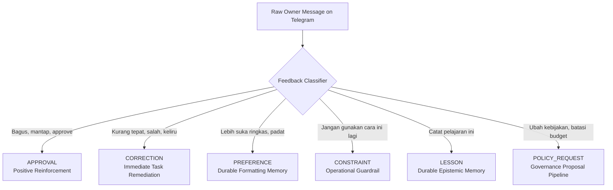

# OWNER FEEDBACK & PREFERENCE MEMORY MODEL — KDI AI OFFICE

```text
===================================================================
KDI AI OFFICE — PHASE 14
DOMAIN: HUMAN-IN-THE-LOOP FEEDBACK INGESTION & DURABLE PREFERENCE MEMORY
STATUS: COMPLETE & PRODUCTION VERIFIED
SOURCES: TELEGRAM WEBHOOK UPDATES & ORCHESTRATOR CHAT SESSIONS
===================================================================
```

---

## 1. Domain Philosophy & Overview

In an AI organization governed by human sovereign authority, **Owner feedback is the highest-value learning signal**. 

However, naive systems fail in two opposing ways:
1. They ignore Owner commentary, making the same behavioral errors repeatedly.
2. They treat every off-hand remark as permanent, brittle system policy, causing chaotic behavioral drift.

The **Owner Feedback Model** normalizes incoming natural-language feedback from Telegram into explicit classifications, extracting durable preferences without confusing casual observations with permanent policy changes.

---

## 2. Feedback Classification Taxonomy (Section 30)

When the Owner interacts with KDI Orchestrator on Telegram, messages are analyzed for feedback intent:



| Classification | Meaning & Scope | System Action Taken |
|---|---|---|
| **`APPROVAL`** | Validation of output, decision, or plan | Logs positive reinforcement receipt; increments confidence score |
| **`CORRECTION`** | Factual or algorithmic error in active task | Corrects active execution; generates retrospective friction log |
| **`PREFERENCE`** | Stylistic, format, or cadence preference | Stores into `OwnerPreference` memory; applies to future reports |
| **`CONSTRAINT`** | Explicit negative boundary or prohibited action | Disables specified tool, agent, or pattern for the target workload |
| **`LESSON`** | Strategic observation from Owner's experience | Promotes directly into structured organizational memory (`StructuredLesson`) |
| **`POLICY_REQUEST`** | Directive to alter risk tiers or budget | Formulates formal `ImprovementProposal` requiring explicit confirmation |

---

## 3. Owner Preference Memory (Section 31)

Durable preferences are stored distinctly from organizational facts:

```json
{
  "id": "PREF-REPORT_VERBOSITY",
  "key": "REPORT_VERBOSITY",
  "preference": "Owner prefers concise, bulleted executive reports with explicit evidence.",
  "scope": "Telegram Daily Briefing & Learning Reports",
  "confidence": 1.0,
  "source": "Initial Sovereign Directive",
  "status": "ACTIVE",
  "recordedAt": "2026-10-01T08:00:00Z"
}
```

### Preference Isolation Rules:
- Preferences never alter security boundaries, RBAC permissions, or cryptographic approval gates.
- Preferences are scoped (e.g., `Telegram Reports` vs `Antigravity Code Generation`).
- Preferences can be inspected, updated, or revoked by the Owner at any time.
