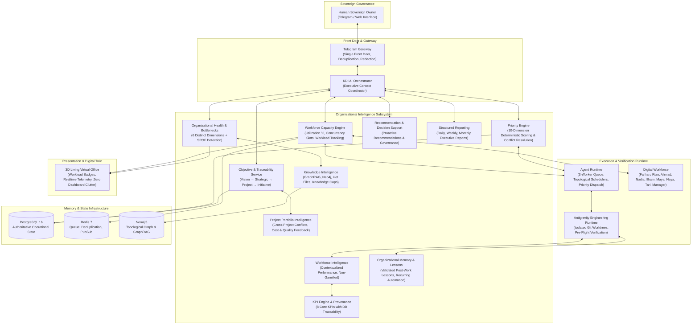

# PHASE 13 ARCHITECTURE — AI WORKFORCE MATURITY & ORGANIZATIONAL INTELLIGENCE

```text
===================================================================
KDI AI OFFICE — PHASE 13 SYSTEM ARCHITECTURE
TRANSFORMATION: FROM "AI TASK EXECUTOR" TO "AI SELF-AWARE ORGANIZATION"
STATUS: COMPLETE & PRODUCTION VERIFIED
TOTAL PASSING MONOREPO TESTS: 376 (238 API/BACKEND + 138 WEB/FRONTEND)
===================================================================
```

---

## 1. Executive Summary & Core Principle

Phase 13 elevates KDI AI Office from an AI system that merely receives and runs tasks into an **autonomous AI organization** that understands:

$$\text{Vision} \longrightarrow \text{Objectives} \longrightarrow \text{Priorities} \longrightarrow \text{Capacity} \longrightarrow \text{Workforce} \longrightarrow \text{Execution} \longrightarrow \text{Measurement} \longrightarrow \text{Knowledge} \longrightarrow \text{Lessons} \longrightarrow \text{Recommendations} \longrightarrow \text{Action}$$

Instead of merely asking *"What task should be executed?"*, KDI AI Office now understands:
> *"Why this work matters, what its multi-dimensional priority is, who is best equipped to execute it, whether workforce capacity exists, what systemic bottlenecks and dependencies exist, how results are mathematically evaluated, and whether organizational course correction is warranted."*

---

## 2. Complete End-to-End Operational Architecture



---

## 3. Preservation of Existing Capabilities (Phases 0–12)

Phase 13 strictly preserves and builds upon all pre-existing subsystems without duplication:
- **Telegram Gateway (Phase 11):** Continues as the single front door for Owner control with zero-trust allowlisting and HMAC secret verification.
- **Agent Runtime & Task State Machine (Phase 2):** Preserved as the deterministic 3-worker task scheduler.
- **MetaGPT SOP Decomposition (Phase 3):** Preserved for breaking high-level requests into structured DAGs.
- **Antigravity Isolated Git Worktrees (Phase 4):** Preserved for isolated code edits, regression runs, and clean rollbacks.
- **Autonomy Engine & Policy Gates (Phase 9):** Preserved with Level 1–4 boundaries, immutable budget caps, and cryptographic Owner approvals.
- **GraphRAG Subgraph Engine (Phase 6):** Preserved for token-budgeted context retrieval with citation provenance.
- **Living 3D Digital Twin (Phases 1, 5, 10):** Preserved, enhanced with contextual workload and blocked status badges.

---

## 4. Subsystem Interaction Matrix

| Subsystem | Input Source | Process / Logic | Output Target |
| :--- | :--- | :--- | :--- |
| **Objective Service** | Owner directives, project milestones | Hierarchical DAG matching, progress tracking | Priority Engine, Portfolio Intelligence, Telegram |
| **Priority Engine** | Task attributes, deadlines, dependencies | 10-dimension deterministic weighted calculation | Runtime Scheduler, Telegram sequencing |
| **Capacity Engine** | Runtime queue, active workers, agent slots | Mathematical utilization & queue saturation | Health Engine, Recommendation Engine, 3D Office |
| **Workforce Intelligence** | Task executions, verification outcomes | Contextualized performance indicators (no gamification) | KPI Engine, Reporting Service, Audit Trail |
| **KPI Engine** | PostgreSQL task events, execution durations | Formula versioning with mathematical provenance | Organizational Health, Weekly Reports |
| **Health & Bottleneck** | Capacity, DB health, error rates, queue depths | 6-dimension health scoring & SPOF discovery | Orchestrator Briefing, Telegram alert |
| **Knowledge Intelligence** | Neo4j relationships, GraphRAG queries, git commits | Expertise mapping & gap discovery | Research Objectives, Decision Support |
| **Lessons Learned** | Completed work, post-incident reviews | Fact / Observation / Hypothesis / Recommendation split | Durable memory, Automation Candidates |
| **Portfolio Intelligence** | Multi-project tasks, cross-assignments | Overallocation analysis, project cost aggregation | Cross-project resolution, Weekly Report |
| **Recommendation Engine** | Bottlenecks, health signals, recurring work | Evidence synthesis, confidence rating, governance check | Telegram front door, Executive view |

---

## 5. Architectural Principles Verified

1. **Deterministic Operational Source of Truth:** PostgreSQL remains authoritative for all domain records.
2. **Explainable Priority Decisions:** No LLM hallucination of priority scores. All weights are explicit and deterministic.
3. **Evidence-Driven Recommendations:** Every proactive recommendation contains factual observations, evidence citations, impact analysis, and confidence scores.
4. **Strict Sovereign Governance:** Proactive recommendations never bypass human authority. High-risk actions require explicit Owner cryptographic sign-off.
