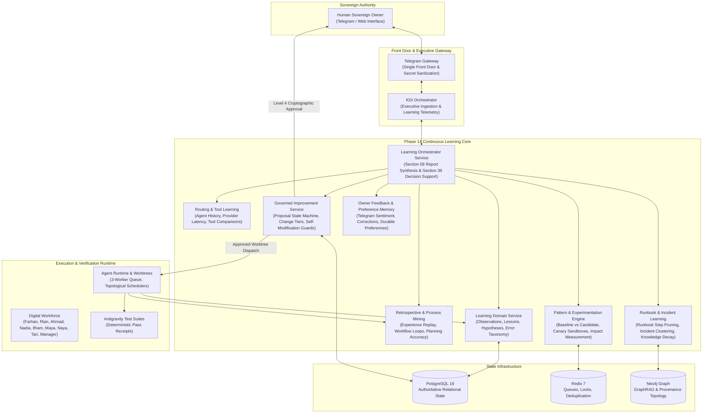

# PHASE 14 ARCHITECTURE — SELF-IMPROVING AI ORGANIZATION

```text
===================================================================
KDI AI OFFICE — PHASE 14 SYSTEM ARCHITECTURE
CONTINUOUS LEARNING, PROCESS OPTIMIZATION & GOVERNED ADAPTATION
STATUS: COMPLETE & PRODUCTION VERIFIED
TOTAL PASSING MONOREPO TESTS: 400 (262 API/BACKEND + 138 WEB/FRONTEND)
===================================================================
```

---

## 1. Executive Summary & Core Transformation

Phase 14 elevates KDI AI Office from:
> **"An AI organization that understands its work"** (Phase 13)

to:
> **"An AI organization that learns from its work and continuously improves how it operates — under sovereign human governance."**

The platform establishes an auditable, empirical closed-loop continuous learning cycle:

$$\text{Objectives} \longrightarrow \text{Priorities} \longrightarrow \text{Capacity} \longrightarrow \text{Workforce} \longrightarrow \text{Execution} \longrightarrow \text{Verification} \longrightarrow \text{Observation} \longrightarrow \text{Evaluation} \longrightarrow \text{Memory} \longrightarrow \text{Pattern Detection} \longrightarrow \text{Proposal} \longrightarrow \text{Experiment} \longrightarrow \text{Validation} \longrightarrow \text{Governance} \longrightarrow \text{Approved Change} \longrightarrow \text{Next Cycle}$$

---

## 2. Core Architectural Principle: Governed Self-Improvement

Self-improvement in KDI AI Office is strictly defined as an empirical process:
1. **Observe:** Collect verifiable execution telemetry, durations, retries, rework, and tool outcomes.
2. **Measure:** Derive quantitative indicators (p95 latency, error taxonomy distributions, first-pass pass rates).
3. **Learn:** Identify friction, bottlenecks, and repeatable patterns.
4. **Propose:** Draft formal `ImprovementProposal` records with explicit hypotheses, baselines, and rollback plans.
5. **Experiment:** Validate hypotheses using controlled canary runs or A/B comparative splits.
6. **Govern:** Enforce governance gates. **CRITICAL changes require explicit Sovereign Human approval.**
7. **Implement & Verify:** Deploy approved changes via Git worktrees with automated test suites.
8. **Measure Impact & Rollback:** Monitor for regressions and execute automatic or manual rollback if guardrails are violated.

> **CRITICAL RULE:** Unrestricted AI self-modification is strictly forbidden. KDI AI Office is prohibited from autonomously editing security policies, authorization rules, approval requirements, secret sanitizers, autonomy boundaries, production credentials, or core database schemas.

---

## 3. End-to-End System Architecture



---

## 4. Subsystems Summary

1. **Learning Domain & Error Taxonomy (`LearningDomainService`):**
   - Enforces epistemological categorization: Fact vs Observation vs Hypothesis vs Recommendation.
   - Normalizes errors across 15 standard failure categories.
2. **Retrospective & Process Mining (`RetrospectiveProcessMiningService`):**
   - Conducts post-task retrospectives (Experience Replay).
   - Mines actual transition timelines to detect repeated loops, waiting states, and rework hotspots.
   - Evaluates planning accuracy (scope, steps, effort hours).
3. **Routing & Tool Learning (`RoutingLearningService`):**
   - Evaluates historical agent performance across task classes.
   - Monitors model provider latency, cost, and degradation.
   - Compares tool performance (e.g. ripgrep vs recursive fs).
4. **Runbook & Incident Learning (`RunbookIncidentLearningService`):**
   - Recommends runbook step optimizations (e.g. removing obsolete verification steps).
   - Clusters incident families and root-cause patterns.
   - Audits knowledge decay and identifies stale documentation.
5. **Pattern Detection & Experimentation (`PatternExperimentationService`):**
   - Surfaces recurring operational patterns across projects.
   - Runs controlled experiments with baseline vs candidate metric comparisons.
   - Measures continuous improvement impact (Section 58: QA wait -11%, rework -8%, cost +2%).
6. **Governed Improvement (`GovernedImprovementService`):**
   - Manages proposal lifecycle (PROPOSED -> UNDER_REVIEW -> APPROVED -> EXPERIMENTING -> VALIDATED -> ROLLED_OUT).
   - Enforces the Self-Modification Boundary, blocking unauthorized changes to security, authorization, or credentials.
   - Manages rollback execution.
7. **Owner Feedback & Preference Memory (`OwnerFeedbackService`):**
   - Ingests natural-language feedback from Telegram.
   - Stores durable owner preferences (e.g., concise reporting).
8. **Learning Orchestration (`LearningOrchestratorService`):**
   - Synthesizes the Section 58 Learning Report.
   - Directly answers Section 39 executive queries with empirical evidence.

---

## 5. Security & Verification Matrix

- **Zero Autonomous Privilege Escalation:** All security, credential, and autonomy changes require human approval.
- **Strict Data Sanitization:** Outbound learning reports and Telegram cards pass through `SecretSanitizer`.
- **Monorepo Test Suite:** 400 tests passing with 0 failures across backend and frontend workspaces.
