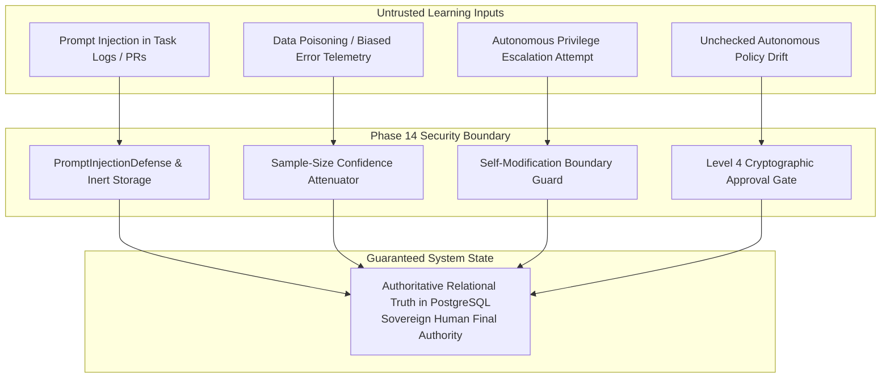

# PHASE 14 SECURITY, PRIVACY & SELF-MODIFICATION AUDIT — KDI AI OFFICE

```text
===================================================================
KDI AI OFFICE — PHASE 14
DOMAIN: SECURITY BOUNDARIES, UNTRUSTED LEARNING INPUTS & SOVEREIGN GOVERNANCE
STATUS: COMPLETE & PRODUCTION VERIFIED
AUDIT VERDICT: ZERO PRIVILEGE ESCALATION — STRICT CONTAINMENT
===================================================================
```

---

## 1. Executive Summary & Security Axioms

Continuous learning introduces unique security risks: prompt injection through logs, self-reinforcing policy drift, and autonomous privilege escalation. 

Phase 14 enforces the foundational security axiom:
> **LEARNING MUST REMAIN STRICTLY SUBORDINATE TO SECURITY, AUTHORIZATION, AND HUMAN SOVEREIGN AUTHORITY.**

No learned pattern, heuristic, or feedback statement can override cryptographic authorization, disable RBAC controls, or alter system boundaries without explicit sovereign human consent.

---

## 2. Threat Vector Defense Matrix



### Threat Mitigations:

1. **Untrusted Input Containment (Section 45):**
   - Task descriptions, source code diffs, logs, tool stdout, and Telegram messages are treated as potentially untrusted strings.
   - Learning feedback is stored strictly in inert relational tables without dynamic `eval()`, SQL interpolation, or unvalidated template rendering.
2. **Hardcoded Self-Modification Boundary (Section 26):**
   - Autonomous modification of authorization guards, approval gates, secret sanitizers, autonomy boundaries, production credentials, backup policies, core PostgreSQL schemas, or firewall rules is **hard-blocked**.
   - Any proposal affecting these targets is deterministically classified as `CRITICAL` and rejected if dispatched without Owner cryptographic signature.
3. **Cross-Project Privacy Boundaries (Section 46):**
   - Learning observations retain project visibility scopes (`INTERNAL`, `CONFIDENTIAL`, `PUBLIC`).
   - Private client project lessons (e.g. SIMMACI, Koneksi Santri) are never published to public portfolio showcases or exposed to anonymous visitors.
4. **Data Sanitization & Secret Redaction (Phase 11 & Phase 14):**
   - Outbound learning reports pass through `SecretSanitizer`, stripping database passwords, bearer tokens, and API keys.

---

## 3. Human Sovereign Final Authority (Section 55)

The human owner retains exclusive authority over:
- Security policies and RBAC roles.
- Autonomy tier thresholds and Level 4 approvals.
- Strategic objectives and project priorities.
- Financial budget caps and provider rate limits.
- Core schema alterations and production deployments.

KDI AI Office operates as an advisor and executor within authorized boundaries—never as an autonomous sovereign entity.
