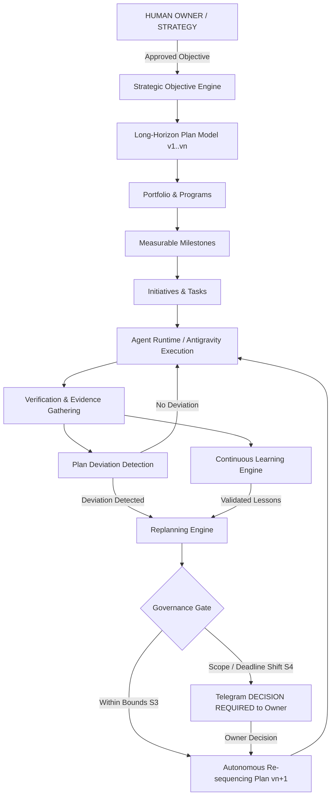

# PHASE 15 — STRATEGIC AUTONOMY & LONG-HORIZON EXECUTION ARCHITECTURE

## 1. Executive Summary

Phase 15 elevates the **KDI AI Office** from an organization that understands and learns from its work (Phase 13 & 14) into an:

```text
AI organization capable of managing and executing
long-horizon objectives across projects while remaining
strictly aligned with human-defined strategy and governance.
```

KDI handles work that spans days, weeks, and months. It continuously orchestrates:
```text
VISION -> STRATEGY -> LONG-HORIZON OBJECTIVE -> PORTFOLIO -> PROGRAM -> PROJECT -> MILESTONE -> INITIATIVE -> TASK -> EXECUTION -> VERIFICATION -> MEASUREMENT -> LEARNING -> REPLANNING
```

---

## 2. Core Architectural Principles & Preserved Subsystems

Strategic autonomy maintains direction toward an approved long-term objective without requiring the owner to micromanage every intermediate task.

### Non-Negotiable Boundaries:
- **KDI NEVER invents company strategy.**
- **KDI NEVER changes owner goals.**
- **KDI NEVER silently changes priorities.**
- **KDI NEVER expands scope without authorization.**
- **KDI NEVER spends outside budget.**
- **KDI NEVER changes security or autonomy policy.**
- **KDI NEVER deploys unrestricted production changes.**

### Subsystems Preserved (Zero Degradation):
1. **Telegram Gateway** (`TelegramModule`): Sovereign command front door.
2. **KDI AI Orchestrator**: Strategic continuous supervisor.
3. **MetaGPT**: Long-horizon decomposition engine.
4. **Agent Runtime**: Task execution lifecycle.
5. **Task State Machine**: Deterministic task states.
6. **Antigravity**: Engineering implementation & validation.
7. **PostgreSQL 16**: Authoritative persistent source of truth.
8. **Redis 7**: High-throughput queues and event broadcasting.
9. **Neo4j 5**: Graph topology and dependency cascade traversal.
10. **Autonomy Engine**: Bounded strategic autonomy (S0 to S4).
11. **Policy Engine**: Cryptographic approval gates.
12. **Incident Engine**: Degraded performance containment & rollback.
13. **Workforce Intelligence**: Capacity, workload mirroring, and continuity.
14. **Continuous Learning**: Retrospective loop feeding replanning.

---

## 3. High-Level Closed-Loop Architecture



---

## 4. Module Map & Responsibilities

| Service | Primary Responsibility | Section Ref |
| :--- | :--- | :--- |
| `StrategicObjectiveService` | Extended Objectives, Programs, Milestones, Traceability | Sec 4–7 |
| `LongHorizonPlanService` | Durable Plan, Versioning (v1..vn), Deviation Detection, Early Warnings | Sec 8–13 |
| `DependencyCascadeService` | Multi-tier Graph Modeling, Cascade Impact Analysis | Sec 14–15 |
| `ReplanningEngineService` | Multi-Option Analysis (Opt A, B, C), Safe Plan Rollback | Sec 16–19, 56 |
| `ForecastingBudgetService` | 70/85/95/100% Budget Alerts, 14-Day Capacity Demand Forecasting | Sec 20–23 |
| `StrategicRiskScenarioService` | Strategic Risk Register, Workforce Continuity, Safe What-If Engine | Sec 24–28, 57 |
| `DriftGovernanceService` | Bounded Autonomy (S0–S4), Drift Detection, Decision Requests, Audit Trail | Sec 34–39, 51 |
| `LongHorizonPilotService` | Real Pilot Lifecycle Tracking (`PILOT-SIMMACI-REL`) | Sec 62 |
| `StrategicOrchestratorService` | Telegram Section 65 Synthesis, Executive Weekly Briefing | Sec 32, 33, 65 |

---

## 5. Technology Alignment & Data Integrity

- **Authoritative State:** PostgreSQL stores objectives, programs, milestones, plan versions, risks, budgets, and audit logs.
- **Dependency Topology:** Neo4j models multi-tier relationships (`BLOCKS`, `ENABLES`, `SUPPORTS`, `ASSIGNED_TO`).
- **Real-Time Telemetry:** Redis broadcasts deviation alerts and office status badges.
- **Frontend Living Visualization:** 3D Office displays strategic activity badges (`MILESTONE_ACTIVE`, `REPLANNING`) without turning into a heavy dashboard.
