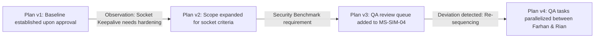

# PLAN VERSIONING & AUDIT SPECIFICATION

## 1. Core Rule: Historical Plans Are Never Overwritten

In Phase 15, plan revisions **must never overwrite** existing plans in-place. Every replan creates an immutable new plan version ($v1 \rightarrow v2 \rightarrow v3$) and marks previous versions as `SUPERSEDED`.

This preserves full auditability of organizational decision-making and provides a reliable baseline for safe rollbacks.

---

## 2. Plan Version Audit Record

```typescript
export interface PlanVersionRecord {
  version: number;                 // e.g. 1, 2, 3
  planId: string;                  // e.g. "OBJ-SIMMACI-REL-PLAN-V3"
  objectiveId: string;             // References StrategicObjective
  createdAt: string;               // ISO timestamp
  reason: string;                  // Concrete justification for revision
  trigger: string;                 // Trigger event (e.g. 'PLAN_DEVIATION_CORRECTION')
  changedScope: string[];          // Scope modifications
  changedTimeline: string[];       // Target date adjustments
  changedDependencies: string[];   // Graph dependency adjustments
  changedResources: string[];      // Agent allocation changes
  approvedBy: string;              // "Owner / Chief Architect"
}
```

---

## 3. Plan Progression in Pilot Portfolio



### Version History Table:
| Version | Plan ID | Created Date | Trigger | Reason & Key Changes | Approved By | Status |
| :--- | :--- | :--- | :--- | :--- | :--- | :--- |
| **v1** | `OBJ-SIMMACI-REL-PLAN-V1` | 2026-09-01 | `OBJECTIVE_APPROVAL` | Initial 5-milestone roadmap established. Target: 2026-10-10. | Owner / Chief Architect | `SUPERSEDED` |
| **v2** | `OBJ-SIMMACI-REL-PLAN-V2` | 2026-09-15 | `PHASE_14_OBSERVATION` | Expanded MS-SIM-02 socket keepalive criteria. Adjusted MS-SIM-03 by 5 days. | Owner / Chief Architect | `SUPERSEDED` |
| **v3** | `OBJ-SIMMACI-REL-PLAN-V3` | 2026-09-25 | `SECURITY_BENCHMARK` | Incorporated security review and automated recovery benchmark into MS-SIM-04. | Owner / Chief Architect | `ACTIVE` |

---

## 4. Rollback Compatibility

Because historical plans remain intact in PostgreSQL, the system can instantly rollback to any prior approved state if an experimental strategy fails or causes performance regression.
