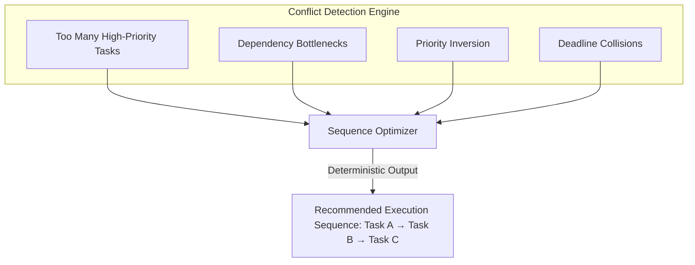

# MULTI-DIMENSIONAL PRIORITY ENGINE & CONFLICT RESOLUTION — KDI AI OFFICE

```text
===================================================================
KDI AI OFFICE — PHASE 13
DOMAIN: DETERMINISTIC PRIORITY EVALUATION & SCHEDULING CONFLICTS
STATUS: COMPLETE & PRODUCTION VERIFIED
RULE: ZERO LLM HALLUCINATED PRIORITIES — 100% EXPLAINABLE ARITHMETIC
===================================================================
```

---

## 1. Executive Summary

In naive AI task frameworks, priority is often assigned as an arbitrary integer (e.g., $P0, P1, P2$) or left to the nondeterministic judgment of an LLM. 

Phase 13 establishes a **Deterministic, Multi-Dimensional Priority Engine**. Priority is computed across 10 concrete operational parameters derived directly from system state, database links, and dependency graphs. Every priority tier assignment is accompanied by mathematically grounded and human-explainable rationale.

---

## 2. The 10 Priority Dimensions & Mathematical Weights

Each candidate task is scored along 10 distinct operational dimensions on a normalized scale ($0 - 100$), then aggregated using strict deterministic weights ($W_i$ where $\sum W_i = 1.0$):

| # | Dimension Name | Weight ($W_i$) | Description & Source Evaluation |
|---|---|---|---|
| 1 | **Strategic Alignment** | 0.15 | Linkage to high-level `OrgObjective` and strategic importance |
| 2 | **Production Impact** | 0.15 | Direct effect on live production systems, SLAs, or customer traffic |
| 3 | **Security Relevance** | 0.15 | Remediates vulnerabilities, credential risks, or CVE disclosures |
| 4 | **Risk Level** | 0.12 | Potential blast radius or damage if unexecuted or failed |
| 5 | **Dependency Blocking** | 0.12 | Number of downstream tasks waiting on this task ($B_{out}$) |
| 6 | **Blocked by Dependencies**| 0.08 | Whether the task itself is blocked by upstream dependencies ($B_{in}$) |
| 7 | **Deadline Urgency** | 0.08 | Proximity to target completion date ($T_{remaining} / T_{total}$) |
| 8 | **Business Impact** | 0.05 | Commercial value, operational savings, or partner commitments |
| 9 | **Reversibility** | 0.05 | Ease of rollback (irreversible migrations score higher priority to scrutinize) |
| 10 | **Estimated Effort** | 0.05 | Inverse effort scale: quick wins with high impact gain priority boost |

### Mathematical Formula:
$$\text{Priority Score} = \sum_{i=1}^{10} \left( D_i \times W_i \right)$$

---

## 3. Deterministic Priority Tiers

The calculated score ($0 - 100$) maps directly to four explicit operational tiers:

- **`CRITICAL` (Score $\ge 80$):** Production outages, critical security remediations, and blocking root dependencies. Dispatched immediately to Level 4 human-authorized runtime.
- **`HIGH` (Score $65 - 79.9$):** Major strategic milestones, high business impact, and items blocking multiple tasks.
- **`MEDIUM` (Score $45 - 64.9$):** Normal engineering tasks, documentation updates, standard features, and regular sprints.
- **`LOW` (Score $< 45$):** Non-blocking enhancements, background audits, backlog grooming, and low-urgency experiments.

---

## 4. Explainable Rationale Generation

Unlike black-box LLM classifiers, the Priority Engine generates plain-language, evidence-backed justifications:

```json
{
  "taskId": "tsk_prod_outage",
  "score": 88.5,
  "priorityTier": "CRITICAL",
  "reasons": [
    "Kritis terhadap kelangsungan operasional dan keandalan sistem produksi",
    "Penting untuk perlindungan keamanan atau mitigasi risiko keamanan siber",
    "Tingkat risiko tugas dinilai sebagai CRITICAL dengan potensi dampak luas",
    "Tugas ini memblokir 3 tugas downstream lain yang sedang tertahan",
    "Selaras langsung dengan tujuan strategis organisasi: OBJ-STRAT-001"
  ]
}
```

---

## 5. Priority Conflict Resolution Engine

When multiple high-priority tasks compete for limited agent capacity, simple FIFO queues lead to starvation and dependency bottlenecks. The Priority Conflict Resolution Engine identifies four core organizational conflict patterns:



### 5.1 Conflict Patterns
1. **`TOO_MANY_HIGH_TASKS`:** Total high/critical tasks exceed available concurrency slots (e.g., 5 HIGH tasks with only 3 available workers).
2. **`DEPENDENCY_BOTTLENECK`:** A high-priority task is blocked by one or more uncompleted lower-priority tasks.
3. **`PRIORITY_INVERSION`:** An urgent downstream task is stuck behind a lower-priority task currently holding worker locks.
4. **`DEADLINE_COLLISION`:** Multiple tasks with short estimated completion deadlines share the same primary agent.

### 5.2 Deterministic Sequencing Output
When a conflict is detected, the engine emits a factual operational recommendation:

```text
Status: Kapasitas tidak mencukupi untuk mengeksekusi semua pekerjaan prioritas tinggi secara bersamaan.
Tersedia 3 agen untuk 5 pekerjaan prioritas tinggi.

Urutan Eksekusi yang Direkomendasikan:
1. Fix production outage (Skor: 88.5) — Membuka blokir dependensi inti & menjaga SLA produksi
2. Security Patch Auth Token (Skor: 82.0) — Mitigasi keamanan siber mendesak
3. Unblock DB migrations (Skor: 78.0) — Membuka 2 tugas downstream
4. SIMMACI UI Polish (Skor: 67.0) — Pekerjaan fitur normal
5. Documentation Sync (Skor: 52.0) — Dapat ditunda tanpa risiko operasional
```
