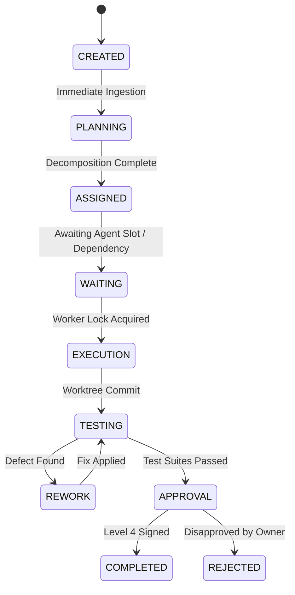

# PROCESS MINING & PLANNING LEARNING MODEL — KDI AI OFFICE

```text
===================================================================
KDI AI OFFICE — PHASE 14
DOMAIN: OPERATIONAL PROCESS MINING, WORKFLOW FRICTION & PLANNING EVALUATION
STATUS: COMPLETE & PRODUCTION VERIFIED
SOURCES: TASK STATE TRANSITIONS & REDIS/POSTGRES TELEMETRY
===================================================================
```

---

## 1. Domain Purpose

Process mining allows KDI AI Office to analyze its **actual observed workflows** rather than theoretical happy paths. By reconstructing task event logs into state transition timelines, the platform detects organizational friction, queue staleness, repeated cycles, and planning inaccuracies.

---

## 2. Process Transition Graph & Friction Detection



### Detected Friction Signatures:
1. **`REPEATED_LOOP`:** A task cycles between `TESTING` and `REWORK` $\ge 2$ times.
   - *Remediation:* Enforce local pre-commit linting and mandatory automated smoke tests in the isolated worktree before dispatching to QA.
2. **`EXCESSIVE_WAITING`:** Duration in `WAITING` state exceeds 5 minutes (300,000ms).
   - *Remediation:* Dynamically scale agent worker concurrency slots or prioritize unblocking dependencies.
3. **`APPROVAL_BOTTLENECK`:** Duration in `APPROVAL` state exceeds 2 hours.
   - *Remediation:* Consolidate low-risk operations into pre-authorized autonomy rules under Level 2 policy.
4. **`REWORK_HOTSPOT`:** Multiple tasks touching the same module require rework within 72 hours.
   - *Remediation:* Schedule refactoring objective and assign senior architect (Farhan/Ahmad).

---

## 3. Process Trace Schema

Every task execution logs an auditable `ProcessMiningTrace`:

```json
{
  "traceId": "trc_simmaci_patch_001",
  "taskId": "tsk_simmaci_patch_001",
  "transitions": [
    { "fromState": "CREATED", "toState": "PLANNING", "durationMs": 1200, "timestamp": "2026-10-01T08:00:00Z" },
    { "fromState": "PLANNING", "toState": "ASSIGNED", "durationMs": 5400, "timestamp": "2026-10-01T08:00:05Z" },
    { "fromState": "ASSIGNED", "toState": "WAITING", "durationMs": 420000, "timestamp": "2026-10-01T08:07:05Z" },
    { "fromState": "WAITING", "toState": "EXECUTION", "durationMs": 720000, "timestamp": "2026-10-01T08:19:05Z" },
    { "fromState": "EXECUTION", "toState": "TESTING", "durationMs": 180000, "timestamp": "2026-10-01T08:22:05Z" },
    { "fromState": "TESTING", "toState": "REWORK", "durationMs": 300000, "timestamp": "2026-10-01T08:27:05Z" },
    { "fromState": "REWORK", "toState": "TESTING", "durationMs": 120000, "timestamp": "2026-10-01T08:29:05Z" },
    { "fromState": "TESTING", "toState": "COMPLETED", "durationMs": 30000, "timestamp": "2026-10-01T08:29:35Z" }
  ],
  "loopCount": 1,
  "waitingDurationMs": 420000,
  "reworkCount": 1,
  "detectedFriction": [
    "Antrean tunggu QA lama (7 menit)",
    "Terjadi 1 siklus rework pengujian"
  ]
}
```

---

## 4. Planning Learning & Accuracy Evaluation (Section 8)

The `RetrospectiveProcessMiningService` compares initial task plans against real execution outcomes along four dimensions:

1. **Step Count Variance:** $|N_{\text{actual}} - N_{\text{planned}}|$
2. **Effort Ratio:** $R_{\text{effort}} = \frac{T_{\text{actual}}}{T_{\text{planned}}}$
3. **Scope Completeness:** Discovery of unexpected dependencies during execution.
4. **Accuracy Score ($0 - 100$):**

$$\text{Accuracy Score} = \max\left(20, \min\left(100, 100 - (5 \times \Delta_{\text{steps}}) - (40 \times |R_{\text{effort}} - 1.0|) - (15 \times N_{\text{missing\_scope}})\right)\right)$$

### Planning Defect Classifications:
- **`UNDERESTIMATED_EFFORT`:** Actual effort exceeds planned by $> 40\%$.
- **`OVERESTIMATED_EFFORT`:** Actual effort is $< 60\%$ of planned estimate.
- **`UNDER_DECOMPOSITION`:** Actual steps exceed planned steps by $> 50\%$.
- **`OVER_DECOMPOSITION`:** Actual steps are $< 50\%$ of planned steps.
- **`MISSING_DEPENDENCY`:** An unmodeled dependency was encountered mid-execution.
