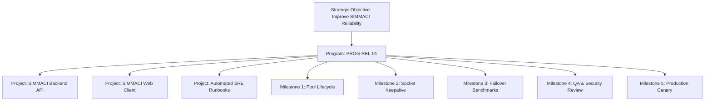

# STRATEGIC PROGRAM MODEL

## 1. Overview

In Phase 15, a **Strategic Program** acts as the portfolio grouping mechanism that unifies multiple related projects, workstreams, and initiatives under a single strategic objective.

Programs decouple strategic intent from specific single-repository codebases.

---

## 2. Program Domain Model

```typescript
export interface StrategicProgram {
  id: string;                      // e.g. "PROG-REL-01"
  name: string;                    // "Reliability Improvement Program"
  objectiveId: string;             // References StrategicObjective
  owner: string;                   // Responsible agent / human lead
  description: string;             // Scope and operational summary
  startDate: string;               // ISO date
  targetDate: string;              // ISO date
  status: 'PLANNED' | 'ACTIVE' | 'COMPLETED' | 'PAUSED';
  priority: TaskPriority;          // 'LOW' | 'MEDIUM' | 'HIGH' | 'URGENT'
  budgetUsd: number;               // Program-allocated ceiling
  resourceConstraints: string[];   // e.g. ["Engineering <= 80h/week", "QA <= 40h/week"]
  successCriteria: string[];       // Measurable portfolio criteria
  riskProfile: RiskLevel;          // Aggregate program risk
  createdAt: string;
}
```

---

## 3. Relationship to Projects & Milestones

A Program coordinates multiple projects across the KDI organization:



---

## 4. Program Governance Rules

1. **Lifecycle Binding:** A program cannot be marked `COMPLETED` until all constituent milestones have verified completion evidence.
2. **Resource Caps:** Cumulative task allocations under a program cannot exceed the program's defined `resourceConstraints`.
3. **Budget Partitioning:** Program budgets are strictly partitioned subsets of the parent objective's `budgetLimitUsd`.
4. **Pause Cascade:** If an Owner pauses a Program via Telegram, all active constituent tasks are paused at safe checkpoints.
