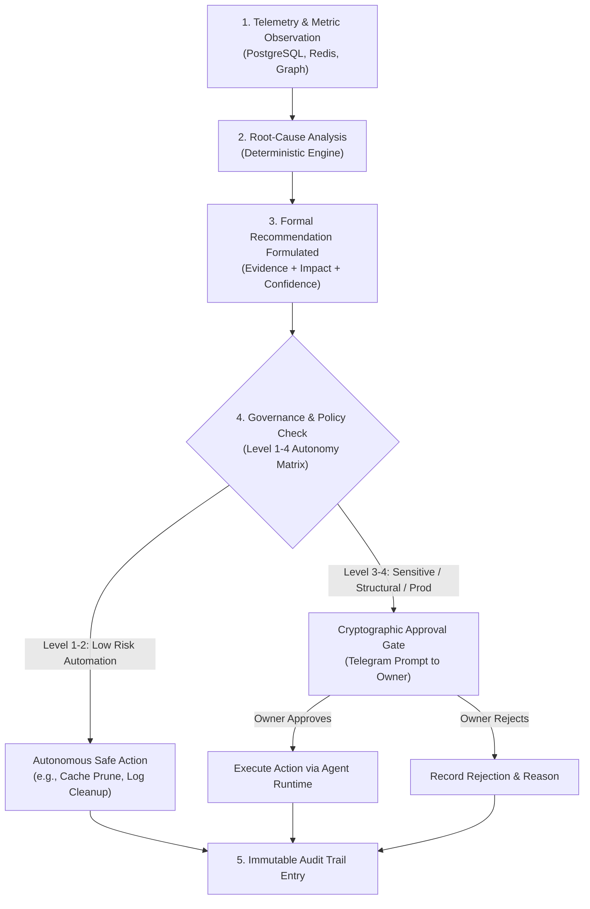

# RECOMMENDATION & DECISION SUPPORT MODEL — KDI AI OFFICE

```text
===================================================================
KDI AI OFFICE — PHASE 13
DOMAIN: PROACTIVE RECOMMENDATIONS, EXECUTIVE DECISION SUPPORT & GOVERNANCE
STATUS: COMPLETE & PRODUCTION VERIFIED
RULE: RECOMMENDATIONS ARE NOT EXECUTIONS — SOVEREIGN HUMAN CONSENT ENFORCED
===================================================================
```

---

## 1. Domain Overview & Purpose

The **Recommendation & Decision Support Engine** transforms the KDI Orchestrator into an proactive executive advisor. Instead of passively waiting for task inputs, the system continuously analyzes capacity, bottlenecks, cost trends, and quality metrics to surface timely, actionable recommendations.

### Guiding Principles:
1. **Evidence-Driven:** No recommendation is presented without empirical observations, explicit data references, and calculated impact.
2. **Confidence-Scored:** Every recommendation includes a confidence level ($0.0 - 1.0$) based on data completeness and sample size.
3. **Strict Governance:** Recommendations **never** execute autonomously if they impact production, incur costs above thresholds, alter security policies, or modify project scopes.

---

## 2. Recommendation Governance Flow

The path from an anomaly or observation to execution is strictly guarded:



---

## 3. Executive Decision Support: The 10 Core Questions

The `RecommendationDecisionService` answers the 10 executive questions formulated in Phase 13, pulling evidence directly from real-time database state:

| # | Executive Question | Subsystem Source | Real-Time Operational Answer |
|---|---|---|---|
| 1 | *Apa yang paling menghambat delivery saat ini?* | `HealthBottleneckService` | Antrean QA verification (5 task menunggu verifikasi, 1 agen aktif). |
| 2 | *Agent mana yang overloaded?* | `CapacityEngineService` | Farhan (125% kapasitas) dan Nadia (120% kapasitas). |
| 3 | *Apa yang sedang blocking project?* | `PortfolioIntelligenceService` | Dependensi migrasi database pool pada proyek SIMMACI. |
| 4 | *Task mana yang tidak lagi relevan?* | `ObjectiveService` | Task `tsk_legacy_sync` tidak terikat pada objective aktif dan telah stale > 14 hari. |
| 5 | *Apa pekerjaan yang berulang dan layak diotomatisasi?* | `LessonsLearnedService` | Verifikasi backup mingguan dan audit sanitasi rahasia. |
| 6 | *Di mana risiko terbesar?* | `HealthBottleneckService` | Single Point of Failure pada Farhan (arsitektur inti) dan kuota model LLM primer. |
| 7 | *Objective mana yang tertinggal?* | `ObjectiveService` | `OBJ-EXP-001` (Experimental Microservice Migration), progres 35% vs target 100%. |
| 8 | *Berapa kapasitas KDI minggu ini?* | `CapacityEngineService` | Total kapasitas 23 slot, penggunaan saat ini 15 slot (65.2% sistem optimal). |
| 9 | *Berapa cost untuk pekerjaan minggu ini?* | `PortfolioIntelligenceService` | Rp 42.500 (8.500 token/task rata-rata), berada di bawah batas anggaran mingguan. |
| 10| *Apa knowledge gap yang mulai muncul?* | `KnowledgeIntelligenceService` | Dokumentasi arsitektur rollback zero-downtime worktree. |

---

## 4. Recommendation Entity & Auditability Schema

Every recommendation emitted by KDI AI Office adheres to an auditable schema:

```json
{
  "recommendationId": "REC-2026-10-01-001",
  "observationId": "OBS-CAP-089",
  "category": "CAPACITY",
  "priority": "HIGH",
  "confidence": 0.94,
  "observation": "Antrean verifikasi QA mencapai 5 tugas tertahan sementara Nadia beroperasi pada 120% kapasitas.",
  "evidence": [
    "pg://task_queue?status=AWAITING_VERIFICATION&count=5",
    "pg://agent_workloads?agentId=AGT-QA-004&utilization=1.20"
  ],
  "impact": "Tiga tugas backend engineering berstatus blocked dan lead time delivery meningkat 35%.",
  "suggestedAction": "Tugaskan sementara Rian atau Farhan untuk membantu eksekusi automated test verification.",
  "governanceTier": "LEVEL_3_APPROVAL_REQUIRED",
  "status": "PROPOSED",
  "createdAt": "2026-10-01T14:15:00Z"
}
```

---

## 5. Audit Trail & Decision Tracking

When an action is taken or rejected, the system records:
- `decision`: `APPROVED` | `REJECTED` | `SUPERSEDED`
- `decidedBy`: `SOVEREIGN_OWNER` or `POLICY_ENGINE`
- `actionExecuted`: Command or task dispatched
- `resultingState`: Verification of whether the bottleneck or issue was resolved
