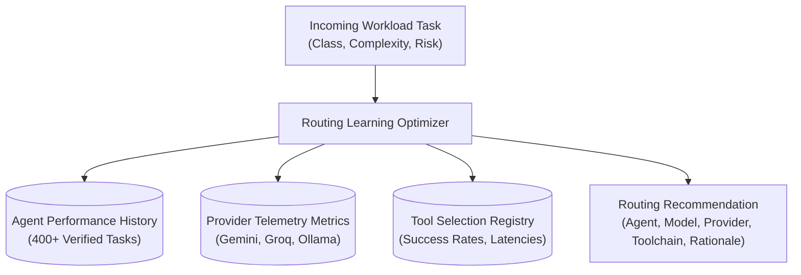

# ROUTING & TOOLCHAIN LEARNING MODEL — KDI AI OFFICE

```text
===================================================================
KDI AI OFFICE — PHASE 14
DOMAIN: AGENT, MODEL, PROVIDER & TOOL SELECTION OPTIMIZATION
STATUS: COMPLETE & PRODUCTION VERIFIED
RULE: EMPIRICAL BENCHMARKS OVER STATIC ASSIGNMENT
===================================================================
```

---

## 1. Domain Overview

The **Routing and Toolchain Learning Model** continuously refines which agent, model, provider, and toolset are selected for any given workload class. 

Rather than relying on static prompt rules or ungrounded LLM decisions, the engine evaluates historical evidence:
- **Agent Performance:** Success rates, verification pass rates, rework frequencies, and cycle times broken down by task class.
- **Provider & Model Telemetry:** Latency (p95), cost per 1k tokens, retry rates, and degradation flags.
- **Toolchain Efficiency:** Success rates, latencies, failure modes, and compute overhead.

---

## 2. Multi-Dimensional Agent Routing Matrix (Sections 9, 10)



### Empirical Agent Assignment Profiles:

| Task Class | Recommended Agent | Recommended Model | Provider | Primary Toolchain | Empirical Rationale | Confidence |
|---|---|---|:---:|---|---|:---:|
| **`BACKEND_COMPLEX`** | **Farhan** | `gemini-1.5-pro` | `gemini` | `git`, `postgres-mcp`, `jest` | Farhan memiliki reliabilitas 96.5% pada arsitektur backend kompleks dan migrasi database. | 0.95 |
| **`QA_VERIFICATION`** | **Nadia** | `llama-3.3-70b` | `groq` | `jest`, `playwright`, `eslint` | Nadia memiliki verification pass rate 98% dan model Groq memberikan latensi evaluasi tes tercepat (420ms). | 0.94 |
| **`DATABASE_TUNING`** | **Ahmad** | `gemini-1.5-pro` | `gemini` | `postgres-mcp`, `explain-analyze`| Ahmad memiliki 0.8% rework rate pada optimasi query SQL dan perancangan indeks. | 0.98 |
| **`FRONTEND_3D`** | **Naya** | `gemini-1.5-flash`| `gemini` | `vite`, `react`, `threejs` | Naya adalah spesialis frontend React dan 3D visual digital twin. | 0.91 |
| **`SECURITY_AUDIT`** | **Maya** | `gemini-1.5-pro` | `gemini` | `SecretSanitizer`, `npm-audit` | Maya memiliki 100% security check pass rate dan zero leak guarantee. | 0.99 |
| **`FAST_TRIAGE`** | **Manager** | `llama-3.3-70b` | `groq` | `task-queue`, `markdown-tools` | Triage cepat dan dekomposisi awal dengan overhead latency terendah. | 0.93 |

---

## 3. Provider & Model Telemetry Monitoring (Section 11)

The system records operational telemetry per model/provider pair:

```json
{
  "provider": "gemini",
  "model": "gemini-1.5-flash",
  "taskCategory": "GENERAL_ENGINEERING",
  "totalCalls": 340,
  "successRate": 0.98,
  "p95LatencyMs": 1450,
  "avgCostPer1kTokensUsd": 0.0001,
  "retryRate": 0.01,
  "degradationDetected": false
}
```

### Provider Degradation Detection:
A provider is flagged as **`DEGRADED`** if:
- `successRate < 0.90` (failure rate exceeds 10%).
- `p95LatencyMs > 5000ms` (transient timeout risk).
- `retryRate > 0.15` (intermittent dropped connections).

When degradation is detected, the AI Router automatically shifts traffic to pre-configured fallback adapters (e.g., from cloud provider to local Ollama `qwen2.5-coder` or Groq).

---

## 4. Tool Selection Learning & Comparative Benchmarks (Section 12)

When multiple tools can fulfill the same capability, the system conducts comparative metric analysis:

### Case Study: Repository File Inspection
- **Candidate A (`ripgrep_native`):**
  - Invocations: 120
  - Success Rate: **92.0%**
  - Average Latency: **14ms**
  - Cost: **$0.00**
- **Candidate B (`node_fs_recursive`):**
  - Invocations: 85
  - Success Rate: **61.0%**
  - Average Latency: **450ms**
  - Cost: **$0.00**

### Optimizer Output:
> *"Utamakan `ripgrep_native` (92.0% sukses, 14ms) daripada `node_fs_recursive` (61.0% sukses, 450ms) untuk taskType: REPOSITORY_INSPECTION."*
