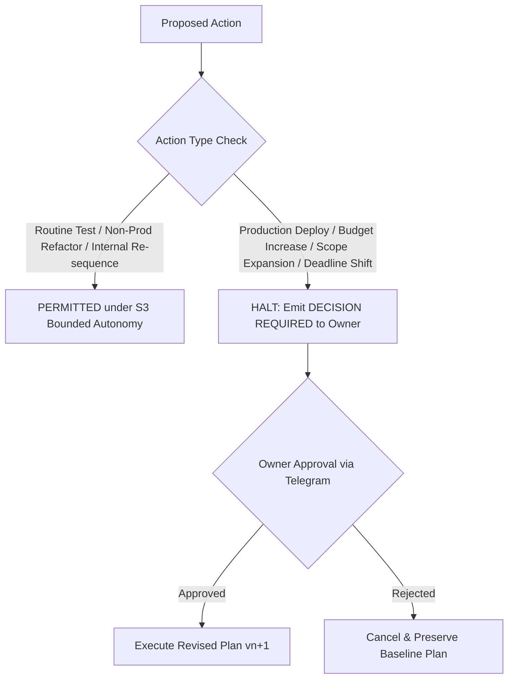

# STRATEGIC GOVERNANCE & BOUNDED AUTONOMY SPECIFICATION

## 1. Strategic Autonomy Levels (S0 to S4)

Phase 15 extends the Phase 9 autonomy model with formal strategic tiers:

| Level | Designation | Operational Boundary | Autonomous Capabilities |
| :--- | :--- | :--- | :--- |
| **S0** | `OBSERVE` | Read-only observation | Monitor telemetry, calculate deviations, zero autonomous mutations. |
| **S1** | `ADVISE` | Advisory decision support | Generate recommendations, early warnings, and cost forecasts. |
| **S2** | `EXECUTE_ROUTINE` | Routine execution | Execute pre-approved scheduled regression tests and documentation. |
| **S3** | `ADAPT_WITHIN_BOUNDS` | Bounded replanning | Re-sequence tasks, reassign internal agent capacity within baseline deadlines. |
| **S4** | `STRATEGIC_ESCALATION` | Human sovereign gate | Require explicit Owner decision for scope, deadline, budget, or production. |

---

## 2. Bounded Strategic Autonomy Matrix



### Action Permissions:
| Action | Autonomy Level Required | Autonomous? | Governance Constraint |
| :--- | :--- | :--- | :--- |
| **Routine Regression Testing** | S2 | YES | Zero production impact. |
| **Re-sequence Verification Tasks** | S3 | YES | Must not alter external deadline or budget. |
| **Non-Production Code Refactoring** | S3 | YES | Must pass all static security analysis. |
| **Production Canary Deployment** | S4 | **NO** | Mandatory human cryptographic approval. |
| **Budget Limit Expansion** | S4 | **NO** | Mandatory Owner authorization. |
| **Deadline Extension Beyond Tolerance**| S4 | **NO** | Mandatory Owner decision. |
| **Security Policy Modification** | S4 | **NO** | Human-only sovereign control. |

---

## 3. Decision Request Template (Section 34)

When human authority is required, the system emits:

```text
DECISION REQUIRED

Issue:
Milestone at risk.

Evidence:
...

Options:
A ...
B ...
C ...

Trade-offs:
...

Deadline for decision:
...

Impact if no decision:
...
```

The response is collected securely via Telegram inline buttons or signed message.
