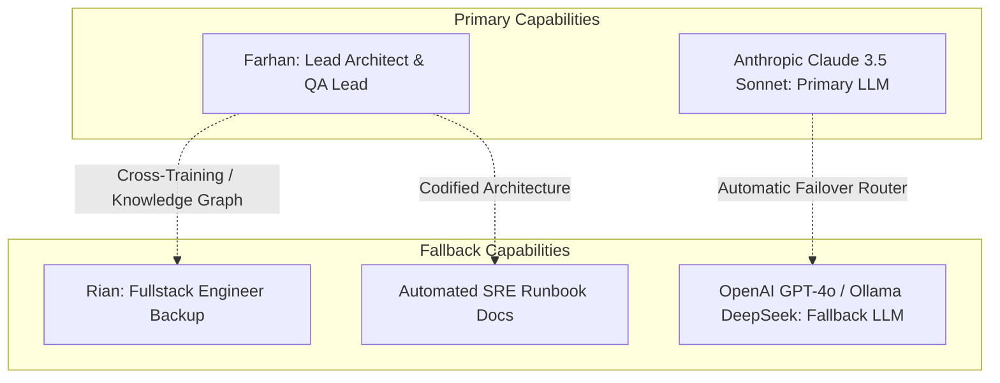

# STRATEGIC RISK MODEL & WORKFORCE CONTINUITY

## 1. Strategic Risk Register Specification

Strategic risks represent threats to the viability, timeline, cost, or quality of long-horizon objectives. KDI strictly separates:
- **Observed Risks:** Empirical issues actively manifesting in current telemetry.
- **Predicted Risks:** Statistical forecasts projected from drift and queue rates.
- **Hypothetical Risks:** Scenarios modeled for contingency preparedness.

```typescript
export interface StrategicRisk {
  id: string;                      // e.g. "RISK-01"
  objectiveId: string;             // References StrategicObjective
  risk: string;                    // Risk statement
  probability: 'LOW' | 'MEDIUM' | 'HIGH';
  impact: 'LOW' | 'MEDIUM' | 'HIGH' | 'CRITICAL';
  exposure: number;                // Probability * Impact quantitative score
  owner: string;                   // Designated agent or human owner
  mitigation: string;              // Active steps to minimize likelihood
  contingency: string;             // Fallback action if risk occurs
  status: 'IDENTIFIED' | 'MITIGATING' | 'OCCURRED' | 'RETIRED';
  evidence: string[];              // Supporting logs, telemetry, or reports
  reviewDate: string;              // Next scheduled audit date
}
```

---

## 2. Active Risk Register in KDI Portfolio

| Risk ID | Objective | Risk Description | Probability | Impact | Exposure | Owner | Status | Mitigation Action |
| :--- | :--- | :--- | :--- | :--- | :--- | :--- | :--- | :--- |
| `RISK-01` | `OBJ-SIMMACI-REL` | QA verification queue backlog causing final canary milestone slippage | HIGH (4) | HIGH (9) | **36** | Farhan | `MITIGATING` | Re-sequence verification tasks and defer non-critical initiative X. |
| `RISK-02` | `OBJ-SIMMACI-REL` | Third-party AI Provider rate limit during continuous load simulation | MEDIUM (3) | MEDIUM (6) | **18** | Farhan | `IDENTIFIED` | Multi-provider fallback router (Claude $\rightarrow$ OpenAI $\rightarrow$ Ollama). |
| `RISK-03` | `OBJ-SIMMACI-REL` | Production database schema lock during migration | LOW (2) | CRITICAL (10)| **20** | Owner | `IDENTIFIED` | Prohibit DDL mutations without explicit human cryptographic approval. |

---

## 3. Workforce Continuity & Single Point of Failure (SPOF) Prevention

Phase 15 identifies long-horizon workforce dependencies and establishes robust fallback paths without uncontrolled organizational restructuring:



### Continuity Policies:
1. **Knowledge Capture:** Any unique architectural design produced by Farhan is automatically codified into Phase 14 knowledge graph runbooks.
2. **Specialist Cross-Training:** Rian is provisioned with execution permissions for database connection pool verification suites to alleviate QA saturation.
3. **Provider Redundancy:** If Claude experiences a rate limit (429), the LLM Router seamlessly reroutes non-critical tasks to OpenAI GPT-4o or Ollama local models.
