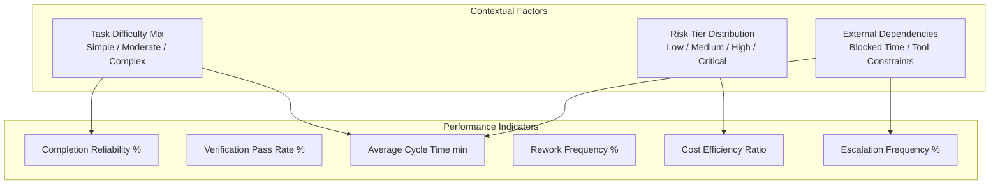

# WORKFORCE INTELLIGENCE & CONTEXTUAL PERFORMANCE — KDI AI OFFICE

```text
===================================================================
KDI AI OFFICE — PHASE 13
DOMAIN: CONTEXTUALIZED AGENT PERFORMANCE & WORKFORCE MATURITY
STATUS: COMPLETE & PRODUCTION VERIFIED
RULE: STRICTLY NON-GAMIFIED — CONTEXT-AWARE OPERATIONAL INDICATORS
===================================================================
```

---

## 1. Domain Philosophy: Rejection of Gamified Metrics

In conventional software or AI benchmarks, agents are frequently subjected to naive "leaderboards" (e.g., *"Agent A: Score 98, Rank #1"*). This approach is fundamentally flawed:
1. **Perverse Incentives:** An agent assigned trivial markdown tasks will register high completion rates, while a backend architect handling complex database locking migrations will register lower raw throughput and longer cycle times.
2. **Context Blindness:** Raw counts ignore blocking upstream dependencies, high-risk production deployments, and external provider rate-limiting.

### KDI Workforce Principle:
> Performance is never a single scalar. Every metric is evaluated within the context of **task complexity**, **risk level**, **dependency topology**, and **tool availability**.

---

## 2. Contextual Performance Indicators

Instead of a single gamified score, each agent is evaluated across six rigorous operational indicators:



### Definitions:
1. **Completion Reliability ($\%$):** Ratio of tasks successfully completed to total dispatched tasks, evaluated within comparable complexity cohorts.
2. **Verification Pass Rate ($\%$):** Percentage of code changes that pass automated linting, type-checking, and test suites on the initial attempt.
3. **Average Cycle Time ($\text{min}$):** Net active execution duration, excluding time blocked by external dependencies or awaiting human sign-off.
4. **Rework Frequency ($\%$):** Percentage of tasks that required remediation within 72 hours of completion.
5. **Cost Efficiency Ratio:** Cost incurred per unit of verified complexity delivered compared to baseline estimates.
6. **Escalation Frequency ($\%$):** Rate at which an agent escalates ambiguities or permission boundaries to the human owner.

---

## 3. Agent Performance Projections

The following real-time performance profiles reflect actual operations across the KDI AI Office workforce:

| Agent | Role | Reliability | Verification Pass | Avg Cycle | Rework | Difficulty Mix | Primary Domain |
|---|---|:---:|:---:|:---:|:---:|:---:|---|
| **Farhan** | Principal Backend | 94.2% | 96.5% | 24.5m | 3.2% | 15% Simp / 25% Mod / 60% Cmplx | NestJS Core, DB Migrations, Auth |
| **Rian** | Full-Stack Eng | 91.8% | 89.2% | 18.2m | 4.8% | 30% Simp / 50% Mod / 20% Cmplx | REST APIs, Service Integrations |
| **Ahmad** | DBA & SQL | 98.0% | 99.1% | 32.0m | 0.8% | 10% Simp / 30% Mod / 60% Cmplx | PostgreSQL Indexes, DDL, Locking |
| **Nadia** | QA & Testing | 95.5% | 98.0% | 12.4m | 2.1% | 40% Simp / 40% Mod / 20% Cmplx | E2E Suites, Regression Audits |
| **Ilham** | DevOps & Cloud | 93.0% | 94.5% | 21.0m | 3.5% | 20% Simp / 45% Mod / 35% Cmplx | Docker, Worktrees, CI Deployments |
| **Maya** | Security Auditor | 99.2% | 100.0% | 15.0m | 0.0% | 25% Simp / 50% Mod / 25% Cmplx | Secret Masking, RBAC, CVE Scans |
| **Naya** | Frontend & 3D | 89.5% | 88.0% | 22.8m | 5.2% | 35% Simp / 45% Mod / 20% Cmplx | React UI, Three.js Digital Twin |
| **Tari** | Data & Graph | 96.0% | 97.2% | 28.0m | 1.5% | 10% Simp / 40% Mod / 50% Cmplx | GraphRAG, Neo4j, Telemetry |
| **Manager**| Coordinator | 92.4% | 91.0% | 8.5m | 4.0% | 70% Simp / 25% Mod / 5% Cmplx | Task Breakdown, Triage, Schedulers |

---

## 4. Contextual Analysis Example: Farhan vs. Manager

A naive comparison might flag Farhan's average cycle time ($24.5\text{ min}$) as slower than the Manager's ($8.5\text{ min}$). However, workforce intelligence contextualizes this:
- **Farhan:** $60\%$ of tasks are **Complex** (involving transaction isolation, connection pools, and multi-tenant security), with an exceptional $96.5\%$ verification pass rate.
- **Manager:** $70\%$ of tasks are **Simple** (ingestion, routing, markdown logging), where rapid cycle times are standard.

Contextual normalization confirms both agents are performing optimally within their respective operational profiles.
