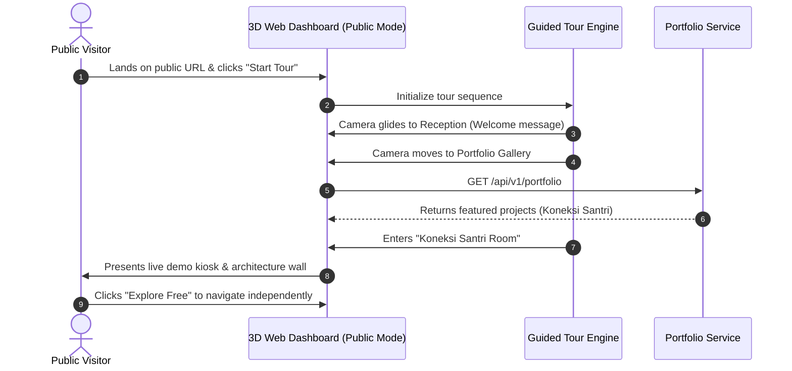
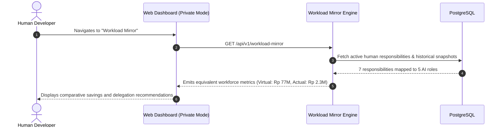

# UX Design & Dashboard Specification: KDI AI Office

## 1. Executive Summary & Design System
The **KDI AI Office** user interface is designed as an ultra-modern, high-efficiency command center combined with an immersive, living digital twin of the AI engineering team. It seamlessly balances deep technical telemetry (AST graphs, git diffs, LLM token metrics) with intuitive spatial presence and compelling public portfolio showcases.

### 1.1 Visual Style & Aesthetics
- **Design Philosophy:** Modern, warm, professional, clean, slightly futuristic, human-centered, and Islamic-friendly technology office.
- **Theme:** Sophisticated Warm Architectural Dark Mode (`#0b0e14` background with `#141a24` cards, muted brass and sage neon accents, warm timber highlights `#b38b59`, and subtle glassmorphism borders `rgba(255, 255, 255, 0.07)`).
- **Prohibited Aesthetics:** Excessive cyberpunk neon, dark dystopian alleys, arcade game styling, or overly robotic visuals.
- **Typography:** Inter for clean operational UI, JetBrains Mono for code diffs, prompts, Cypher queries, and execution logs.
- **Responsiveness:** Full fluidity across multi-monitor desktop setups and mobile browsers (for remote monitoring and emergency 1-tap approvals).

---

## 2. Navigation Architecture & View Hierarchy

```text
[ Top Bar: Workstation Status | Mode: PUBLIC / PRIVATE | Active Agents | Guided Tour | Approval Alert ]
┌─────────────────┬────────────────────────────────────────────────────────────────────────┐
│ Side Navigation │ Main Content Viewport                                                  │
│ ─────────────── │ ────────────────────────────────────────────────────────────────────── │
│ 1. Living Office│ [ 3D Digital Twin: Free Explore, Guided Tour, 18 Functional Zones ]    │
│ 2. Portfolio    │ [ Portfolio Gallery: Project Wall, Kiosks, Dedicated Showrooms ]       │
│ 3. Workload Mirr│ [ Workload Mirror: Human Responsibility to AI Labor Mapping ]          │
│ 4. Workforce    │ [ AI Employee Registry: Grades, Virtual Compensation, Performance ]    │
│ 5. Command Ctr  │ [ Quick Task Input | Live Activity Feed | Priority Approvals ]         │
│ 6. Projects     │ [ Project Backlog & Repositories: Koneksi Santri, Core Services ]      │
│ 7. Tasks        │ [ Kanban & List Views: Queued, Executing, Waiting Approval, Completed ]│
│ 8. Approvals    │ [ Dedicated Gate: Side-by-Side Unified Diffs, 1-Click Approval/Reject ]│
│ 9. Graph View   │ [ Interactive Neo4j Node Explorer & Lineage Tracer ]                   │
│ 10. LLM Engine  │ [ Provider Health: Gemini, Groq, OpenRouter, Ollama | Routing Rules ]  │
│ 11. Cost/Budget │ [ Token Counter, Quota Meters, Multi-Project Cost Allocation ]         │
│ 12. Audit Logs  │ [ Searchable Immutable Event Stream with Cryptographic Hashes ]        │
│ 13. Server Room │ [ Infrastructure Telemetry: Postgres, Redis, Neo4j, Ollama Status ]   │
│ 14. Settings    │ [ API Keys Vault, Whitelist Rules, Webhook Endpoints, CMS Admin ]      │
└─────────────────┴────────────────────────────────────────────────────────────────────────┘
```

---

## 3. View Specifications

### 3.1 3D Living Virtual Office (Digital Twin)
- **Controls:** Desktop (WASD + Mouse look + Click to focus); Mobile (Touch drag + Pinch zoom + Optional virtual joystick).
- **Dual Mode Views:**
  - **Free Explore:** Freely navigate through all 18 functional office zones.
  - **Guided Tour:** Automated cinematic camera path leading visitors from Reception through the Portfolio Gallery, Project Rooms, Engineering Floor, and Whiteboard.
- **Dynamic Elements:** Avatars moving along NavMesh corridors, sitting at desks, conferring in Meeting Rooms, enjoying coffee in the Pantry, or performing prayer in the Musholla.

### 3.2 Portfolio Gallery & Dedicated Project Showrooms
- **Gallery Wall:** Curved 3D digital wall presenting interactive cards for Web, Mobile, SaaS, and AI projects.
- **Dedicated Showroom (e.g., *Koneksi Santri Room*):** A physical 3D exhibition lab displaying the product overview, verified AI contributions, Mermaid architecture diagram, mobile interface gallery, and live staging demo kiosk.

### 3.3 Workload Mirror View
- **Purpose:** Map complex human developer responsibilities into equivalent specialized digital AI labor.
- **Components:**
  - Input list of human tasks (IT ops, web administration, WordPress, UI/UX, content, troubleshooting).
  - Decomposition into 5–7 specialized AI roles with assigned seniority grades.
  - Cost comparison matrix: Estimated Virtual Compensation vs Actual Cloud LLM / Host Infrastructure Spend.
  - Historical quarterly trend line showing workload absorption over time.

### 3.4 AI Workforce & Compensation Dashboard
- **Components:**
  - 14 Digital Employee Cards: Photo avatar, role, department, seniority grade (`GR-01` to `GR-08`), current activity, and room location.
  - Monthly Simulated Compensation Breakdown: Base virtual salary, standby allowance, performance incentive, and incurred cloud inference bills.
  - Performance scorecard: Tasks closed, first-pass approval rate, bug fix turnaround time, and tests authored.

### 3.5 Approvals Portal (Human-in-the-Loop Gate)
- Side-by-side syntax-highlighted Unified Git Diff viewer.
- SQL Migration preview with dry-run verification logs.
- 1-click **Approve Action**, **Approve with Modification**, or **Reject (with text feedback)**.

---

## 4. Interaction Flows

### Flow 1: Visitor Guided Tour & Portfolio Exploration


### Flow 2: Workload Mirror Inspection by Lead Developer

