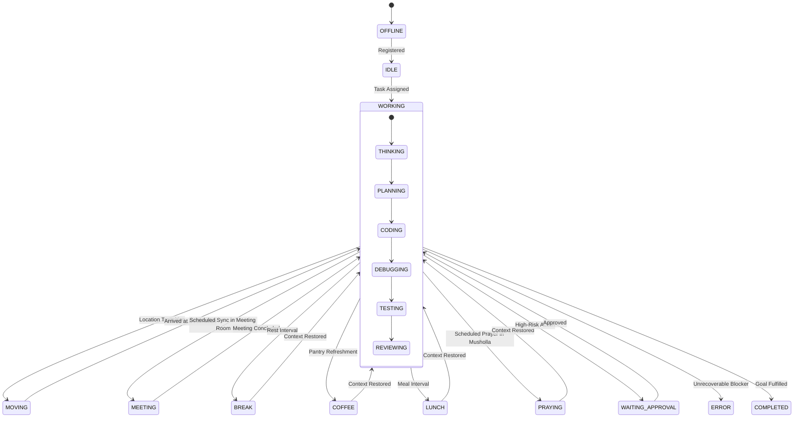

# 3D Digital Twin Office Design: KDI AI Office

## 1. Vision & Architectural Concept
The **3D Digital Twin Office** provides an authentic, spatial representation of the **KDI AI Office**. Rather than presenting static tables or arbitrary animations, every avatar, room light, and digital screen reflects the genuine, real-time operational state of the backend multi-agent engineering team.

---

## 2. Visual Style & Aesthetic Philosophy
- **Style:** Modern, warm, professional, clean, slightly futuristic, human-centered, and Islamic-friendly technology company office.
- **Color Palette:** Natural oak woods, soft architectural concrete, warm bronze fixtures, 3000K ambient recessed lights, and subdued sage foliage.
- **Strictly Prohibited:** Excessive cyberpunk neon streaks, dark dystopian alleyway themes, arcade video game aesthetics, or overly mechanical cyborg avatars.
- **Visual Target:** A world-class software engineering office where the primary engineering workforce happens to be autonomous AI specialists.

---

## 3. Spatial Layout & Floorplan (18 Functional Zones)

```text
┌─────────────────┬──────────────────┬─────────────────┬─────────────────┬─────────────────┐
│ 1. RECEPTION    │ 2. MANAGEMENT    │ 3. PM ROOM      │ 4. ARCHITECTURE │ 5. WHITEBOARD   │
│ - Visitor Desk  │ - AI Manager     │ - Product Mgr   │ - Sys Architect │ - Active System │
│ - Guided Tour   │ - Mission Wall   │ - Biz Analyst   │ - DB Architect  │ - Flow Diagrams │
├─────────────────┼──────────────────┴─────────────────┴─────────────────┼─────────────────┤
│ 6. PORTFOLIO    │ 7. MEETING ROOM (CONFERENCE TABLE)                   │ 8. PROJECT ROOM │
│ - Display Wall  │ - Multi-Agent Standups & Cross-Functional Sync       │ - Koneksi Santri│
│ - Hologram Kiosk│ - 10 Ergonomic Chairs & Central Agenda Screen        │ - Live Staging  │
├─────────────────┼──────────────────────────────────────────────────────┼─────────────────┤
│ 9. PANTRY       │ 10. ENGINEERING FLOOR (OPEN WORKSPACE PODS)          │ 11. QA ROOM     │
│ - Espresso Bar  │ - Frontend Area (FE-01, FE-02)                       │ - Test Benches  │
│ - Water Coolers │ - Backend Area  (BE-01, BE-02)                       │ - Status Tower  │
│ - Bistro Tables │ - DevOps Area   (DevOps-01, TechWriter)              │ - Robot Arms    │
├─────────────────┼──────────────────┬─────────────────┬─────────────────┼─────────────────┤
│ 12. BREAK AREA  │ 13. MUSHOLLA     │ 14. SECURITY RM │ 15. RESEARCH RM │ 16. SERVER ROOM │
│ - Lounge Chairs │ - Mihrab & Sajadah│ - Vault Door   │ - Paper Library │ - Live Racks    │
│ - Tech Library  │ - Wudhu Wash     │ - Threat Screen │ - Radar Terminal│ - DB Health LEDs│
└─────────────────┴──────────────────┴─────────────────┴─────────────────┴─────────────────┘
```

### 3.1 Zone Furniture & Dynamic Props

| Zone Name | Props & Furniture | Realtime Dynamic Visual Cues |
|---|---|---|
| **1. Reception** | Glass entrance, reception desk, turnstile gates, kiosk. | Green portal beacon indicates active VPS reverse tunnel; Welcome prompt for visitors. |
| **2. Management Room** | Executive desk, leather chair, panoramic roadmap display. | Floating holograms reflect active task queue volumes and pipeline threads. |
| **3. PM Room** | Standing desks, Kanban whiteboard, wireframe terminals. | Sprint burndown chart and active requirements counter (`FR-xxx`). |
| **4. Architecture Room** | Blueprint drafting tables, 3D rotating Neo4j graph model. | Interactive node-link graph rotates and highlights nodes active in current task. |
| **5. Whiteboard Area** | Magnetic frosted glass dry-erase wall with digital projection. | Dynamically renders active Mermaid architecture diagrams and sequence flows. |
| **6. Portfolio Gallery** | Curved digital project wall, interactive touch kiosks, pedestals. | Project cards float and glow; clicking a pedestal launches the project detail overlay. |
| **7. Meeting Room** | Oval wooden table, 10 conference chairs, overhead agenda screen. | Avatars gather here during scheduled collaborative syncs; screen shows meeting minutes. |
| **8. Project Room** | Strategic lab (e.g., *Koneksi Santri Room*), demo terminal. | Live staging demo kiosk, product overview banners, and architecture wall. |
| **9. Pantry** | Espresso machine, cups, hot/cold water dispenser, snack bar. | Avatars walk here for `COFFEE` or `LUNCH`; cup prop attached to avatar hand. |
| **10. Engineering Floor** | Modular acoustic desks, dual curved screens, mechanical keyboards. | Monitors stream simulated code; floor lighting indicates active pods. |
| **11. QA Room** | Automated test benches, pass/fail light towers. | Light tower glows emerald green on passing test suites, flashes amber/red on failures. |
| **12. Break Area** | Ergonomic lounge armchairs, indoor potted plants, bookshelf. | Avatars relax here in `BREAK` or `READING` states with book/tablet prop. |
| **13. Musholla** | Clean wooden mihrab facing Qibla, sajadah rugs, Quran shelf, wudhu area. | Avatars gather for individual or congregational prayer (`PRAYING`). Respectful lighting. |
| **14. Security Room** | Biometric security door, dark aesthetic, threat monitoring wall. | Shield hologram glows green for clean code; pulses red when secrets/CVEs detected. |
| **15. Research Room** | Scientific book stacks, floating data tablets, radar terminal. | Radar dish pulses blue when searching documentation or package registries. |
| **16. Server Room** | Cold-aisle server racks, glass blades, cable management trays. | Rack LEDs blink green/amber/red reflecting live health checks of Postgres, Neo4j, Ollama. |

---

## 4. The 20 Canonical Agent States & Visual Mapping



| State | Avatar Pose / Animation | Overhead Floating Icon | Lighting / FX | Audio Cue |
|---|---|---|---|---|
| **OFFLINE** | Avatar greyed out / semi-transparent | Grey power icon `⏻` | Dark workstation | None |
| **IDLE** | Seated at desk, relaxed breathing | Dim gray circle `●` | Soft ambient light | None |
| **WORKING** | Focused posture at terminal | Cyan gear `⚙️` | Desk light on | None |
| **THINKING** | Hand on chin, looking at screen/ceiling | Pulsing cyan brain `🧠` | Concentric ring wave | Digital hum |
| **PLANNING** | Drawing on virtual pad | Golden blueprint `📐` | Golden sparkles | None |
| **CODING** | Rapid typing at keyboard | Neon green bracket `</>` | Green data stream | Subtle clatter |
| **DEBUGGING** | Hand on forehead, scrolling logs | Orange bug/wrench `🔧` | Amber focal glow | None |
| **TESTING** | Clipboard in hand, watching runner | Blue beaker `🔬` | Blue radar sweep | Terminal chime |
| **REVIEWING** | Examining floating diff sheets | Purple spectacles `👓` | Violet aura | None |
| **MEETING** | Seated at conference table, nodding | Speech bubbles `💬` | Meeting spotlight | Muffled chatter |
| **MOVING** | Walking posture along corridor | Blue footsteps `👟` | Soft footprint decal| Subtle footsteps |
| **BREAK** | Relaxing in lounge chair | Coffee cup / leaf `🌿` | Warm 2700K lamp | None |
| **COFFEE** | Pouring or holding espresso mug | Steaming coffee mug `☕` | Warm pantry glow | Espresso hiss |
| **LUNCH** | Seated at pantry dining table | Dining plate `🍽️` | Warm pantry glow | None |
| **PRAYING** | Standing, bowing, or prostrating on sajadah | Crescent & star `🕌` | Serene soft lighting| Gentle chime |
| **READING** | Holding tablet/book | Open book `📖` | Soft reading light | None |
| **TRAINING** | Inspecting holographic knowledge cube | Graduation cap `🎓` | Blue particle orbit | None |
| **WAITING_APPROVAL**| Standing at attention, waving hands | Flashing amber alert `⚠️` | Urgent amber beacon | Intermittent alert |
| **ERROR** | Shrugging, hands on head | Red cross `❌` | Red smoke particles | Error buzzer |
| **COMPLETED** | Thumbs up / celebratory pose | Green checkmark `✅` | Green sparkle burst | Triumph chime |

---

## 5. Movement & Navigation Mechanics
1. **NavMesh Pathfinding:** Avatars navigate strictly along predetermined NavMesh corridors, passing through doorways naturally without clipping through walls or furniture.
2. **Dynamic Waypoint Queuing:** When transitioning rooms, the avatar enters `MOVING` state, traverses waypoints, and upon arrival snaps to the designated desk or chair node, updating its activity state.
3. **Speed & Non-Blocking Rules:** Avatar movement is an asynchronous visualization. Underlying backend tasks begin processing immediately; the agent's work is never delayed by 3D walking speed.

---

## 6. Interaction Controls & Modes

### 6.1 Desktop Controls
- **WASD / Arrow Keys:** First-person or third-person movement across corridors.
- **Mouse Drag:** Camera pitch, yaw, and orbit.
- **Click to Focus:** Clicking any room or avatar smoothly interpolates the camera to that zone and opens the detail slide-over.

### 6.2 Mobile Controls
- **Touch Drag:** Smooth camera panning.
- **Pinch to Zoom:** Orbit zoom in/out.
- **Optional Virtual Joystick:** On-screen floating dual-thumb controls for floor exploration.

### 6.3 Guided Tour Mode (`START TOUR`)
- An automated, cinematic camera sequence taking visitors on a 6-step walkthrough:
  `Reception -> Portfolio Gallery -> Featured Showcase -> Engineering Floor -> Whiteboard -> Reception`.
- Visitors can pause, resume, skip steps, or take manual control at any point.

---

## 7. 3D Engine Architecture & Performance Optimization
- **Official 3D Engine:** PlayCanvas Engine (`playcanvas`) and PlayCanvas React (`@playcanvas/react`) per [ADR-015](file:///d:/apss-source/KDI%20AI%20OFFICE/docs/decisions/ADR-015-playcanvas-react-3d-engine.md).
- **Declarative Entity-Component Architecture:** Structured with modular `<Entity>`, `<Camera>`, `<Light>`, `<Render>`, and script hooks (`useMaterial`, `useAppEvent`).
- **Instanced & Shared Meshes:** Desks, ergonomic chairs, and structural geometry utilize shared standard materials and instanced batching, keeping total scene draw calls < 35 per frame.
- **Low-Poly Polygon Budget:** Entire office environment capped at <= 65,000 triangles.
- **Baked Ambient Lighting:** Floor shadows and indirect room bounce are pre-baked into lightmap textures; dynamic shadow casting is disabled on low-power devices.
- **Dynamic Render Throttling:** When the camera is stationary and no agent states change, render loop throttles efficiently, reducing GPU consumption to < 2%.
- **2D Graceful Fallback:** If WebGL is unsupported or disabled in the client browser, the application automatically falls back to the high-efficiency 2D Command Center and WebGL Fallback component.
