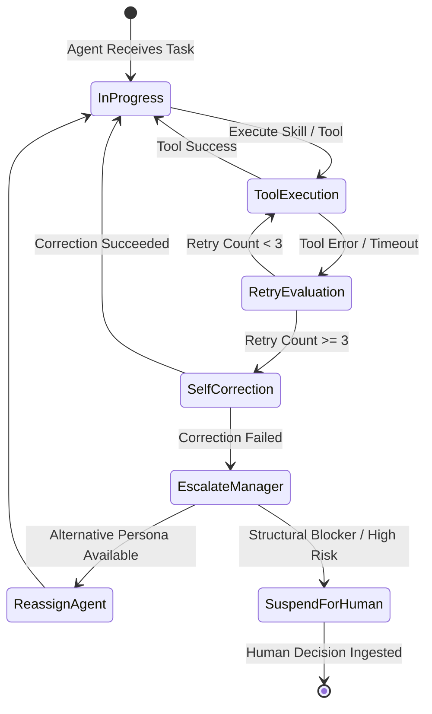

# Agent Contracts & Communication Protocols: KDI AI Office

## 1. Overview & Standard Operating Procedures (SOP)
To prevent prompt drift and chaotic agent dialogues, **KDI AI Office** enforces formal **Agent Contracts**. Every interaction between agents or between the AI Manager and an agent is mediated via strongly typed JSON schemas, standardized artifact exchange envelopes, and immutable role boundaries.

---

## 2. Standard Agent Message Envelope

All inter-agent messages and supervisor instructions adhere to the following canonical envelope:

```json
{
  "$schema": "https://kdi-office.internal/schemas/v1/agent-message.json",
  "message_id": "msg_01J9X8K2M4N5P6Q7R8S9T0V1W2",
  "task_id": "tsk_01J9X8A1B2C3D4E5F6G7H8J9K0",
  "trace_id": "trc_01J9X899999999999999999999",
  "timestamp": "2026-09-29T16:15:00.000Z",
  "sender": {
    "agent_id": "agent_architect_01",
    "role": "SYSTEM_ARCHITECT"
  },
  "recipient": {
    "agent_id": "agent_backend_01",
    "role": "BACKEND_ENGINEER"
  },
  "intent": "HANDOFF_SPECIFICATION",
  "payload": {
    "contract_version": "1.0.0",
    "title": "Pickup Module API Specification",
    "artifacts": [
      {
        "type": "OPENAPI_SPEC",
        "uri": "workspace://docs/api/pickup-service.yaml",
        "hash_sha256": "e3b0c44298fc1c149afbf4c8996fb92427ae41e4649b934ca495991b7852b855"
      }
    ],
    "context_summary": "Architectural contract for the student pickup status query and mutation endpoints.",
    "acceptance_criteria": [
      "Endpoint POST /api/v1/pickup/verify implements JWT validation",
      "Response time < 50ms for cache hits"
    ]
  },
  "risk_assessment": {
    "level": "LOW",
    "requires_human_approval": false,
    "rationale": "Design specification handoff only; zero executable changes."
  }
}
```

---

## 3. Core Agent Handoff Contracts

### 3.1 PM Agent -> Architect Agent Contract
- **Trigger:** Functional specification ready.
- **Contract Schema:**
  - `requirements_list`: Array of functional requirement IDs (`FR-xxx`).
  - `user_stories`: Structured Given-When-Then criteria.
  - `domain_constraints`: Specific performance, legal, or security boundaries.
- **Validation:** Architect verifies all user stories have verifiable criteria before accepting handoff.

### 3.2 Architect Agent -> Engineer Agent Contract
- **Trigger:** System architecture & interface contract finalized.
- **Contract Schema:**
  - `adr_reference`: URI to the approved Architectural Decision Record.
  - `api_contracts`: OpenAPI or TypeScript interface definitions.
  - `target_modules`: Specific files/directories permitted for modification.
- **Validation:** Engineer validates that interface types compile and adhere to project standards.

### 3.3 Engineer Agent -> QA Agent Contract
- **Trigger:** Code modification complete in working git branch.
- **Contract Schema:**
  - `git_branch`: Dedicated task working branch (e.g., `ai/task-1092-fix-pickup`).
  - `unified_diff_uri`: Path to generated `.diff` file.
  - `modified_files`: Explicit list of added/edited/deleted files.
  - `reproduced_test_case`: Name/location of new reproducing test case.
- **Validation:** QA verifies the branch cleanly merges and runs the test suite against the diff.

### 3.4 QA & Security Agent -> Code Reviewer Contract
- **Trigger:** Tests pass and security scan yields zero high/critical vulnerabilities.
- **Contract Schema:**
  - `test_results`: Total tests run, passed, failed, duration, coverage percentage.
  - `security_scan_results`: CVE findings, secret leakage status (`CLEAN` / `DETECTED`).
  - `recommended_action`: `PROCEED_TO_REVIEW` or `BLOCK_TASK`.
- **Validation:** Code Reviewer rejects immediately if test results report any failure or security scan is missing.

---

## 4. Failure & Escalation Protocols



1. **Local Retries:** An agent may retry a failed tool call up to 3 times using exponential backoff and error message reflection.
2. **Self-Correction:** If a compiler or linter errors, the agent parses the error log, modifies its code patch, and re-executes.
3. **Escalation to AI Manager:** If self-correction fails after 3 iterations, the agent yields control to AI Manager with a structured `FAILURE_REPORT`.
4. **Escalation to Human:** If the AI Manager cannot resolve the blocker through alternative agents, it flags the task as `NEEDS_ASSISTANCE` and notifies the Human Developer.
