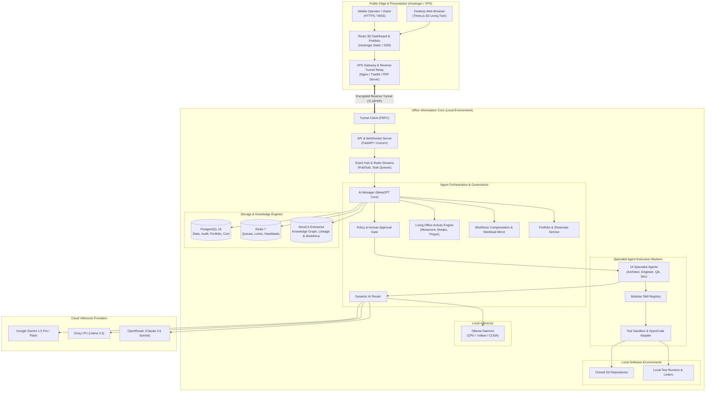

# System Design Document (SDD): KDI AI Office

## 1. System Overview & Architectural Baseline
**KDI AI Office** is an enterprise-grade, asynchronous, multi-agent software engineering automation platform designed to operate on a local workstation while providing secure remote management via an edge cloud gateway and an interactive, living 3D digital twin dashboard.

The architecture decouples the execution layer (on-premise workstation with full repository access, test runners, and databases) from the presentation and gateway layer (hosted web frontend and secure relay tunnel), while featuring an authentic digital twin office, first-class portfolio showrooms, and an AI workforce compensation simulation engine.

---

## 2. Core Architectural Principles

```text
Human Authority
      ↓ (Task Delegation / Approval)
KDI AI Office Gateway (Auth / Rate Limiting)
      ↓ (Encrypted Tunnel)
AI Office Core (Event Hub / Task Supervisor)
      ↓ (Decomposition / Planning)
AI Manager (MetaGPT SOP Engine)
      ↓ (Delegation)
Specialist Agents (14 Dedicated Personas)
      ↓ (Execution Plan)
Skills Engine (Reusable Procedural Recipes)
      ↓ (Tool Invocation)
Sandboxed Tools (Antigravity Engineering Engine, Git Worktrees, Shell Whitelist, Neo4j, PostgreSQL)
      ↓
Target Repositories & Local Systems
```

### 2.1 The Core Design Pillars
1. **Human Sovereignty:** Every action with risk level `HIGH` or `CRITICAL` (such as schema alterations, deletions, and git pushes to protected branches) triggers an execution block awaiting cryptographically signed human approval.
2. **On-Premise Computational Primacy:** Source code, development databases, and execution sandboxes remain strictly inside the local office workstation. Code is never uploaded to arbitrary public third-party SaaS platforms without developer consent.
3. **Hybrid Inference Layer:** Combines cloud LLMs (Gemini 1.5 Pro/Flash, Groq Llama-3, OpenRouter Claude 3.5 Sonnet) for high-order reasoning with local Ollama models (Qwen2.5-Coder, DeepSeek-R1-Distill) for private, offline, or fallback execution on standard CPUs/GPUs.
4. **Triple-Tier Knowledge & Memory:**
   - *Working Memory:* Redis (TTL-bounded task scratchpads, pub/sub events, distributed locks).
   - *Relational State:* PostgreSQL (users, tasks, runs, tool call logs, provider costs, workforce ledgers, immutable audit trail).
   - *Graph Knowledge:* Neo4j (code AST dependencies, file-commit-task lineage, GraphRAG architectural context, organizational policy rules, workforce allocation).
5. **Decoupled Agent Orchestration & Execution:** MetaGPT provides software company planning and multi-agent SOPs, while Google Antigravity (SDK and headless CLI) provides isolated workspace management, file manipulation, test execution, and strict verification gating (ADR-018).
6. **Zero-Trust Network Perimeter:** The local office workstation does not expose any open listening ports to the public internet. Communication with the public web dashboard is mediated entirely via outbound-initiated encrypted reverse tunnels (SSH / Cloudflare Tunnel / FRP).
7. **Resource-Aware Scheduling:** Concurrency controls and host telemetry feedback throttle agent workers whenever host CPU utilization exceeds 75% or RAM exceeds 80%, ensuring the workstation remains responsive for interactive human development.
8. **Living Digital Twin Fidelity:** 3D visual activities derive deterministically from backend state transitions (coding, meetings, breaks, prayers); visual states never fake or hallucinate operational reality.
9. **Empirical Portfolio Truth:** Client portfolio assets reflect verified Git and task execution evidence, preventing inflated marketing claims.

---

## 3. High-Level Architectural Block Diagram



---

## 4. Subsystem Breakdown

### 4.1 Gateway & Tunnel Subsystem
- Bridges external web clients securely to the on-premise workstation.
- Handles SSL termination, edge JWT verification, and WebSocket multiplexing.
- Outbound connection initiated from workstation eliminates NAT traversal / port-forwarding vulnerabilities.

### 4.2 Core Control & Task Lifecycle Subsystem
- Manages the lifecycle of tasks: `QUEUED -> PLANNING -> EXECUTING -> WAITING_APPROVAL -> COMPLETED / FAILED`.
- Enforces distributed idempotency locks via Redis keys (`kdi:lock:task:<id>`).
- Persists state transitions to PostgreSQL `tasks` and `task_runs` tables.

### 4.3 Living Virtual Office & Activity Engine
- Translates active agent states into spatial room assignments across 18 functional zones.
- Coordinates NavMesh corridor movement, break preservation (Pantry/Coffee), non-blocking Musholla prayer schedules, and collaborative conference meetings.

### 4.4 Software Execution Subsystem (Antigravity Engineering Engine + Tool Sandbox)
- Manages sandboxed Git worktrees (`git worktree add -b task/...`).
- Executes code inspection, editing, and test runs through Google Antigravity primitives (Python SDK and headless CLI).
- Restricts shell executions via strict Command Risk Classification with human approval gates.
- Enforces zero-fake-success Verification Gate requiring passing tests and compiler checks.

### 4.5 AI Workforce Compensation & Workload Mirror Subsystem
- Simulates virtual employee compensation (Base + Allowance + Incentive) across 8 grades.
- Calculates true multi-project software costs combining virtual labor with actual cloud LLM bills.
- Maps solo-developer responsibilities to equivalent AI teams via the Workload Mirror.

### 4.6 Portfolio & Showcase Subsystem
- Serves 11 project categories through 3D Gallery exhibition spaces and dedicated project rooms (*Koneksi Santri Room*).
- Formats structured case studies and verifies AI engineering contributions against real commit and audit evidence.

### 4.7 Knowledge & GraphRAG Subsystem
- Neo4j indexes project structures down to function and file levels.
- Maps commit lineage, test traceability, and workforce responsibility graphs.
- Provides GraphRAG query endpoints to enrich agent prompts with relevant dependency topology before code modifications.

### 4.8 AI Router & Model Subsystem
- Evaluates task metadata (complexity score, context token count, security sensitivity, latency requirements).
- Selects the primary model and constructs a fallback chain (e.g., `Gemini 1.5 Pro -> OpenRouter Claude -> Local Ollama`).
- Automatically handles token rate-limits (HTTP 429) and network retries with exponential backoff.
