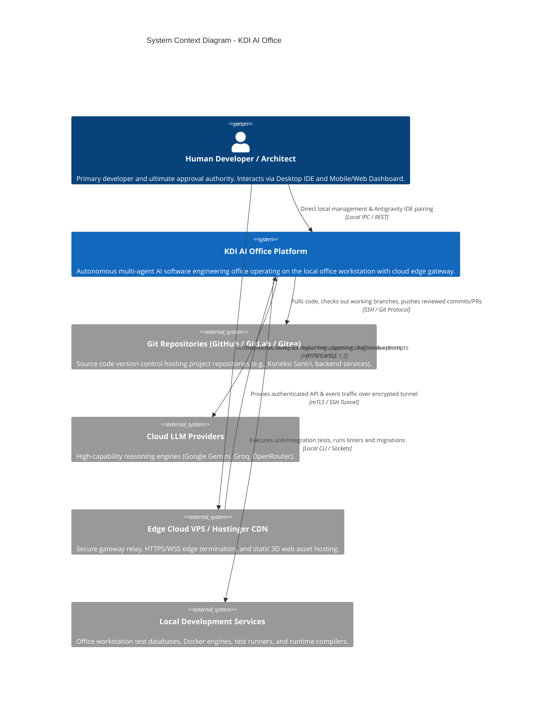

# System Context Architecture (C4 Level 1): KDI AI Office

## 1. Purpose & Scope
This document describes the **C4 Level 1 System Context** for **KDI AI Office**. It establishes the contextual boundaries between the human developer, external software repositories, cloud inference providers, edge presentation layers, and the core office system.

---

## 2. Context Diagram (C4 Level 1)

---

## 3. Boundary & Entity Definitions

### 3.1 Actors & Primary Users
- **Human Developer (Master User):**
  - Defines project goals, delegates background tasks, inspects real-time progress.
  - Reviews code diffs, architecture plans, and approves or rejects high-risk actions.
  - Continues high-priority coding in Antigravity IDE without interruption from background agents.

### 3.2 The Core System: KDI AI Office
- Operates primarily on the local office workstation.
- Encapsulates agent orchestration, knowledge graph management, tool execution sandboxes, and AI routing.
- Maintains isolated working directories for target repositories to prevent conflicts with the developer's active workspace.

### 3.3 External Systems & Interactions
- **Edge Cloud VPS (Gateway & Web Host):**
  - Serves static assets for the React Three Fiber 3D office dashboard.
  - Terminates public SSL/TLS connections and enforces edge rate-limiting and DDoS protection.
  - Maintains a secure, authenticated multiplexed reverse tunnel to the local office machine.
- **Git Repositories (GitHub / GitLab / Local Git):**
  - Source of truth for software codebases.
  - AI Office clones repositories into isolated workspaces, branches off target commits, and produces clean diffs.
- **Cloud LLM Providers (Google Gemini, Groq, OpenRouter):**
  - Provides scalable, high-throughput inference for complex multi-file planning, architecture reasoning, and deep code review.
- **Local Dev Services & Execution Host:**
  - Standard workstation environment running Node.js, Python, Docker, PHP, Go, or other project runtimes to execute unit tests and linters.
