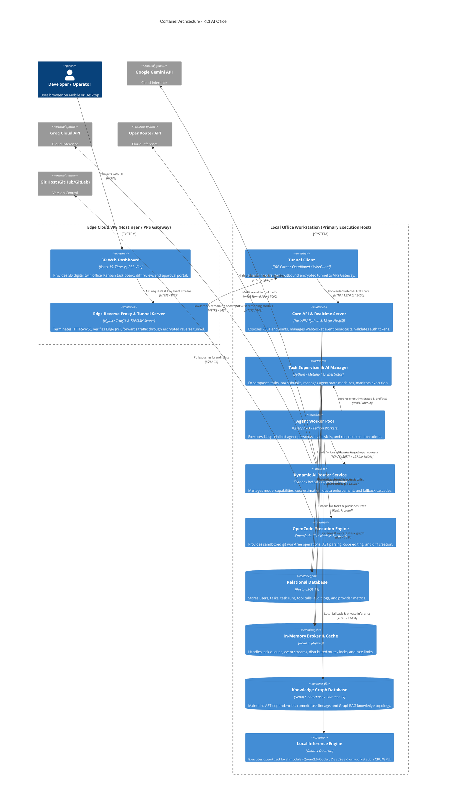

# Container Architecture (C4 Level 2): KDI AI Office

## 1. Overview & Execution Containers
This document details the **C4 Level 2 Container Architecture** of the **KDI AI Office**. It outlines the distinct containerized services, databases, runtimes, and their network communication boundaries across the Edge Cloud VPS and the Local Office Workstation.

---

## 2. Container Architecture Diagram (C4 Level 2)

---

## 3. Container Roles & Specifications

| Container ID | Container Name | Base Technology | Host Location | Memory / CPU Limits | Purpose |
|---|---|---|---|---|---|
| **C-01** | `kdi-web-ui` | React 19, Three.js, Nginx | Hostinger VPS / Edge | 512 MB / 0.5 CPU | Serves static 3D web dashboard assets. |
| **C-02** | `kdi-vps-gateway` | Nginx + FRP Server | Edge VPS | 1 GB / 1.0 CPU | Edge reverse proxy, SSL termination, and secure reverse tunnel endpoint. |
| **C-03** | `kdi-tunnel-client` | FRP Client / WireGuard | Local Office PC | 256 MB / 0.2 CPU | Outbound-initiated encrypted tunnel connection to Edge VPS. |
| **C-04** | `kdi-api-server` | FastAPI / Uvicorn | Local Office PC | 1 GB / 1.0 CPU | REST API gateway, WebSocket hub, and authentication validator. |
| **C-05** | `kdi-task-supervisor`| Python / MetaGPT | Local Office PC | 2 GB / 2.0 CPU | Task decomposition, state machine runner, and SOP coordinator. |
| **C-06** | `kdi-agent-workers` | Python / Celery / RQ | Local Office PC | 4 GB / 4.0 CPU (Max) | Specialist agent executor workers (scaled dynamically 1-4 workers). |
| **C-07** | `kdi-ai-router` | Python LiteLLM wrapper | Local Office PC | 512 MB / 1.0 CPU | Model capability routing, quota enforcement, and fallback cascade. |
| **C-08** | `kdi-opencode-engine`| Node.js 20 / OpenCode | Local Office PC | 2 GB / 2.0 CPU | Isolated repository sandboxes, AST parsing, and git diff generators. |
| **C-09** | `kdi-postgres` | PostgreSQL 16 (Alpine) | Local Office PC | 2 GB / 2.0 CPU | Relational persistence, audit logs, user sessions, and task runs. |
| **C-10** | `kdi-redis` | Redis 7 (Alpine) | Local Office PC | 1 GB / 1.0 CPU | Event streaming, task priority queues, and distributed mutex locks. |
| **C-11** | `kdi-neo4j` | Neo4j 5.20+ Enterprise | Local Office PC | 3 GB / 2.0 CPU | Code knowledge graph, task lineage, and GraphRAG vector indexing. |
| **C-12** | `kdi-ollama` | Ollama Daemon | Local Office PC | Dynamic (4-8 GB RAM)| Local quantized LLM inference for privacy-sensitive and offline tasks. |
