# Component Architecture (C4 Level 3): KDI AI Office

## 1. Overview & Scope
This document details the **C4 Level 3 Component Architecture** of the **KDI AI Office**. It specifies the internal software components, modules, interfaces, and control flow within the primary services operating on the office workstation.

---

## 2. Component Decomposition Diagram

```mermaid
graph TB
    subgraph APIServer["kdi-api-server (FastAPI)"]
        AuthController["Auth & Security Controller"]
        TaskController["Task & Workflow Controller"]
        ApprovalController["Approval Gate Controller"]
        PortfolioController["Portfolio CMS Controller"]
        WorkforceController["Workforce & Cost Controller"]
        WSBroadcaster["WebSocket Event Broadcaster"]
        HealthController["Health & Telemetry Controller"]
    end

    subgraph Orchestrator["kdi-task-supervisor (MetaGPT Core)"]
        PlanDecomposer["Task Decomposition Engine"]
        DAGScheduler["DAG Dependency Scheduler"]
        AgentCoordinator["Multi-Agent Coordinator"]
        ApprovalInterceptor["Approval Policy Interceptor"]
        MeetingCoordinator["Meeting & Standup Coordinator"]
    end

    subgraph LivingOffice["Living Office Activity Engine"]
        ActivityEngine["Office Activity Engine"]
        MovementSupervisor["NavMesh Movement Supervisor"]
        PrayerScheduler["Prayer Time Scheduler"]
        WhiteboardEngine["Dynamic Whiteboard Projector"]
    end

    subgraph WorkforceEconomics["Workforce & Cost Engine"]
        CompensationEngine["Virtual Compensation Engine"]
        WorkloadMirrorCalc["Workload Mirror Calculator"]
        MultiProjectLedger["Multi-Project Cost Ledger"]
    end

    subgraph PortfolioEngine["Portfolio Subsystem"]
        PortfolioService["Portfolio Showcase Service"]
        EvidenceAuditor["Empirical Contribution Auditor"]
        SanitizationGuard["Public Data Redaction Guard"]
    end

    subgraph AgentWorker["kdi-agent-workers (Worker Process)"]
        PersonaRuntime["Agent Persona Runtime"]
        MemoryManager["Context & Memory Manager"]
        SkillLoader["Modular Skill Loader"]
        ToolSandboxEngine["Tool Sandbox & Guard"]
    end

    subgraph AIRouter["kdi-ai-router (Inference Engine)"]
        CapabilityMatcher["Model Capability Matcher"]
        CostOptimizer["Cost & Latency Optimizer"]
        PrivacyFilter["Privacy & Data Classification Guard"]
        FallbackManager["Cascade Fallback Engine"]
        ProviderAdapters["Provider Adapters (Gemini, Groq, OpenRouter, Ollama)"]
    end

    subgraph AntigravityEngine["kdi-antigravity-engine (Engineering Execution)"]
        WorkspaceManager["Git Worktree & Sandbox Manager"]
        AntigravitySDKAdapter["Antigravity Python SDK Adapter"]
        AntigravityCLIAdapter["Antigravity Headless CLI Adapter"]
        DiffGenerator["Unified Diff & Patch Generator"]
        VerificationGate["Verification Gate & Test Supervisor"]
    end

    subgraph GraphRAGEngine["Graph & Memory Service (Neo4j Bridge)"]
        KnowledgeIndexer["Code & AST Graph Indexer"]
        LineageTracer["Task & Commit Lineage Tracer"]
        WorkforceGraphIndexer["Workforce & Cost Graph Indexer"]
        GraphRAGRetriever["GraphRAG Hybrid Context Retriever"]
    end

    TaskController --> PlanDecomposer
    ApprovalController --> ApprovalInterceptor
    PortfolioController --> PortfolioService
    WorkforceController --> CompensationEngine
    WSBroadcaster <==> AgentCoordinator
    WSBroadcaster <==> ActivityEngine

    PlanDecomposer --> DAGScheduler
    DAGScheduler --> AgentCoordinator
    AgentCoordinator --> PersonaRuntime
    AgentCoordinator --> MeetingCoordinator

    PersonaRuntime --> ActivityEngine
    ActivityEngine --> MovementSupervisor
    ActivityEngine --> PrayerScheduler

    PersonaRuntime --> MemoryManager
    PersonaRuntime --> SkillLoader
    SkillLoader --> ToolSandboxEngine

    MemoryManager --> GraphRAGRetriever
    ToolSandboxEngine --> WorkspaceManager
    ToolSandboxEngine --> TestSupervisor

    PersonaRuntime --> CapabilityMatcher
    CapabilityMatcher --> PrivacyFilter
    PrivacyFilter --> CostOptimizer
    CostOptimizer --> FallbackManager
    FallbackManager --> ProviderAdapters
```

---

## 3. Detailed Component Specifications

### 3.1 Core API & Realtime Server Components
1. **AuthController:** Validates inbound JSON Web Tokens (JWT) minted at the edge gateway. Enforces user identity, session expiration, and role-based permissions (`ROLE_OPERATOR`, `ROLE_ADMIN`, `PUBLIC`).
2. **TaskController:** Implements CRUD for tasks (`POST /tasks`, `GET /tasks/:id`, `POST /tasks/:id/cancel`). Validates task input against strict Pydantic schemas and enqueues tasks into Redis.
3. **ApprovalController:** Handles `POST /tasks/:id/approve` and `POST /tasks/:id/reject`. Emits resolution signals that unlock suspended workers.
4. **PortfolioController & WorkforceController:** Exposes endpoints for public portfolio exploration, case studies, AI workforce compensation reports, and Workload Mirror metrics.
5. **WSBroadcaster:** Manages bidirectional WebSocket connections with connected web dashboards. Channels include `office:events`, `task:<id>`, and `agent:<id>`.
6. **HealthController:** Performs active health checks against PostgreSQL, Redis, Neo4j, and Ollama, returning composite health payloads for system telemetry.

### 3.2 Task Supervisor & AI Manager Components
1. **PlanDecomposer:** Uses MetaGPT SOPs and high-tier cloud LLMs (Gemini/Claude) to decompose user prompts into sequential or parallel subtasks with well-defined inputs, outputs, and assigned agent personas.
2. **DAGScheduler:** Computes topological ordering of subtasks. Monitors prerequisites and dispatches ready subtasks to the Redis worker queue.
3. **AgentCoordinator:** Tracks active agent heartbeats, synchronizes inter-agent messaging via a shared message pool, and handles escalation when an agent fails to complete its goal.
4. **MeetingCoordinator:** Coordinates cross-functional syncs in the Meeting Room based on graph project dependencies.
5. **ApprovalInterceptor:** Scans pending tool calls against risk classification tables. If a tool call has risk `HIGH` or `CRITICAL`, suspends the DAG step and transitions task state to `WAITING_APPROVAL`.

### 3.3 Living Office Activity Engine Components
1. **OfficeActivityEngine:** Maps deterministic backend agent states to room assignments, break intervals, and collaborative activities.
2. **MovementSupervisor:** Calculates obstacle-free NavMesh waypoints for avatars walking between rooms in the 3D space.
3. **PrayerScheduler:** Computes Islamic prayer times from geographic coordinates and triggers respectful Musholla transitions without halting background AI jobs.
4. **WhiteboardEngine:** Renders active system architecture and sequence diagrams on the virtual glass whiteboard.

### 3.4 Workforce Economics & Cost Accounting Components
1. **CompensationEngine:** Calculates virtual compensation (Base + Allowance + Incentive) across 8 salary grades.
2. **WorkloadMirrorCalculator:** Decomposes single-developer tasks into equivalent specialized AI roles and calculates comparable virtual costs.
3. **MultiProjectLedger:** Allocates labor and cloud expenses proportionally across active software repositories.

### 3.5 Portfolio & Showcase Components
1. **PortfolioService:** Delivers structured project data for 11 software categories.
2. **EvidenceAuditor:** Validates that listed AI contributions are backed by real Git commits and task runs in Neo4j.
3. **SanitizationGuard:** Ensures sensitive internal variables, private IPs, and proprietary code are redacted before serving public portfolio visitors.

### 3.6 Agent Worker & Skill Engine Components
1. **PersonaRuntime:** Instantiates one of the 14 agent personas with immutable system prompts, specialized instructions, output constraints, and memory buffers.
2. **MemoryManager:** Fetches working memory from Redis and architectural context from the GraphRAG service. Truncates and summarizes historical messages to stay within the model's effective context window.
3. **SkillLoader:** Dynamically mounts validated procedural skill modules (e.g., `git`, `test-runner`, `code-review`) based on agent contracts.
4. **ToolSandboxEngine:** Verifies permissions before invoking any tool. Enforces path traversal boundaries (`..` checks), argument sanitization, command whitelists, and maximum execution timeouts.

### 3.7 Dynamic AI Router Components
1. **CapabilityMatcher:** Maps agent requirements (e.g., `needs_large_context`, `needs_function_calling`, `needs_coding_specialization`) against the Model Capability Matrix.
2. **PrivacyFilter:** Inspects task privacy flags. If data is marked confidential or internal-only, routes exclusively to local Ollama, completely blocking outbound cloud calls.
3. **CostOptimizer:** Selects the most cost-effective model that satisfies the task complexity score.
4. **FallbackManager:** Catches HTTP 429 (rate limit), 500 (provider error), or network timeouts. Automatically retries with the next provider in the cascade.
5. **ProviderAdapters:** Normalized SDK clients translating canonical request/response formats into Gemini, Groq, OpenRouter, and Ollama REST APIs.

### 3.8 Antigravity Software Engineering Engine Components (ADR-018)
1. **WorkspaceManager:** Creates isolated git worktrees (`git worktree add -b task/<id> ...`) guaranteeing agent edits never modify or push to protected branches (`main`, `master`, `production`).
2. **AntigravitySDKAdapter:** Programmatic Python SDK wrapper (`google.antigravity`) capturing tool executions, reasoning tokens, and structured lifecycle states.
3. **AntigravityCLIAdapter:** Headless non-interactive operational CLI runner (`agy --headless --json`) with structured JSON event streaming.
4. **DiffGenerator:** Computes unified diffs (`git diff`) and patch summaries for human operator audit.
5. **VerificationGate:** Enforces strict non-fabricated verification executing local test runners, linters, typecheckers, and build scripts with pass/fail evidence collection before marking tasks verified.

### 3.9 GraphRAG & Memory Engine Components
1. **KnowledgeIndexer:** Scans cloned repositories, parses code files into structural nodes (`Module`, `File`, `Function`), and persists relationships (`CONTAINS`, `CALLS`, `IMPORTS`) in Neo4j.
2. **LineageTracer:** Creates immutable graph links connecting `Task -> Agent -> ToolCall -> Commit -> File -> Test`.
3. **WorkforceGraphIndexer:** Maps relationships between agents, responsibilities, compensation nodes, and projects.
4. **GraphRAGRetriever:** Performs 2-hop graph neighborhood expansion to extract all relevant architecture decisions, dependency files, and recent bug reports.

### 3.10 Frontend 3D Digital Twin Architecture (PlayCanvas React + React Shell)
1. **React Application Shell (`App.tsx`):** Hosts the navigation bar, live telemetry badge, authentication session, and top-level tab state routing (`3D Digital Twin`, `Operations & Telemetry`, `Infrastructure Health`, `Command Center`).
2. **PlayCanvas Application Root (`PlayCanvasApp.tsx`):** Encapsulates the WebGL `<Application>` lifecycle, responsive viewport resizing, hardware support checks, and cleanup on unmount.
3. **Office Scene Composer (`OfficeScene.tsx`):** Assembles lighting, orbit camera, architectural floor slab, workstation desks, and live agent avatars.
4. **Agent 3D State Adapter (`Agent3DStateAdapter.ts`):** Normalizes 20 discrete backend engineering states (`CODING`, `DEBUGGING`, `MEETING`, `BREAK`, `PRAYING`, etc.) into 6 canonical 3D visual states (`IDLE`, `WORKING`, `MEETING`, `BREAK`, `PRAYING`, `ERROR`) with deterministic hex colors and emissive glows.
5. **Interactive Agent Entity (`PlayCanvasAgent.tsx`):** Low-poly humanoid avatar with procedural breathing/working bobbing animations driven by PlayCanvas frame events (`useAppEvent`), glowing visor, and pointer click interaction.
6. **React HUD Overlay (`AgentOverlay.tsx`):** Decoupled 2D UI rendered over the canvas displaying safe agent telemetry, role, active activity, and detail modal actions while enforcing public/private data isolation.
7. **WebGL Fallback Boundary (`WebGLFallback.tsx`):** Provides an interactive 2D digital twin fallback when WebGL 2.0 hardware acceleration is unavailable, guaranteeing zero blank screens.
