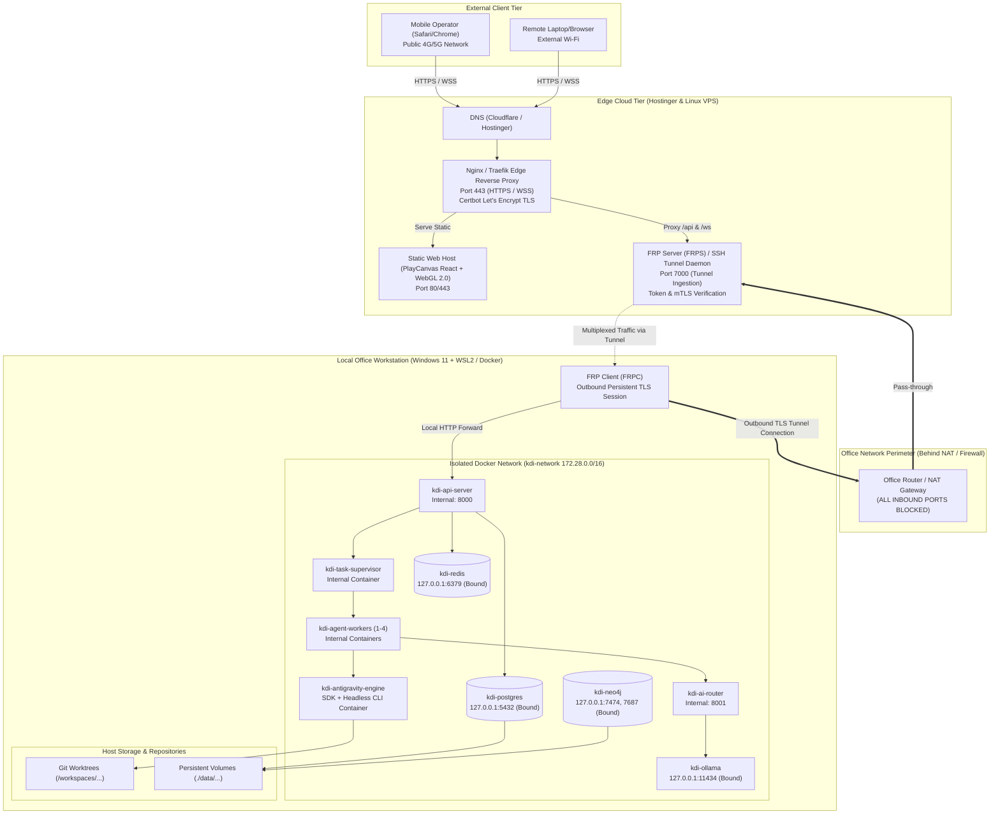

# Deployment Architecture & Network Topology: KDI AI Office

## 1. Executive Summary & Strategy
The deployment architecture of **KDI AI Office** enforces a **Zero-Trust Hybrid Deployment Model**:
1. **Public Edge (Hostinger Web & Linux VPS):** Serves the 3D Web UI, terminates SSL/TLS, enforces rate limiting, and runs the edge reverse tunnel server.
2. **Private On-Premise Host (Office Workstation):** Runs all persistent databases (PostgreSQL, Neo4j, Redis), local inference (Ollama), multi-agent supervisors, OpenCode execution sandboxes, and repository worktrees.
3. **Outbound Reverse Tunnel:** The office computer initiates an outbound TLS connection to the VPS. No public ports or port-forwarding rules are opened on the office router/firewall.

---

## 2. Deployment Topology Diagram



---

## 3. Network Ports & Binding Security Rules

| Service / Container | Host Binding | Internal Docker Port | Public Internet Access | Access Restrictions |
|---|---|---|---|---|
| **Nginx / Traefik (VPS)** | `0.0.0.0:443`, `80` | N/A | **YES** | Public HTTPS; WAF rate-limiting; SSL termination. |
| **FRPS Tunnel Server (VPS)** | `0.0.0.0:7000` | N/A | **YES (Whitelisted)** | Only allows authenticated FRP clients with cryptographic token. |
| **kdi-api-server** | `127.0.0.1:8000` | `8000` | **NO** | Accessible only via localhost and FRPC tunnel forward. |
| **kdi-ai-router** | `127.0.0.1:8001` | `8001` | **NO** | Internal container network only. |
| **PostgreSQL 16** | `127.0.0.1:5432` | `5432` | **NO** | Bound strictly to loopback interface; strong password in `.env`. |
| **Redis 7** | `127.0.0.1:6379` | `6379` | **NO** | Bound strictly to loopback interface; `requirepass` enabled. |
| **Neo4j 5 (Bolt / Web)** | `127.0.0.1:7687, 7474`| `7687, 7474`| **NO** | Bound strictly to loopback interface; auth required. |
| **Ollama Local Daemon** | `127.0.0.1:11434` | `11434` | **NO** | Bound strictly to loopback interface; no external exposure. |

> [!CAUTION]
> Under no circumstances may `5432` (Postgres), `6379` (Redis), `7687` (Neo4j Bolt), or `11434` (Ollama) be bound to `0.0.0.0` or forwarded on the office network router.

---

## 4. Reverse Tunnel Specification (FRP / Cloudflare Tunnel)

To connect the Edge VPS with the local office machine behind NAT without port forwarding:
1. **Tunnel Protocol:** FRP (Fast Reverse Proxy) with TLS encryption and token-based handshake (or Cloudflare Named Tunnel as alternative).
2. **Connection Initialization:** Outbound from `kdi-tunnel-client` on the office PC to `vps.kdioffice.domain:7000`.
3. **Keep-Alive & Reconnection:**
   - Heartbeat interval: `30s`
   - Timeout: `90s`
   - Reconnect strategy: Exponential backoff (`1s`, `2s`, `4s` ... max `30s`) with auto-reconnect on network drops.
4. **Traffic Multiplexing:**
   - HTTP traffic forwarded to `127.0.0.1:8000`
   - WebSocket upgrades forwarded transparently for `/ws/events` and `/ws/tasks`

---

## 5. Host Workstation Environment Requirements

The local workstation runs Windows 11 with WSL2 (Ubuntu 22.04 LTS) and Docker Desktop / Engine.

### 5.1 Minimum System Specifications
- **CPU:** 8 physical cores (e.g., AMD Ryzen 7 5700X / Intel Core i7-12700 or equivalent).
- **System RAM:** 32 GB DDR4/DDR5 (16 GB allocated to Docker / WSL2).
- **Disk Storage:** Fast NVMe M.2 SSD with at least 200 GB dedicated space for Git worktrees, Docker volumes, and local Ollama model weights.
- **GPU (Optional):** Consumer GPU (NVIDIA RTX 3060 12GB or similar) for Ollama GPU offloading. If running on CPU only, quantized models (3B to 7B Q4_K_M) are used.

### 5.2 Storage Mount Hierarchy
```text
D:\apss-source\KDI AI OFFICE\
├── .env                       # Local secrets (NEVER committed to git)
├── docker-compose.yml         # Container definitions
├── config/                    # Service configuration files
│   ├── frpc.ini               # Tunnel client configuration
│   ├── neo4j.conf             # Neo4j memory & bolt config
│   ├── postgres.conf          # Connection pooling & WAL config
│   └── routing-rules.json     # Dynamic AI routing rules
├── data/                      # Persistent database volumes
│   ├── postgres/
│   ├── neo4j/
│   ├── redis/
│   └── ollama/
└── workspaces/                # Isolated Git worktrees for agent tasks
    ├── project-koneksi-santri/
    └── project-core-services/
```
