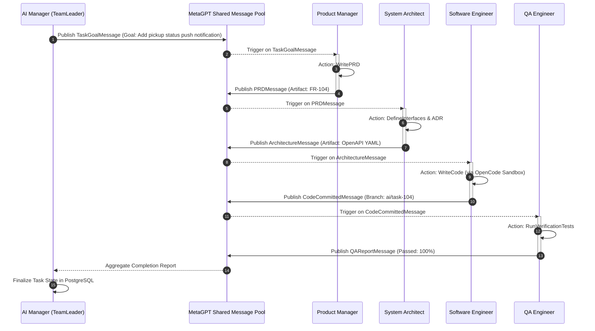

# Integration Specification: MetaGPT Multi-Agent Orchestration (`metagpt.md`)

## 1. Architectural Positioning & Role Boundary
**MetaGPT** serves strictly as the **Multi-Agent Orchestration and Workflow Engine** within **KDI AI Office**. 

### 1.1 What MetaGPT IS:
- A structured orchestration framework providing role-based Standard Operating Procedures (SOPs).
- A stateful message hub coordinating communication between distinct personas (e.g., PM, Architect, Engineer, QA).
- A dependency pipeline managing artifact handoffs (e.g., Requirement Document -> API Contract -> Code File -> Test Suite).

### 1.2 What MetaGPT IS NOT:
- **MetaGPT is NOT a database:** Persistent state, tasks, and audit logs reside in PostgreSQL and Neo4j, not inside ephemeral Python objects.
- **MetaGPT is NOT the frontend:** The 3D and 2D web interfaces interact via FastAPI WebSockets/REST, not MetaGPT internal UI.
- **MetaGPT is NOT the security layer:** Capability checks and tool permissions are enforced by the core `PolicyEngine`, not inside agent prompts.
- **MetaGPT is NOT the software execution runner:** File edits and git operations are executed via OpenCode and sandboxed tools.

---

## 2. MetaGPT Role Mapping to KDI Office Personas

| KDI Agent Persona | MetaGPT Base Role Class | Core SOP / Action Pipeline |
|---|---|---|
| **AI Manager** | `TeamLeader` / `Supervisor` | `DecomposeGoal` -> `AssignRoles` -> `MonitorExecution` |
| **Product Manager** | `ProductManager` | `WritePRD` -> `PublishRequirements` |
| **System Architect** | `Architect` | `DesignArchitecture` -> `WriteADR` -> `DefineInterfaces` |
| **Database Architect** | `DataArchitect` | `ModelSchema` -> `GenerateMigration` -> `VerifyRollback` |
| **Software Engineer** | `Engineer` | `AnalyzeAST` -> `WriteCode` -> `RunLinters` |
| **QA Engineer** | `QaEngineer` | `DesignTestPlan` -> `WriteUnitTests` -> `ExecuteTests` |
| **Security Engineer** | `SecurityReviewer` | `ScanVulnerabilities` -> `CheckSecrets` -> `SignAudit` |
| **Code Reviewer** | `Reviewer` | `ParseDiff` -> `CheckStandards` -> `EmitDisposition` |

---

## 3. Workflow & Shared Message Pool Topology

---

## 4. Failure Handling & Circuit Breaking
1. **Action Timeout:** If an agent action inside MetaGPT exceeds its allocated timeout (default: 120 seconds), the workflow engine halts the subtask, issues an `ActionTimeoutException`, and attempts a single retry with a higher-capability model.
2. **Re-planning on Structural Blockers:** If an agent emits a `BlockerMessage` (e.g., dependency missing, port collision), the AI Manager consumes the message and dynamically injects a remediation subtask (e.g., delegating to DevOps Engineer to install dependency) before re-triggering the blocked agent.
3. **Loop Detection Guard:** If messages between two agents ping-pong more than 3 iterations without progress (e.g., QA rejects code -> Engineer fixes -> QA rejects again), the circuit breaker triggers, halts the loop, and escalates to the Human Developer.

---

## 5. Memory & Permission Boundaries
- **Ephemeral Shared Pool:** Messages in MetaGPT's shared pool exist only for the duration of the active task run.
- **Relational Ingestion:** Before task teardown, all key messages, decisions, and artifacts are extracted and persisted to PostgreSQL `task_runs` and `tool_calls`.
- **Knowledge Lineage:** Cross-agent dependencies (`PM-produced-PRD -> Architect-consumed-PRD`) are written to Neo4j as relationship edges (`(:Requirement)-[:INFORMS]->(:Design)`).
- **Zero Raw Shell:** MetaGPT agents cannot execute raw python `eval()` or unmediated `os.system()`; all tool actions must call the KDI Sandboxed Tool Layer.
