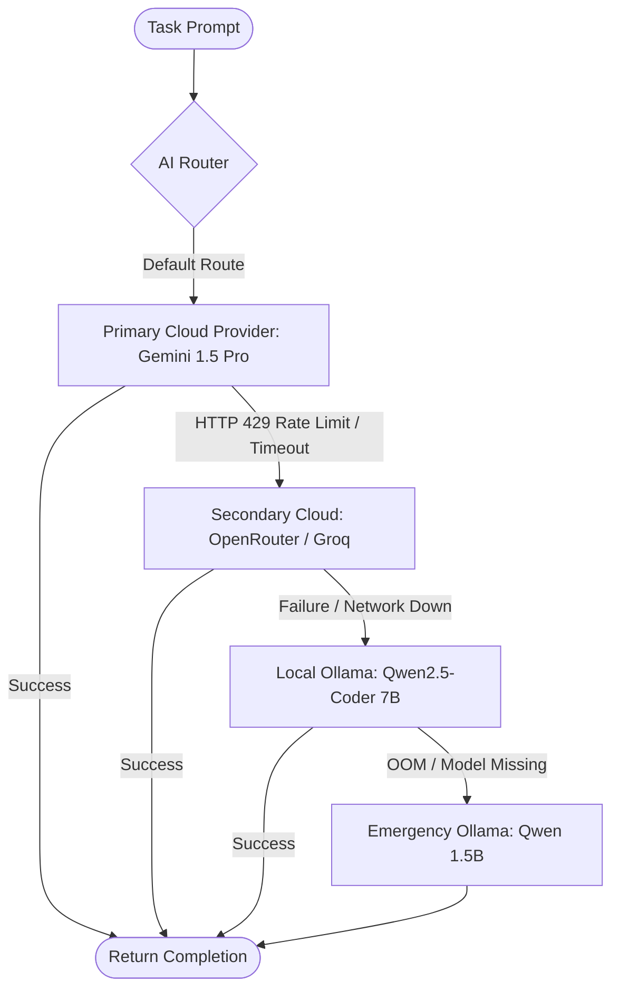

# Integration Specification: Local Ollama Inference (`ollama.md`)

## 1. Architectural Role & Philosophy
**Ollama** serves as the **Local, Sovereign, and Fallback Inference Engine** for **KDI AI Office**. It runs directly as a local daemon on the office workstation, ensuring the system remains operational even during cloud network outages, provider rate limits, or when handling strictly confidential proprietary data.

---

## 2. Resource-Aware & CPU-Friendly Baseline

> [!IMPORTANT]
> The KDI AI Office architecture **DOES NOT** mandate a dedicated high-end GPU. The local inference layer is specifically tuned to operate reliably on standard workstation hardware:
> - **CPU:** Multicore x86_64 CPU (AVX2 / AVX-512 support).
> - **RAM:** 32GB system memory (with 8GB to 12GB allocated for model quantization buffers).
> - **Storage:** Fast NVMe SSD for fast model weight loading.
> - **Optional GPU Offload:** If an NVIDIA/AMD/Intel GPU is available, Ollama automatically offloads layers; if not, it runs seamlessly in pure CPU mode (`num_gpu: 0`).

### 2.1 Recommended Quantized Local Model Suite

| Model Purpose | Recommended Model Tag | Parameter Size | Quantization | Memory Required | CPU Token Speed |
|---|---|---|---|---|---|
| **Code Generation & Editing** | `qwen2.5-coder:7b-instruct-q4_K_M` | 7.6 B | 4-bit Medium | ~4.7 GB RAM | 8 - 14 t/s |
| **Lightweight Fallback Chat** | `llama3.2:3b-instruct-q4_K_M` | 3.2 B | 4-bit Medium | ~2.2 GB RAM | 18 - 25 t/s |
| **Local Reasoning / Analysis** | `deepseek-r1:7b` | 7.0 B | 4-bit Medium | ~4.8 GB RAM | 7 - 12 t/s |
| **Ultra-Low Memory Emergency** | `qwen2.5-coder:1.5b-base-q4_K_M` | 1.5 B | 4-bit Medium | ~1.2 GB RAM | 35+ t/s |

---

## 3. Integration Architecture & REST Client

Ollama runs as a background service binding strictly to `127.0.0.1:11434`. The KDI AI Router interacts with it via the standard Ollama REST API:

```python
# Ollama Client Adapter Snippet
class OllamaProviderAdapter:
    def __init__(self, base_url: str = "http://127.0.0.1:11434"):
        self.base_url = base_url

    async def check_health(self) -> bool:
        try:
            async with httpx.AsyncClient(timeout=3.0) as client:
                res = await client.get(f"{self.base_url}/api/version")
                return res.status_code == 200
        except Exception:
            return False

    async def generate_completion(self, model: str, prompt: str, system: str, temperature: float = 0.2):
        async with httpx.AsyncClient(timeout=120.0) as client:
            payload = {
                "model": model,
                "prompt": prompt,
                "system": system,
                "stream": False,
                "options": {
                    "temperature": temperature,
                    "num_ctx": 8192,
                    "num_thread": 6  # Limit CPU threads to prevent host freezing
                }
            }
            res = await client.post(f"{self.base_url}/api/generate", json=payload)
            return res.json()["response"]
```

---

## 4. Privacy & Data Classification Policy
Tasks flagged with high privacy constraints bypass cloud LLMs entirely:
1. **Confidentiality Tag (`data_classification: "CONFIDENTIAL"`):** If a task involves sensitive credentials, proprietary customer records, or internal trade secrets, the AI Router routes the prompt exclusively to local Ollama.
2. **Zero Network Egress Guarantee:** In privacy mode, all outbound HTTP connections to external LLM endpoints (Google, Groq, OpenRouter) are blocked at the application level.

---

## 5. Automated Fallback Cascade
When external cloud inference fails, Ollama acts as the final resilient backstop:



---

## 6. Health Check & Resource Guardrails
1. **Periodic Ping:** The `HealthController` checks `GET http://127.0.0.1:11434/api/version` every 30 seconds.
2. **Dynamic Unloading:** To avoid exhausting host RAM when agents are idle, Ollama is configured with `keep_alive: 5m`. If no inference requests arrive within 5 minutes, model weights are unloaded from RAM automatically.
3. **Thread Clamping:** CPU inference threads are restricted to `CPU_CORES - 2` (e.g., on an 8-core CPU, `num_thread: 6`), guaranteeing that the operating system and Antigravity IDE remain completely smooth.
