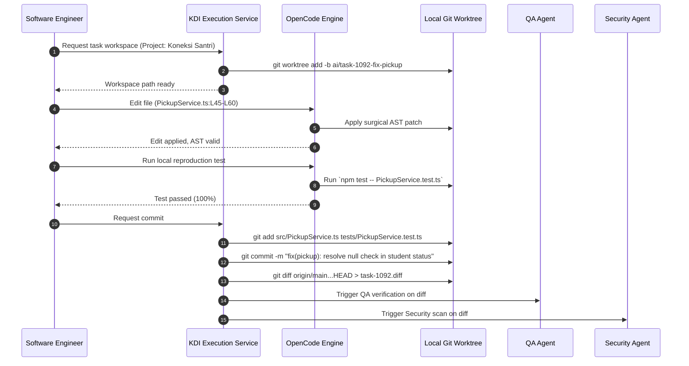

# Integration Specification: OpenCode Execution Engine (`opencode.md`)

## 1. Architectural Positioning
**OpenCode** serves as the **Autonomous Software Engineering Execution Layer** in the **KDI AI Office**. While MetaGPT orchestrates *who* does *what*, OpenCode provides the low-level, high-fidelity mechanics of *how* code is read, parsed, modified, tested, and committed in local software repositories.

```text
Agent Persona (Software Engineer / Backend / Frontend)
      ↓ (Task Directives)
KDI Execution Service (Guardrails, Sandboxing, Worktrees)
      ↓ (Structured Tool Requests)
OpenCode Engine (AST Parsing, Surgical Edits, Patching)
      ↓ (Local Worktree Operations)
Git Repository (Isolated Working Branch)
```

---

## 2. Repository Access & Workspace Worktree Strategy

To prevent autonomous agents from dirtying or conflicting with the human developer's active workspace in Antigravity IDE:
1. **Isolated Git Worktrees:** For every task requiring code modifications, the Execution Service provisions a distinct Git worktree linked to the primary local repository:
   ```bash
   git worktree add -b ai/task-<task_id>-<slug> D:/apss-source/workspaces/<task_id> origin/main
   ```
2. **Worktree Isolation:** The agent operates exclusively inside `D:/apss-source/workspaces/<task_id>/`. The developer's primary directory remains untouched.
3. **Automatic Worktree Pruning:** Upon task completion or cancellation (and after diff generation), the worktree is cleanly pruned:
   ```bash
   git worktree remove --force D:/apss-source/workspaces/<task_id>
   ```

---

## 3. Core OpenCode Primitives & Capabilities

### 3.1 AST-Aware Code Editing
Rather than relying on naive regex or full-file rewrites, OpenCode utilizes Tree-sitter AST parsers for TypeScript, JavaScript, Python, PHP, and Go:
- **Symbol Targeting:** Can modify a specific function or class by name without altering surrounding code.
- **Syntax Pre-Validation:** Parsed AST tree is verified before saving to disk. If an unclosed brace or syntax error is detected, the edit is aborted and re-prompted.

### 3.2 Surgical Search & Replace
- Locates unique target strings with leading whitespace matching.
- Enforces strict substring uniqueness within the targeted file line range to prevent unintended replacements.

### 3.3 Command & Test Execution Sandbox
- Executes test commands (`npm test`, `pytest`, `php artisan test`) inside a child process wrapper.
- Enforces strict execution timeouts, CPU affinity limits, and memory caps (max 2GB per test runner).
- Streams stdout and stderr in real-time to the task audit log.

---

## 4. Branching, Commit & Pull Request Workflow



---

## 5. Failure Handling & Clean Reversals
1. **Compilation or Syntax Failure:** If an edited file introduces a syntax error, OpenCode automatically restores the original file content from the git index (`git checkout -- <file>`) and returns the exact compiler error back to the agent for self-correction.
2. **Merge Conflicts:** If the base branch has moved ahead, OpenCode attempts a local rebase. If conflicts occur, it does not attempt blind resolution; it aborts, tags the task as `MERGE_CONFLICT`, and alerts the AI Manager.
3. **Dirty State Abort:** If a task process crashes unexpectedly, the supervisor detects the abandoned worktree, deletes the temporary directory, and resets git state to clean.
