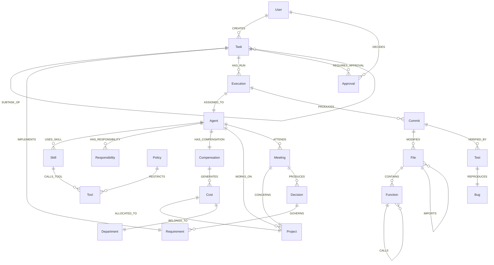

# Knowledge Graph Architecture & Neo4j Schema: KDI AI Office

## 1. Overview & Architectural Role
**Neo4j** is the mandatory knowledge, dependency, and organizational backbone of **KDI AI Office**. It provides the multi-dimensional topology linking software artifacts, code AST dependencies, task lineage, governance policies, and the newly integrated **AI Workforce Economics & Meeting Collaboration** topology.

While PostgreSQL stores linear transactional records (tables of users, logs, runs, financial ledger rows), Neo4j models how these entities connect into an interconnected semantic graph.

---

## 2. Graph Node Catalog (The 26 Canonical Entity Types)

| Node Label | Description & Purpose | Primary Unique Key | Key Properties |
|---|---|---|---|
| `:Project` | High-level software product (e.g., *Koneksi Santri*) | `id` (UUID) | `name`, `status`, `created_at` |
| `:Repository` | Git repository under management | `uri` (String) | `name`, `default_branch`, `language` |
| `:Module` | Logical software package / namespace / directory | `id` (UUID) | `name`, `path`, `type` |
| `:File` | Source code file, configuration file, or script | `path` (String) | `extension`, `size_bytes`, `sha256` |
| `:Function` | Concrete function, method, or class within a file | `symbol_id` (String)| `name`, `signature`, `line_start`, `line_end` |
| `:Task` | Delegated user goal or decomposed subtask | `id` (UUID) | `title`, `status`, `risk_level`, `created_at` |
| `:Agent` | The 14 specialist agent personas (Digital Employees)| `role` (String) | `display_name`, `state`, `room_id`, `grade` |
| `:Skill` | Reusable procedural recipes | `name` (String) | `version`, `category`, `timeout_secs` |
| `:Requirement`| Formal PRD user story or acceptance criteria (`FR-xxx`) | `req_id` (String) | `title`, `priority`, `acceptance_criteria` |
| `:Decision` | Architectural Decision Record (ADR) | `adr_id` (String) | `title`, `status`, `date_approved` |
| `:Bug` | Reported or reproduced defect / exception | `id` (UUID) | `title`, `severity`, `stack_trace_hash` |
| `:Commit` | Git commit hash | `hash` (String) | `message`, `author`, `timestamp` |
| `:Test` | Automated test suite or individual test case | `test_id` (String) | `name`, `runner`, `status`, `duration_ms` |
| `:Policy` | Security or governance guardrail rule | `policy_id` (String)| `name`, `risk_threshold`, `action_type` |
| `:Approval` | Human approval gate instance | `id` (UUID) | `risk_level`, `status`, `decided_at` |
| `:User` | Human master developer or operator | `id` (UUID) | `username`, `role`, `public_key` |
| `:Document` | Architecture guide, manual, or specification | `uri` (String) | `title`, `format`, `last_updated` |
| `:Knowledge` | Extracted fact, architectural guideline, or pattern | `id` (UUID) | `summary`, `category`, `confidence` |
| `:Event` | System or lifecycle event | `event_id` (String)| `type`, `timestamp`, `source` |
| `:Execution` | Concrete run of an agent or task worker | `run_id` (String) | `status`, `started_at`, `completed_at` |
| `:Tool` | Executable primitive (OpenCode, Git, Shell, etc.) | `tool_id` (String) | `name`, `risk_level`, `permission_req` |
| `:Responsibility`| Functional workload item mapped in Workload Mirror | `id` (UUID) | `name`, `category`, `complexity_weight` |
| `:Compensation`| Virtual compensation package allocated to an agent | `id` (UUID) | `base_idr`, `allowance_idr`, `incentive_idr` |
| `:Cost` | Allocated financial cost item for a project/department | `id` (UUID) | `amount_idr`, `llm_cost_usd`, `period` |
| `:Budget` | Spending threshold assigned to a project/department | `id` (UUID) | `cap_idr`, `cap_usd`, `fiscal_period` |
| `:Meeting` | Structured cross-agent conference in Meeting Room | `meeting_id` (UUID)| `topic`, `start_time`, `end_time`, `decisions` |

---

## 3. Relationship Schema & Cardinality



### 3.1 Formal Relationships
- Code: `(:Project)-[:HAS_REPO]->(:Repository)-[:CONTAINS]->(:Module)-[:CONTAINS]->(:File)-[:CONTAINS]->(:Function)`
- Code Dependencies: `(:File)-[:IMPORTS]->(:File)`, `(:Function)-[:CALLS]->(:Function)`
- Task & Execution: `(:Task)-[:IMPLEMENTS]->(:Requirement)`, `(:Task)-[:HAS_RUN]->(:Execution)-[:PRODUCES]->(:Commit)`
- Verification: `(:Commit)-[:VERIFIED_BY]->(:Test)`, `(:Test)-[:REPRODUCES]->(:Bug)`
- Workforce & Cost:
  - `(:Agent)-[:HAS_RESPONSIBILITY]->(:Responsibility)`
  - `(:Agent)-[:HAS_COMPENSATION]->(:Compensation)`
  - `(:Compensation)-[:GENERATES]->(:Cost)`
  - `(:Cost)-[:ALLOCATED_TO]->(:Project)`
  - `(:Cost)-[:BELONGS_TO]->(:Department)`
  - `(:Agent)-[:WORKS_ON]->(:Project)`
- Collaboration:
  - `(:Agent)-[:ATTENDS]->(:Meeting)`
  - `(:Meeting)-[:CONCERNS]->(:Project)`
  - `(:Meeting)-[:PRODUCES]->(:Decision)`

---

## 4. Neo4j Constraints & Performance Indexes (Cypher DDL)

```cypher
// Uniqueness Constraints
CREATE CONSTRAINT c_project_id IF NOT EXISTS FOR (p:Project) REQUIRE p.id IS UNIQUE;
CREATE CONSTRAINT c_repo_uri IF NOT EXISTS FOR (r:Repository) REQUIRE r.uri IS UNIQUE;
CREATE CONSTRAINT c_file_path IF NOT EXISTS FOR (f:File) REQUIRE f.path IS UNIQUE;
CREATE CONSTRAINT c_task_id IF NOT EXISTS FOR (t:Task) REQUIRE t.id IS UNIQUE;
CREATE CONSTRAINT c_agent_role IF NOT EXISTS FOR (a:Agent) REQUIRE a.role IS UNIQUE;
CREATE CONSTRAINT c_commit_hash IF NOT EXISTS FOR (c:Commit) REQUIRE c.hash IS UNIQUE;
CREATE CONSTRAINT c_req_id IF NOT EXISTS FOR (rq:Requirement) REQUIRE rq.req_id IS UNIQUE;
CREATE CONSTRAINT c_decision_id IF NOT EXISTS FOR (d:Decision) REQUIRE d.adr_id IS UNIQUE;
CREATE CONSTRAINT c_tool_id IF NOT EXISTS FOR (tl:Tool) REQUIRE tl.tool_id IS UNIQUE;
CREATE CONSTRAINT c_resp_id IF NOT EXISTS FOR (r:Responsibility) REQUIRE r.id IS UNIQUE;
CREATE CONSTRAINT c_comp_id IF NOT EXISTS FOR (cmp:Compensation) REQUIRE cmp.id IS UNIQUE;
CREATE CONSTRAINT c_cost_id IF NOT EXISTS FOR (cst:Cost) REQUIRE cst.id IS UNIQUE;
CREATE CONSTRAINT c_budget_id IF NOT EXISTS FOR (b:Budget) REQUIRE b.id IS UNIQUE;
CREATE CONSTRAINT c_meeting_id IF NOT EXISTS FOR (m:Meeting) REQUIRE m.meeting_id IS UNIQUE;

// Performance Indexes for Graph Traversal
CREATE INDEX idx_task_status IF NOT EXISTS FOR (t:Task) ON (t.status);
CREATE INDEX idx_cost_period IF NOT EXISTS FOR (c:Cost) ON (c.period);
CREATE INDEX idx_agent_grade IF NOT EXISTS FOR (a:Agent) ON (a.grade);
```

---

## 5. Practical Cypher Query Examples

### 5.1 Query: Complete Task-to-Code Lineage Trace
```cypher
MATCH (t:Task {id: $taskId})
OPTIONAL MATCH (t)-[:IMPLEMENTS]->(rq:Requirement)
OPTIONAL MATCH (t)-[:HAS_RUN]->(e:Execution)-[:PRODUCES]->(c:Commit)
OPTIONAL MATCH (c)-[:MODIFIES]->(f:File)
OPTIONAL MATCH (c)-[:VERIFIED_BY]->(ts:Test)
RETURN t.title AS TaskTitle, 
       rq.req_id AS Requirement, 
       c.hash AS CommitHash, 
       collect(DISTINCT f.path) AS ModifiedFiles,
       collect(DISTINCT ts.name) AS VerifiedTests;
```

### 5.2 Query: Which agents cover these responsibilities?
```cypher
MATCH (r:Responsibility) WHERE r.name IN $responsibilityNames
MATCH (r)<-[:HAS_RESPONSIBILITY]-(a:Agent)
RETURN r.name AS Responsibility, collect(a.display_name) AS QualifiedAgents;
```

### 5.3 Query: Which projects consume the most AI workforce cost?
```cypher
MATCH (p:Project)<-[:ALLOCATED_TO]-(c:Cost)
RETURN p.name AS Project, 
       sum(c.amount_idr) AS TotalVirtualCostIDR, 
       sum(c.llm_cost_usd) AS ActualCloudSpendUSD
ORDER BY TotalVirtualCostIDR DESC;
```

### 5.4 Query: Which agents work on multiple projects?
```cypher
MATCH (a:Agent)-[:WORKS_ON]->(p:Project)
WITH a, collect(p.name) AS Projects, count(p) AS ProjectCount
WHERE ProjectCount > 1
RETURN a.display_name AS Agent, a.role AS Role, ProjectCount, Projects;
```

### 5.5 Query: Meeting Context & Decisions
```cypher
MATCH (m:Meeting {meeting_id: $meetingId})
OPTIONAL MATCH (m)<-[:ATTENDS]-(a:Agent)
OPTIONAL MATCH (m)-[:PRODUCES]->(d:Decision)
RETURN m.topic AS Topic, 
       collect(DISTINCT a.display_name) AS Attendees, 
       collect(DISTINCT d.title) AS DecisionsMade;
```
