# GraphRAG Architecture: Graph-Augmented Context Retrieval: KDI AI Office

## 1. Overview & Problem Definition
Standard vector-only Retrieval-Augmented Generation (Vector RAG) relies strictly on text chunk semantic embedding similarity (cosine distance). In software engineering, Vector RAG regularly fails because:
1. Code has deep structural dependencies (a change in `pickup.controller.ts` directly impacts `pickup.service.ts`, `database.migration.ts`, and `parent.notification.ts` regardless of text embedding distance).
2. Pure vector search misses indirect imports, inherited classes, foreign key constraints, and architectural policy boundaries.

**GraphRAG** in **KDI AI Office** merges **vector semantic search** with **Neo4j graph traversal** to construct dense, hyper-relevant context windows.

---

## 2. GraphRAG Two-Phase Retrieval Pipeline

```mermaid
sequenceDiagram
    autonumber
    actor Agent as Specialist Agent
    participant Engine as GraphRAG Engine
    participant Neo as Neo4j Graph Database
    participant PG as PostgreSQL Knowledge Store
    participant Router as Context Builder

    Agent->>Engine: Retrieve context for: "Fix pickup status null error in Koneksi Santri"
    
    rect rgb(20, 30, 45)
        note over Engine,Neo: Phase 1: Seed Entity Identification
        Engine->>Neo: Fulltext/Vector Search: Identify seed nodes (:File, :Function, :Bug)
        Neo-->>Engine: Seed Node: (:File {path: "src/services/PickupService.ts"})
    end

    rect rgb(25, 40, 60)
        note over Engine,Neo: Phase 2: Topological Graph Expansion (2 Hops)
        Engine->>Neo: Cypher: Expand 2-hops across CALLS, IMPORTS, MODIFIED_BY, GOVERNS
        Neo-->>Engine: Subgraph: Dependent controllers, unit tests, recent commits, ADR-004
    end

    Engine->>PG: Fetch distilled knowledge items for "PickupService"
    PG-->>Engine: Lesson: "PickupService requires redis lock before updating status"

    Engine->>Router: Synthesize Dense Architectural Context Block
    Router-->>Agent: Injected Structured Context (<project_context>...</project_context>)
```



---

## 3. The 2-Hop Graph Expansion Cypher Procedure

When an agent needs context for a target file or module, GraphRAG executes a targeted 2-hop neighborhood query:

```cypher
MATCH (seed:File {path: $targetFilePath})
// Hop 1: Direct imports and containing modules
OPTIONAL MATCH (seed)-[:IMPORTS]->(depFile:File)
OPTIONAL MATCH (seed)<-[:IMPORTS]-(callerFile:File)
OPTIONAL MATCH (seed)-[:CONTAINS]->(func:Function)

// Hop 2: External callers and test verifiers
OPTIONAL MATCH (func)<-[:CALLS]-(externalCaller:Function)
OPTIONAL MATCH (seed)<-[:MODIFIES]-(c:Commit)-[:VERIFIED_BY]->(t:Test)
OPTIONAL MATCH (c)<-[:PRODUCES]-(:Execution)<-[:HAS_RUN]-(:Task)-[:IMPLEMENTS]->(rq:Requirement)

RETURN seed.path AS Target,
       collect(DISTINCT depFile.path)[..5] AS DirectDependencies,
       collect(DISTINCT callerFile.path)[..5] AS Consumers,
       collect(DISTINCT externalCaller.name)[..10] AS CallingFunctions,
       collect(DISTINCT t.name)[..5] AS AssociatedTests,
       collect(DISTINCT rq.title)[..3] AS RelatedRequirements;
```

---

## 4. Context Assembly & Formatting

The extracted subgraph is compiled into a compact, token-efficient XML block injected directly into the LLM system prompt:

```xml
<graph_context target="src/services/PickupService.ts">
  <direct_dependencies>
    <file path="src/models/Student.ts" symbols="Student, PickupStatus" />
    <file path="src/lib/redis.ts" symbols="acquireLock, releaseLock" />
  </direct_dependencies>
  <calling_consumers>
    <file path="src/controllers/PickupController.ts" function="handleStudentPickup" />
  </calling_consumers>
  <associated_tests>
    <test name="PickupService.test.ts" status="PASSING" coverage="92%" />
  </associated_tests>
  <governing_adrs>
    <adr id="ADR-004" title="Event-Driven Pickup Notification via Redis Stream" />
  </governing_adrs>
  <institutional_knowledge>
    <note confidence="0.95">Pickup status must transition through PENDING before VERIFIED.</note>
  </institutional_knowledge>
</graph_context>
```

---

## 5. Quantitative Benefits
1. **Hallucination Reduction:** Agents do not guess variable types or method signatures; all exported interfaces from dependent files are present in context.
2. **Side-Effect Prevention:** By identifying `calling_consumers`, the agent proactively checks whether changing a function signature will break downstream controllers.
3. **Token Efficiency:** Instead of dumping an entire 50-file repository into a 1M token window (which degrades attention needle-in-a-haystack accuracy), GraphRAG delivers a dense 4,000-token payload containing only topologically verified dependencies.
