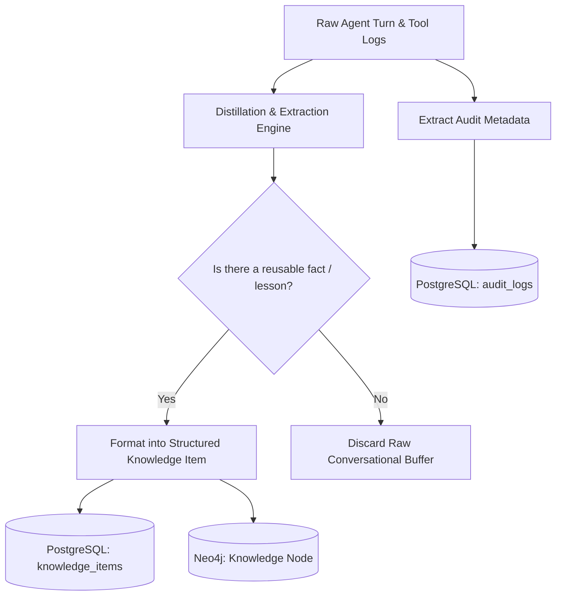

# Tiered Memory Architecture: KDI AI Office

## 1. Overview & Architectural Principles
A fundamental flaw in early autonomous agent frameworks is the naive dumping of uncompressed, raw conversational histories into local databases or model prompts. This causes rapid context window saturation, severe hallucinations, and prohibitive token expenses.

**KDI AI Office** implements a **Six-Tiered Memory Architecture** mapped across dedicated, purpose-built storage engines:

```text
┌────────────────────────────────────────────────────────────────────────┐
│                        Six Memory Tiers                                │
├───────────────────────────────┬────────────────────────────────────────┤
│ 1. Short-Term Memory          │ Active LLM Context Window (In-Memory)  │
│ 2. Working Memory             │ Redis (Session TTL, Scratchpad, Locks) │
│ 3. Long-Term Memory           │ PostgreSQL (Summaries, Key Facts, Runs)│
│ 4. Project Memory             │ Neo4j (AST Code, Files, Modules, Diffs)│
│ 5. Organizational Memory      │ Neo4j & Markdown (/docs, ADRs, PRDs)   │
│ 6. Audit & Compliance History │ PostgreSQL (Immutable Append-Only Log) │
└───────────────────────────────┴────────────────────────────────────────┘
```

---

## 2. Memory Tier Specifications

### 2.1 Short-Term Memory (Context Window Buffer)
- **Engine:** Ephemeral In-Memory Process RAM.
- **Scope:** Current active reasoning turn between agent and LLM.
- **Content:** System prompt, task directive, immediate tool responses (e.g., git diff hunk, linter output).
- **Eviction / Retention:** Cleared immediately after turn completion; key takeaways summarized into Working Memory.

### 2.2 Working Memory (Task Session Scratchpad)
- **Engine:** Redis (Key: `kdi:task:<task_id>:working_mem`).
- **Scope:** Active duration of a single task or subtask.
- **Content:** Ephemeral state variables, current file under edit, temporary reproduction test outcomes, loop counters, active lock tokens.
- **TTL & Eviction:** Key has a sliding TTL of 2 hours. Automatically flushed upon task terminal state (`COMPLETED`, `CANCELLED`, `FAILED`).

### 2.3 Long-Term Memory (Episodic Experience & Knowledge)
- **Engine:** PostgreSQL (`agent_sessions`, `knowledge_items`, `task_runs`).
- **Scope:** Cross-task historical memory for an agent persona.
- **Content:** Distilled insights from past tasks:
  - *"In repo Koneksi Santri, pickup module requires running `npm run build:types` before tests pass."*
  - *"Database migrations must not use ALTER TABLE on large table `attendance_logs` without 30s timeout."*
- **Eviction / Retention:** Permanent retention with periodic vector deduplication and confidence scoring.

### 2.4 Project Memory (Structural Code Topology)
- **Engine:** Neo4j Knowledge Graph.
- **Scope:** Dedicated to each registered software project and repository.
- **Content:**
  - Files, classes, exported interfaces, and functions.
  - Call graph (`Function -[:CALLS]-> Function`).
  - Import graph (`File -[:IMPORTS]-> File`).
  - Recent commits and active working branches.
- **Lifecycle:** Updated incrementally whenever an agent commits changes or upon repository sync.

### 2.5 Organizational Memory (Governance & Architecture)
- **Engine:** Neo4j + Document Storage (`/docs`).
- **Scope:** Enterprise-wide architectural standards, ADRs, compliance policies, coding style guides, and permission matrices.
- **Content:** The single source of truth for all engineering practices in KDI.
- **Lifecycle:** Versioned in git, indexed into Neo4j nodes (`:Decision`, `:Policy`, `:Requirement`).

### 2.6 Audit & Compliance History
- **Engine:** PostgreSQL (`audit_logs`, `tool_calls`).
- **Scope:** Complete, immutable, verifiable record of all system executions.
- **Content:** Exact timestamp, user ID, task ID, agent role, tool called, parameters, exit code, and cryptographic hash.
- **Retention:** Append-only; zero deletions permitted.

---

## 3. Storage Engine Mapping Matrix

| Memory Tier | Storage Technology | Serialization Format | Read Latency | Write Latency | Retention Policy |
|---|---|---|:---:|:---:|---|
| **Short-Term** | Process RAM | Native Object | < 0.1 ms | < 0.1 ms | Turn lifetime |
| **Working** | Redis 7 | JSON Strings / Hashes | < 1 ms | < 1 ms | 2-hour sliding TTL |
| **Long-Term** | PostgreSQL 16 | Relational + JSONB | < 10 ms | < 15 ms | Permanent (Indexed) |
| **Project** | Neo4j 5 | Graph Nodes & Edges | < 25 ms | < 30 ms | Repo lifetime |
| **Organizational** | Neo4j + Git Docs | Markdown + Graph | < 20 ms | < 50 ms | Permanent (Git tracked) |
| **Audit History** | PostgreSQL 16 | Append-Only Rows | < 5 ms | < 10 ms | Immutable (Zero purge) |

---

## 4. Conversation Distillation Pipeline (No Raw Bloat)



Raw conversation turns are passed through a background distillation prompt:
1. Extract architectural insights or recurring bug patterns.
2. Store key-value facts in `knowledge_items`.
3. Discard raw conversational fluff, greetings, and repetitive chain-of-thought strings.
