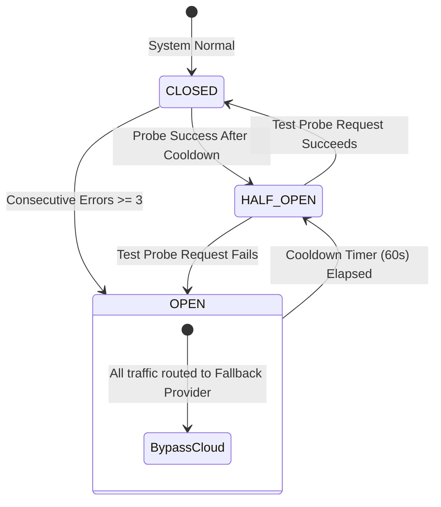

# Inference Fallback & Resilience Policy: KDI AI Office

## 1. Overview & Circuit Breaker Architecture
To maintain high availability during background engineering tasks, **KDI AI Office** implements an **Automated Inference Fallback & Circuit Breaker System**. External cloud AI providers frequently experience transient rate limits (HTTP 429), regional gateway timeouts (HTTP 504), service degradations (HTTP 500/503), or quota exhaustion.

The fallback policy guarantees that a background agent run does not crash mid-execution due to an upstream API outage.

---

## 2. Trigger Conditions & Failure Detection

| Error Category | HTTP / Error Signal | Immediate Action | Circuit Breaker Impact |
|---|---|---|---|
| **Rate Limit Exceeded** | `HTTP 429 Too Many Requests` | Immediate failover to secondary provider in fallback chain. | Mark primary provider *Throttled* for 60 seconds. |
| **Provider Server Error** | `HTTP 500, 502, 503, 504` | 1 exponential retry (2s delay); if fails, failover to secondary. | Increment provider failure counter. |
| **Request Timeout** | Socket read timeout (> 60s) | Terminate socket; failover to secondary. | Increment provider failure counter. |
| **Malformed Response / Incomplete JSON** | JSON parse exception from model | Retry with higher temperature penalty; if fails, switch provider. | None. |
| **Host Network Down** | DNS resolution failure / `ECONNREFUSED` | Failover directly to local **Ollama** daemon. | Set *Offline Mode* flag across all cloud providers. |

---

## 3. Circuit Breaker State Machine



1. **CLOSED (Normal Operation):** Requests flow to the primary provider selected by the AI Router.
2. **OPEN (Provider Tripped):** If a provider accumulates 3 consecutive 5xx errors or timeouts within a 2-minute window, the circuit trips to `OPEN`. All subsequent requests bypass this provider immediately without waiting for timeouts.
3. **HALF_OPEN (Recovery Probing):** After a 60-second cooldown period, the router dispatches a single lightweight canary ping to the provider. If successful, the circuit resets to `CLOSED`; if it fails, the cooldown resets to 120 seconds.

---

## 4. Fallback Execution Algorithm

```python
# Conceptual Fallback Execution Loop
async def execute_with_fallback(request: NormalizedLLMRequest, plan: RoutingDecision) -> NormalizedLLMResponse:
    candidates = [plan.primary_target] + plan.fallback_chain
    
    last_exception = None
    for target in candidates:
        if circuit_breaker.is_open(target.provider):
            logger.warning(f"Circuit breaker OPEN for {target.provider}. Skipping.")
            continue
            
        try:
            logger.info(f"Attempting inference with {target.provider}/{target.model}")
            response = await provider_registry.get(target.provider).generate(target.model, request)
            circuit_breaker.record_success(target.provider)
            return response
            
        except RateLimitException as e:
            logger.warning(f"Rate limit hit on {target.provider}: {e}. Triggering fallback.")
            circuit_breaker.trip(target.provider, duration_secs=60)
            last_exception = e
            
        except (TimeoutException, ProviderServerException) as e:
            logger.warning(f"Provider {target.provider} failed: {e}. Trying fallback.")
            circuit_breaker.record_failure(target.provider)
            last_exception = e

    # If all cloud and primary options fail, fall back to emergency local Ollama
    logger.critical("All planned providers failed. Engaging Emergency Local Ollama.")
    return await provider_registry.get("ollama").generate("qwen2.5-coder:7b-instruct-q4_K_M", request)
```

---

## 5. Audit & Telemetry of Fallback Events
Every invocation of a fallback rule generates:
- An entry in PostgreSQL `llm_requests` recording `attempted_provider`, `fallback_provider`, `failure_reason`, and `failover_latency_ms`.
- A WebSocket event `llm.fallback.triggered` updating the 3D dashboard (Server Room LED turns orange).
- Telemetry counter `kdi_llm_fallback_total{from="gemini", to="groq"}` incremented for Prometheus/Grafana monitoring.
