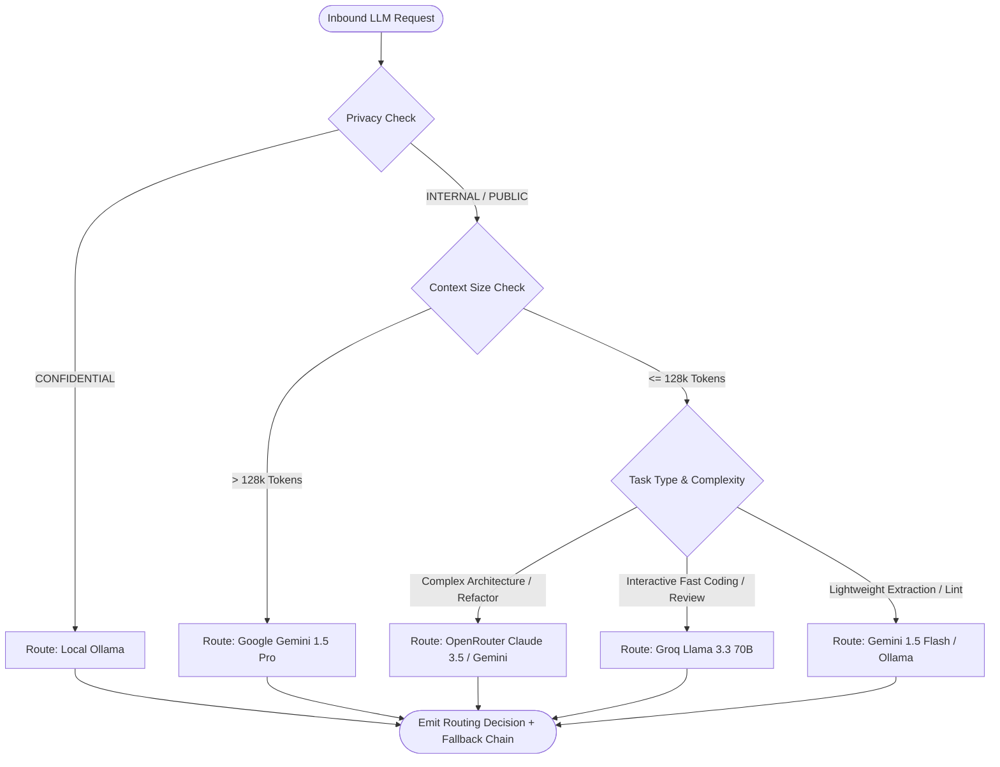

# Dynamic AI Routing Policy: KDI AI Office

## 1. Overview & Objectives
The **Dynamic AI Router** is the cognitive traffic controller of **KDI AI Office**. It evaluates incoming prompt requests and dynamically determines the optimal inference provider and model based on multiple operational dimensions.

The primary goals of the routing engine are:
1. **Quality Maximization:** Direct high-complexity architectural reasoning to Tier 1 frontier models.
2. **Cost & Latency Optimization:** Direct high-volume, low-complexity tasks (e.g., unit test generation, doc updates) to ultra-fast, cost-effective models.
3. **Data Sovereignty & Privacy:** Guarantee that confidential tasks never exit the local workstation.
4. **Resilience:** Construct a deterministic fallback cascade for every decision.

---

## 2. Multi-Dimensional Routing Evaluation



### 2.1 Routing Input Parameters
- `task_type`: `ARCHITECTURE`, `DECOMPOSITION`, `CODING`, `DEBUGGING`, `TESTING`, `REVIEW`, `RESEARCH`, `DOCS`.
- `complexity_score`: Integer 1 (trivial) to 5 (extreme complexity).
- `context_token_estimate`: Estimated input tokens + repository snippets.
- `privacy_level`: `PUBLIC`, `INTERNAL`, `CONFIDENTIAL`.
- `latency_tolerance`: `REALTIME` (<1s), `INTERACTIVE` (<5s), `BACKGROUND` (<60s).
- `tool_requirement`: Boolean (requires JSON function/tool calling).
- `cost_sensitivity`: `LOW` (prioritize quality), `HIGH` (prioritize cost savings).

---

## 3. Canonical Routing Rules Table (Configurable Baseline)

| Task Domain | Complexity | Token Size | Privacy | Primary Target | Primary Reason | Fallback Chain |
|---|:---:|:---:|:---:|---|---|---|
| **System Architecture / ADR** | 4 - 5 | Any | INTERNAL | `gemini-1.5-pro` | Superior long-context reasoning & structural synthesis. | `claude-3.5-sonnet` -> `deepseek-r1:7b (Ollama)` |
| **Task Decomposition** | 4 - 5 | < 32k | INTERNAL | `claude-3.5-sonnet` | Precise JSON schema output and deterministic tool contracts. | `gemini-1.5-pro` -> `llama-3.3-70b (Groq)` |
| **Surgical Bugfixing** | 3 - 4 | < 64k | INTERNAL | `claude-3.5-sonnet` | Highest benchmark for surgical code editing & AST patch accuracy. | `gemini-1.5-pro` -> `qwen2.5-coder:7b (Ollama)` |
| **Unit Test Authoring** | 2 - 3 | < 32k | INTERNAL | `llama-3.3-70b-versatile (Groq)` | High throughput (>250 t/s) and strong test boilerplate generation. | `gemini-1.5-flash` -> `qwen2.5-coder:7b (Ollama)` |
| **Code Review** | 3 - 4 | < 64k | INTERNAL | `gemini-1.5-pro` | Comprehensive cross-file consistency and edge-case spotting. | `claude-3.5-sonnet` -> `llama-3.3-70b (Groq)` |
| **Technical Documentation** | 1 - 2 | Any | INTERNAL | `gemini-1.5-flash` | Extremely low cost, fast generation, clean Markdown styling. | `llama-3.3-70b (Groq)` -> `qwen2.5-coder (Ollama)` |
| **Confidential / PII Data** | Any | Any | **CONFIDENTIAL** | `qwen2.5-coder:7b (Ollama)` | **Strict local execution; zero data egress.** | `deepseek-r1:7b (Ollama)` -> `qwen:1.5b (Ollama)` |

---

## 4. Routing Decision Output Schema

The router returns a structured decision envelope logged to PostgreSQL `llm_requests`:

```json
{
  "request_id": "req_01J9X8XYZ123",
  "decision": {
    "selected_provider": "gemini",
    "selected_model": "gemini-1.5-pro",
    "rationale": "High complexity task (score=4) with large context (84,200 tokens) requiring tool calling.",
    "estimated_cost_usd": 0.084,
    "fallback_chain": [
      {
        "provider": "openrouter",
        "model": "anthropic/claude-3.5-sonnet",
        "trigger": "HTTP_429_OR_TIMEOUT"
      },
      {
        "provider": "ollama",
        "model": "qwen2.5-coder:7b-instruct-q4_K_M",
        "trigger": "ALL_CLOUD_UNAVAILABLE"
      }
    ]
  }
}
```

---

## 5. Configuration & Hot Reloading
The routing policy rules are loaded from `config/routing-rules.json` and mirrored in the PostgreSQL `system_settings` table. System operators can modify weights, default models, and cost thresholds at runtime via the Settings Dashboard without restarting the server.
