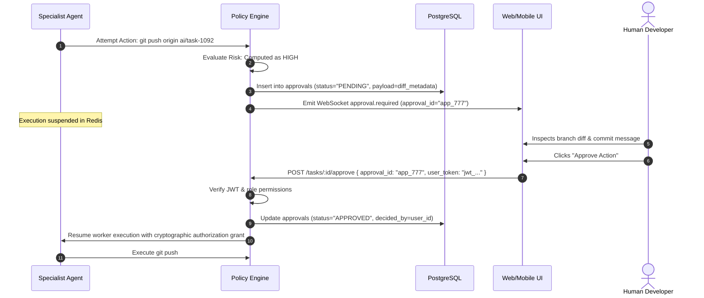

# Agent Security Boundaries & Permission Governance: KDI AI Office

## 1. Overview & Principle of Least Privilege
In **KDI AI Office**, agents are treated as semi-trusted internal entities. An agent persona is never granted global administrative privileges. Every agent executes within a strictly scoped capability sandbox enforced at the runtime kernel level.

---

## 2. Dynamic Risk Classification Engine

Whenever an agent attempts an action or tool call, the `PolicyEngine` dynamically computes a **Risk Level**:

```text
Action Type + Target Resource + Impact Radius = Risk Classification
```

### 2.1 Risk Rules Catalog
1. **LOW (Autonomous):**
   - Read files inside current worktree.
   - Run linter or type-checker.
   - Query Neo4j knowledge graph.
   - Write documentation files in `/docs`.
2. **MEDIUM (Audited Autonomous):**
   - Create and commit to local task branch (`ai/task-*`).
   - Run unit and integration tests inside local sandbox.
   - Modify application source files within task worktree.
3. **HIGH (Mandatory Human Approval):**
   - Execute `git push` to any remote branch.
   - Apply database migrations (`ALTER TABLE`, `CREATE INDEX`).
   - Install new third-party packages via `npm install` or `pip install`.
   - Modify infrastructure configuration files (Dockerfiles, CI/CD).
4. **CRITICAL (Blocked / MFA Mandatory):**
   - Direct push to protected branches (`main`, `master`, `release`).
   - Executing `DROP DATABASE`, `DROP TABLE`, `TRUNCATE`.
   - Modifying `.env` files or extracting credentials.
   - Spawning interactive subshells.

---

## 3. Cryptographic Human Approval Flow



---

## 4. Runaway Agent & Infinite Loop Circuit Breakers
1. **Step Budget Limit:** Every task run is assigned a maximum step count (default: 15 tool calls). If an agent exceeds 15 steps without completing its goal, execution is halted, marked `STEP_BUDGET_EXCEEDED`, and handed to the AI Manager.
2. **Execution Timeout:** Max wall-clock time for any single subtask is 15 minutes.
3. **Token Spend Limit:** Max token spend per individual task is capped at $0.50 USD; any task attempting to exceed this cap must request human approval to proceed.
