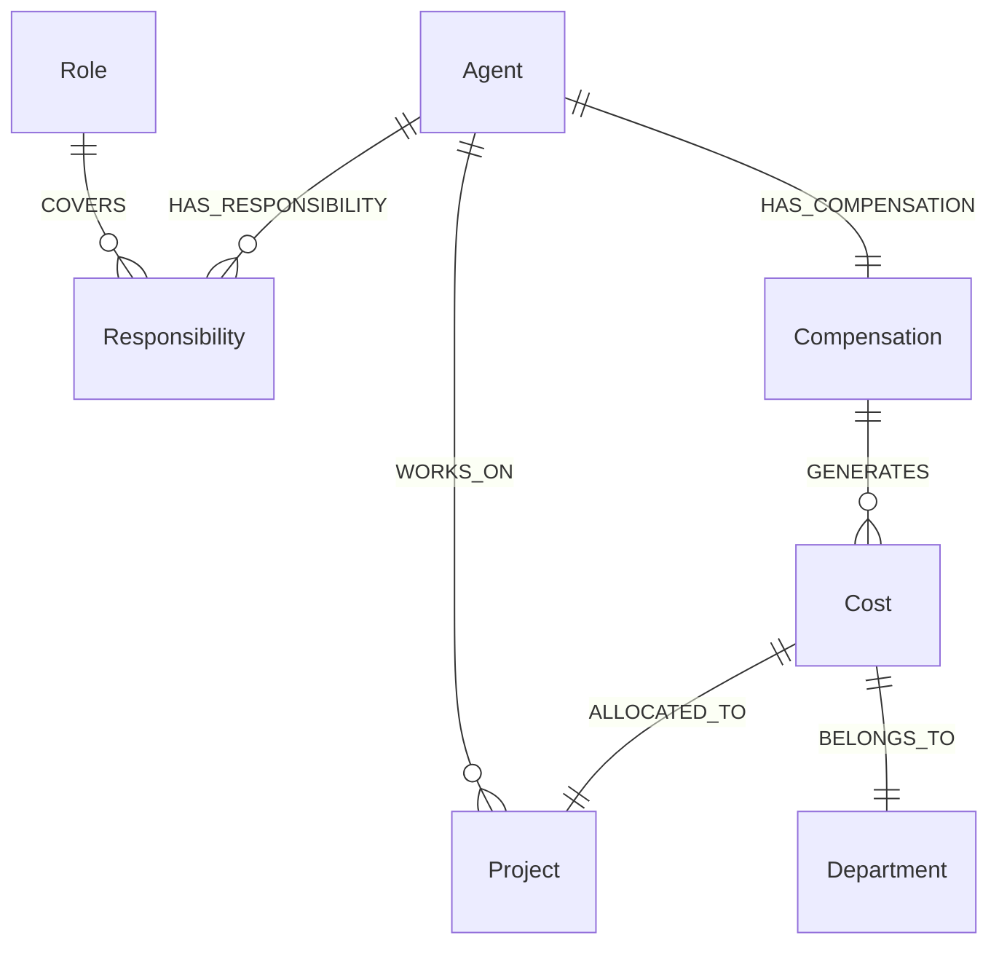

# AI Workforce Compensation & Cost Accounting: KDI AI Office

## 1. Executive Summary & Legal Disclaimers
The **AI Workforce Compensation & Cost Accounting Subsystem** provides a sophisticated financial and operational simulation engine within **KDI AI Office**.

> [!IMPORTANT]
> **LEGAL & METHODOLOGICAL NOTICE:**
> This subsystem is strictly an **Internal Virtual AI Workforce Simulation** and cost accounting model. It **DOES NOT** represent legal human payroll, employment contracts, labor standards, or official market wage benchmarks. All figures, salary grades, and compensation rates are configurable operational simulation values designed exclusively for:
> 1. Multi-project software cost allocation.
> 2. Infrastructure, LLM, and tool spend budgeting.
> 3. Visualizing organizational scale and AI labor leverage in the 3D Digital Twin.
> All views and reports generated by this subsystem are explicitly marked:
> `[INTERNAL SIMULATION] - [ILLUSTRATIVE MODEL] - [NON-LEGAL ESTIMATE]`.

---

## 2. Total AI Employee Cost Accounting Model

The complete financial burden of an autonomous AI employee comprises two primary pillars: **Virtual Compensation** and **Direct Operational Costs**:

```text
┌────────────────────────────────────────────────────────────────────────┐
│                        TOTAL AI EMPLOYEE COST                          │
├────────────────────────────────────────┬───────────────────────────────┤
│ 1. Virtual Labor Compensation          │ 2. Direct Operational Costs   │
│    - Base Virtual Salary               │    - Incurred Cloud LLM Spend │
│    - Role & Knowledge Allowance        │    - Tool & Third-Party Fees  │
│    - Performance / Output Incentive    │    - Host Hardware & Infra    │
└────────────────────────────────────────┴───────────────────────────────┘
```

### 2.1 Formal Accounting Formulas

$$\text{Virtual Compensation} = \text{Base Salary} + \text{Allowance} + \text{Performance Incentive}$$

$$\text{Total AI Employee Cost} = \text{Virtual Compensation} + \text{LLM Cost} + \text{Tool Cost} + \text{Infrastructure Allocation}$$

- **Base Salary:** Benchmark virtual compensation assigned to the agent's grade and role.
- **Allowance:** Compensation for specialized tools, security clearances, or standby 24/7 availability.
- **Performance Incentive:** Dynamic metric scaled by task success rate, zero rework rate, and bug fix turnaround speed.
- **LLM Cost:** Actual USD/IDR cloud provider inference bill incurred by the agent (Gemini, Groq, OpenRouter).
- **Tool Cost:** Prorated cost of paid external APIs (search, hosting, packaging).
- **Infrastructure Allocation:** Workstation electricity, NVMe wear, and VPS hosting share.

---

## 3. Configurable AI Salary Grades & Tiers

Compensation ranges are fully configurable in `config/workforce-compensation.json` and PostgreSQL `workforce_grades`:

| Grade Identifier | Experience Level | Illustrative Monthly Base Range (IDR) | Typical Assigned Roles | Autonomous Risk Authority |
|---|---|---|---|---|
| **GR-01: Intern** | Automated Linting & Scrapers | Rp 2.500.000 – Rp 4.000.000 | Scraper, Log Cleaner | LOW (Read-Only) |
| **GR-02: Junior** | Boilerplate & Unit Tests | Rp 5.000.000 – Rp 8.000.000 | QA Assistant, Doc Drafter | LOW / MEDIUM |
| **GR-03: Mid-Level**| Standard Feature Implementation | Rp 9.000.000 – Rp 14.000.000 | Frontend, Backend Engineer | MEDIUM |
| **GR-04: Senior** | Complex Bugfix & Refactoring | Rp 15.000.000 – Rp 22.000.000 | Senior Software Engineer | MEDIUM (Local Commits) |
| **GR-05: Lead** | Architecture & Security Guard | Rp 24.000.000 – Rp 32.000.000 | System Architect, Sec Engineer | HIGH (Approval Gated) |
| **GR-06: Principal**| Enterprise Optimization & Data | Rp 35.000.000 – Rp 45.000.000 | Database Architect, Lead Arch | HIGH (Approval Gated) |
| **GR-07: Manager** | Team Lead & Task Decomposition | Rp 40.000.000 – Rp 55.000.000 | AI Manager | ORCHESTRATION |
| **GR-08: Director**| Strategic Governance & Charter | Rp 60.000.000 – Rp 75.000.000 | AI Executive Director | POLICY AUTHORITY |

---

## 4. Performance & Productivity Metrics Engine

Every agent's performance incentive and rating is calculated objectively from verified execution records:

```text
Performance Score (0 - 100%) = (0.35 × TaskSuccessRate) + (0.25 × FirstPassReviewRate)
                             + (0.20 × BugFixSpeedScore) + (0.20 × TestCoverageDelta)
```

### Tracked Performance Attributes
- `tasks_completed`: Total successfully closed engineering tasks.
- `tasks_failed`: Total tasks halted due to unrecoverable errors.
- `cycle_time_avg_seconds`: Average duration from ingestion to diff completion.
- `success_rate_percent`: $\frac{\text{tasks\_completed}}{\text{tasks\_total}} \times 100$.
- `rework_rate_percent`: Percentage of pull requests requiring change requests during code review.
- `tests_authored_passed`: Number of unit/regression tests written that pass.
- `bugs_introduced`: Regressions discovered by QA in code authored by this agent.
- `bugs_fixed`: Validated defect fixes authored and merged.
- `approval_pass_rate`: Percentage of high-risk actions approved by human developer on first submission.

---

## 5. Workload Mirror: Human-to-AI Labor Mapping

### 5.1 Concept & Purpose
In lean software organizations, a single senior developer often bears an overwhelming breadth of disparate responsibilities (frontend coding, backend APIs, database management, DevOps, WordPress maintenance, graphic design, social media content, customer troubleshooting).

The **Workload Mirror** provides an **Equivalent AI Workforce Simulation**:
1. It catalogs the human developer's discrete responsibilities.
2. It decomposes them into specialized functional roles.
3. It maps each role to an equivalent autonomous AI specialist.
4. It calculates the virtual workforce compensation and operational cost required to deliver that equivalent labor.

### 5.2 Illustrative Workload Mirror Mapping Example

```text
┌─────────────────────────────────────────────────────────────────────────────────┐
│                          ONE HUMAN DEVELOPER WORKLOAD                           │
│  [ IT Ops ] [ Web Portal ] [ WordPress ] [ UI/UX ] [ Content ] [ Support ]      │
└──────────────────────────────────────┬──────────────────────────────────────────┘
                                       │ (Workload Mirror Mapping Engine)
                                       ▼
┌─────────────────────────────────────────────────────────────────────────────────┐
│                     EQUIVALENT AI WORKFORCE SIMULATION (6 ROLES)                │
├───────────────────────┬──────────────────────────┬──────────────────────────────┤
│ Specialized AI Role   │ Seniority Grade          │ Virtual Compensation (Sim)   │
├───────────────────────┼──────────────────────────┼──────────────────────────────┤
│ 1. DevOps Specialist  │ GR-04: Senior            │ Rp 18.000.000                │
│ 2. Backend Engineer   │ GR-04: Senior            │ Rp 19.500.000                │
│ 3. Frontend / UI Spec │ GR-03: Mid-Level         │ Rp 12.000.000                │
│ 4. CMS / WordPress    │ GR-03: Mid-Level         │ Rp 10.000.000                │
│ 5. Technical Writer   │ GR-02: Junior            │ Rp  6.500.000                │
│ 6. QA & Support Eng   │ GR-03: Mid-Level         │ Rp 11.000.000                │
├───────────────────────┴──────────────────────────┼──────────────────────────────┤
│ Total Equivalent Virtual Compensation:           │ Rp 77.000.000 / month        │
│ Actual Cloud LLM Inference Incurred:             │ Rp  1.850.000 / month        │
│ Workstation Host Infrastructure Cost:            │ Rp    450.000 / month        │
├──────────────────────────────────────────────────┼──────────────────────────────┤
│ TOTAL EQUIVALENT AI WORKFORCE VALUE DELIVERED:   │ Rp 79.300.000 / month        │
└──────────────────────────────────────────────────┴──────────────────────────────┘
```

### 5.3 Workload Mirror Historical Snapshots
Monthly historical records are stored in PostgreSQL `workload_mirror_snapshots` to trace how organizational workload expands and shifts across quarters.

---

## 6. Multi-Project & Department Cost Allocation

### 6.1 Multi-Project Allocation Policy
When an agent works across multiple codebases during a billing period, their costs are allocated proportionally based on execution run duration:

$$\text{Project Cost Allocation} = \text{Total Employee Cost} \times \left( \frac{\text{Task Run Seconds on Project}}{\text{Total Active Run Seconds}} \right)$$

*Example:* If Backend Engineer incurs Rp 15.000.000 total monthly cost and spends 60% of execution time on *Koneksi Santri*, 30% on *Internal Core Services*, and 10% on *Idle Standby*, *Koneksi Santri* is billed Rp 9.000.000 in virtual project allocation.

### 6.2 Department Stratification
- **Management:** AI Manager (Orchestration, backlog decomposition).
- **Engineering:** Software Engineer, Frontend Engineer, Backend Engineer.
- **QA:** QA Engineer (Automated test authoring, regression suites).
- **Security:** Security Engineer, Code Reviewer.
- **DevOps:** DevOps Engineer (Docker, tunnel maintenance).
- **Research & Docs:** Researcher, Technical Writer, Business Analyst.

---

## 7. AI Employee Monthly Statement (Simulated Slip)

```text
================================================================================
                    KDI AI OFFICE — VIRTUAL WORKFORCE SIMULATION
                           AI EMPLOYEE MONTHLY STATEMENT
================================================================================
Employee ID   : AGT-BE-01                    Period         : September 2026
Employee Name : Backend Engineer              Grade          : GR-04 (Senior)
Department    : Engineering                  Primary Model  : Claude 3.5 / Llama 3.3
--------------------------------------------------------------------------------
VIRTUAL COMPENSATION:
  Base Virtual Salary                       : Rp 16.000.000
  Standby & Tool Allowance                  : Rp  2.000.000
  Performance Incentive (Score: 94%)        : Rp  2.820.000
                                              ----------------------------------
  Total Virtual Compensation                : Rp 20.820.000 [SIMULATION ONLY]

DIRECT OPERATIONAL COSTS:
  Cloud LLM Spend (Gemini & Claude)         : Rp    485.000
  Tool & Third-Party Sandbox Fees           : Rp     50.000
  Workstation Electricity / Compute Share   : Rp     75.000
                                              ----------------------------------
  Total Direct Operational Cost             : Rp    610.000 [ACTUAL EXPENSE]

--------------------------------------------------------------------------------
TOTAL AI EMPLOYEE ECONOMIC COST             : Rp 21.430.000
================================================================================
OPERATIONAL DELIVERABLES:
  Tasks Completed : 42 tasks                 Tests Authored : 84 unit tests
  Success Rate    : 97.6%                    Regressions    : 0 bugs introduced
  Cycle Time Avg  : 4m 12s                   Diffs Merged   : 14 pull requests
================================================================================
```

---

## 8. Graph Extension for Workforce & Cost Accounting

Neo4j models the financial and responsibility topology connecting agents, projects, and departments:



### Cypher Queries for Workforce Analytics

#### Query 1: What is the virtual workforce cost allocated to project *Koneksi Santri*?
```cypher
MATCH (p:Project {name: "Koneksi Santri"})<-[:ALLOCATED_TO]-(c:Cost)<-[:GENERATES]-(comp:Compensation)<-[:HAS_COMPENSATION]-(a:Agent)
RETURN p.name AS Project,
       collect(a.display_name) AS AssignedTeam,
       sum(c.amount_idr) AS TotalVirtualCostIDR,
       sum(c.llm_actual_cost_usd) AS TotalLLMSpendUSD;
```

#### Query 2: Which agents cover a specific human responsibility?
```cypher
MATCH (r:Responsibility {name: "WordPress Maintenance"})<-[:COVERS]-(role:Role)<-[:ASSIGNED_ROLE]-(a:Agent)
RETURN r.name AS Responsibility, a.display_name AS Agent, a.grade AS SeniorityGrade;
```
